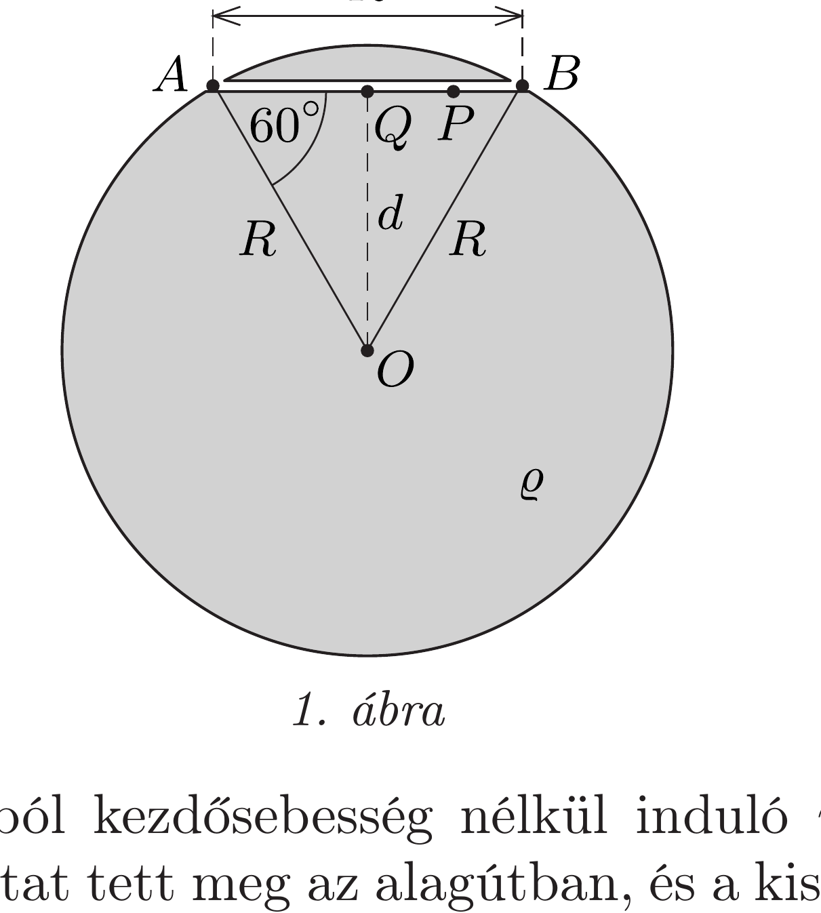
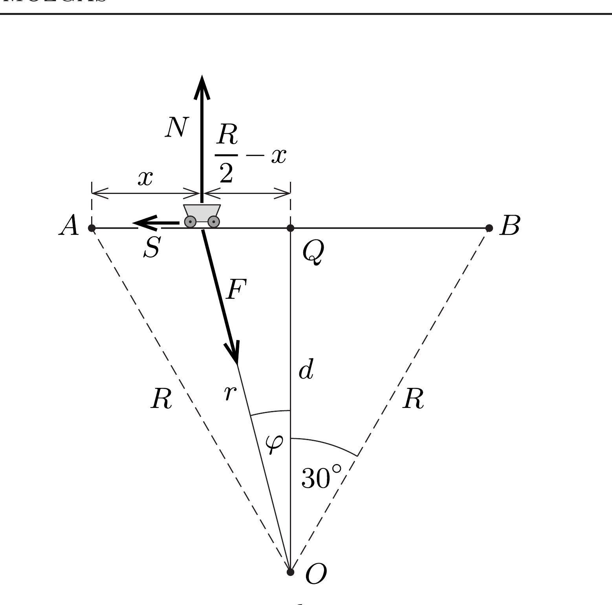

## Útmutatás

A szakértő - akivel látszólag semmilyen számadatot nem közöltek - képes numerikus választ adni a feltett kérdésekre. Szakvéleményében először azt igazolja, hogy a csille mozgása (szakaszonként) harmonikus rezgőmozgás volt. Azt is tudhatja a szakértő, hogy a kisbolygó anyagának néhány jellemző adata (például a súrúsége) táblázatokban megtalálható, ismert érték.

## Megoldás

Jelöljük a kisbolygó sugarát (ami az alagút hosszával egyezik meg) $R$-rel, a kisbolygó súrúségét $\varrho$-val, az alagút végpontjait $A$-val és $B$-vel, a bányamester helyét pedig $P$-vel (1. ábra)! Az alagút és a végpontjaihoz tartozó sugarak szabályos háromszöget alkotnak, így az alagút $Q$ középpontja és a kisbolygó középpontjának távolsága $d=\sqrt{3} R / 2$.

Tekintsük az $A$ pontból kezdősebesség nélkül induló $m$ tömegü csille azon helyzetét, amikor már $x$ utat tett meg az alagútban, és a kisbolygó középpontjától $r$ távolságra van (2. ábra). A csillére itt
\[
F=\gamma m \frac{4 \pi}{3} r^{3} \varrho \cdot \frac{1}{r^{2}}
\]
nagyságú gravitációs eró hat. (Felhasználtuk azt az ismert tényt, hogy egy homogén tömegeloszlású gömbhéj gravitációs tere a gömbhéj belsejében nulla.) A csille a sínekre merőleges irányban nem gyorsul, így a sínek által kifejtett kényszererő nagysága
\[
N=F \cos \varphi=F \frac{d}{r}=\frac{4 \pi}{3} \gamma m \varrho d=\text { állandó. }
\]
A kényszererő tehát nem változik, így a csúszási súrlódási eró is állandó,
\[
S=\mu N=\frac{4 \pi}{3} \gamma m \varrho \mu d
\]
nagyságú a mozgás során. A súrlódási eró a csille sebességével ellentétes irányú, tehát a mozgás elsó szakaszában az $A$ pont felé, a második szakaszban pedig $B$ felé mutat.

A csille mozgásegyenlete az indulástól a visszafordulásáig:
\[
m a=F \sin \varphi-S .
\]
Felhasználva az (1) és (2) kifejezéseket:
\[
m a=\frac{4 \pi}{3} \gamma m \varrho(r \sin \varphi-\mu d)=\frac{4 \pi}{3} \gamma m \varrho\left(\frac{R}{2}-x-\mu d\right),
\]
ahonnan a gyorsulás
\[
a=-\omega^{2}\left(x-x_{0}\right)
\]
alakban is felírható, ha bevezetjük a következő jelöléseket:
\[
x_{0}=\frac{R}{2}-\mu d, \quad \omega^{2}=\frac{4 \pi}{3} \gamma \varrho .
\]
A (3) egyenlet egy olyan harmonikus rezgőmozgást ír le, amelynek középpontja az $x_{0}$ koordinátájú pont, periódusideje pedig
\[
T=\frac{2 \pi}{\omega}=\sqrt{\frac{3 \pi}{\gamma \varrho}} .
\]
Mivel $T$ csak a kisbolygó anyagának (a titánnak) ismert súrúségétől függ, így a periódusidő számszerú értéke a kisbolygó sugarának és a súrlódási együttható nagyságának ismerete nélkül is kiszámítható, az eredmény:
\[
T=5597 \mathrm{~s} \approx 1,55 \text { óra. }
\]

A rezgőmozgás középpontja az alagút közepétől $R / 2-x_{0}=\mu d$ távolságban van, a csille visszafordulási pontja tehát az indulás helyétól
\[
A P=2 x_{0}=R-2 \mu d,
\]
az alagút közepétől pedig
\[
P Q=2 x_{0}-\frac{R}{2}=\frac{R}{2}-2 \mu d
\]
távol van. A mozgás ezen szakaszának megtételéhez $T / 2$ időre volt szükség.
A csille visszafordulása után a súrlódási eró iránya megváltozik, emiatt a rezgőmozgás középpontja (új egyensúlyi helyzete) az alagút $Q$ középpontjától jobbra, attól $\mu d$ távolságra lesz. Mivel a csille végül éppen az alagút közepén állt meg, így fennáll:
\[
2 \mu d=P Q=\frac{R}{2}-2 \mu d
\]
vagyis a KOBALKIVI szakértőjének jelentésében szereplő súrlódási együttható:
\[
\mu=\frac{R}{8 d}=\frac{2}{8 \sqrt{3}} \approx 0,14 .
\]
Ennek ismeretében a szakértő azt is kiszámíthatja (4)-ből, hogy a bányamester a csille indulási pontjától
\[
A P=R-2 \mu d=R-\frac{R}{4}=\frac{3}{4} R
\]
távolságban, vagyis az alagút hosszának 75\%-ánál állhatott. A csille mozgásának teljes ideje két félperiódus idejével, vagyis $T=1,55$ órával egyezett meg.

Megjegyzés. Érdekesség, hogy a csille mozgásának $T=\sqrt{3 \pi /(\gamma \varrho)}$ periódusideje megegyezik egy közvetlenül a légkör nélküli kisbolygó felszíne közelében (körpályán) mozgó múhold keringési idejével.
