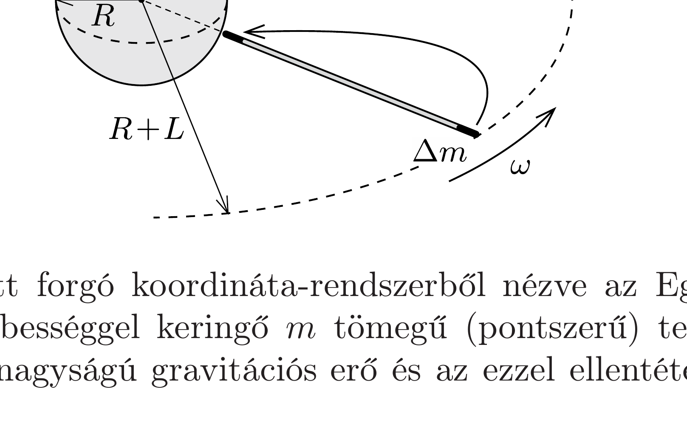

## Útmutatás

Gondoljuk végig egy hosszú, vékony fonál „szinkronmozgásának” feltételeit, amely az Egyenlító fölött függőlegesen helyezkedik el, és a Földdel együtt forog!

## Megoldás

Tételezzük fel, hogy az egyenletes keresztmetszetú és anyageloszlású, mindkét végén szabad madzag úgy kering a Föld körül, hogy a Földhöz viszonyított helyzete időben állandó marad! Ez az állapot csak az Egyenlító fölött, a madzag függőleges helyzetében valósulhat meg.

A Földdel együtt forgó koordináta-rendszerből nézve az Egyenlító fölött $r$ távolságra $\omega$ szögsebességgel keringő $m$ tömegü (pontszerü) testre a Föld felé irányuló, $\gamma m M / r^{2}$ nagyságú gravitációs erő és az ezzel ellentétes irányú, $m r \omega^{2}$
nagyságú centrifugális erő hat (itt $M$ a Föld tömege). A madzag egyensúlyának feltétele az, hogy a helyről helyre változó gravitációs erók eredője megegyezzen az ugyancsak helyfüggő centrifugális erők eredőjével. Ez a feltétel integrálszámítás segítségével önthető egyenlet formájába, de szerencsére egy ügyes gondolatkísérlet segítségével felsőbb matematikai ismeretek nélkül is megfogalmazható.

Képzeljük el, hogy a madzagot az alsó végénél fogva egy nagyon picit a Föld felé húzzuk! Mivel a madzag (a forgó koordináta-rendszerből nézve) eredetileg egyensúlyban volt, tetszőlegesen kicsi erővel, tehát tetszólegesen kis munkavégzéssel kimozdítható az egyensúlyi helyzetéből. Az egész madzag elmozdítása a munkavégzés szempontjából egyenértékú azzal, mintha a madzag Földtől távolabbi végéről levágnánk egy kicsiny ( $\Delta m$ tömegú) darabot, és azt lassan a másik végéhez vinnénk. A végzett munka két tag összegeként kapható meg: a mozgatott darabka gravitációs potenciális energiájának megváltozásából és a centrifugális eró ellenében végzett munkából. Ez utóbbi járulék (az elmozdulással lineárisan változó nagyságú centrifugális eró́ miatt) számolható úgy, mintha a mozgatott darabkára végig egy olyan átlagos erő hatna, amely a legkisebb és legnagyobb centrifugális eró számtani közepével egyenlő. Ha az $L$ hosszúságú madzag alsó vége $R$ földsugárnyi távolságra van a Föld középpontjától, akkor a kérdéses munkavégzés
\[
W=-\gamma M \Delta m\left(\frac{1}{R}-\frac{1}{L+R}\right)+\Delta m \frac{R+(R+L)}{2} \omega^{2} L=0 .
\]
Ez $L$-re egy másodfokú egyenlet, amelyet megoldva és az ismert adatokat behelyettesítve a madzag hosszára
\[
L=\frac{R}{2}\left(\sqrt{1+\frac{8 \gamma M}{R^{3} \omega^{2}}}-3\right)=1,44 \cdot 10^{8} \mathrm{~m},
\]
azaz kb. 144000 km adódik. Ez a hossz csaknem 3,5-szerese a távközlési szinkronmúholdak
\[
r_{0}=\sqrt[3]{\frac{\gamma M}{\omega^{2}}} \approx 42000 \mathrm{~km}-\mathrm{es}
\]
pályasugarának!
Megjegyzés. Vajon mekkora maximális húzófeszültség ébred a madzagban? Belátható, hogy a rugalmas feszültség a Föld középpontjától $r=r_{0}$ távolságra a legnagyobb.

Egy lehetséges gondolatmenet a következő. Forgó vonatkoztatási rendszerből nézve a madzag Földhöz közeli darabkáira ható gravitációs erő nagyobb, mint a centrifugális erố. A madzag felső végéhez közeli darabkáknál a helyzet pont fordított: itt a centrifugális erő gyốz a gravitációs vonzóeró felett. Az egyes darabkák egyensúlyát a madzagban ébredő, helyról helyre változó nagyságú feszítőerő biztosítja, emiatt a feszítőerő a madzag alsó végétől fölfelé haladva a kezdeti zérus értékről fokozatosan növekszik, eléri maximális értékét, majd a madzag felső végéig továbbhaladva fokozatosan nullára csökken. A Föld középpontjától $r_{0}$ távolságra elhelyezkedő kicsiny madzagdarabka két végénél ugyanakkora feszítőerő hat (hiszen erre a darabkára ható gravitációs és centrifugális erők eredője
nulla), tehát itt a feszítőerő hely szerinti megváltozása nulla. Ebből következik, hogy a madzagban ébredő erő (és ezzel együtt a rugalmas feszültség) éppen itt, a szinkronmûholdak magasságában a legnagyobb.

A rugalmas feszültség meghatározásához vizsgáljuk meg, hogy mennyi munkát végzünk, ha a madzagnak a Föld középpontjától $r_{0}$ távolságra lévő $\Delta s$ hosszú darabkáját „összecsippentjük” úgy, hogy a madzag alsó vége ne mozduljon el, felső vége viszont $\Delta s$ távolsággal lejjebb kerüljön. Ha a madzagot ebben a pontban $F_{\max }$ eró feszíti, akkor munkavégzésünk $F_{\text {max }} \Delta s$. Ugyanezt az (1) egyenlettel teljesen analóg módon is kiszámíthatjuk, hiszen az „összecsippentést” most is elképzelhetjük úgy, mintha a madzag Földtől távoli végéről levágott $\Delta s$ hosszúságú, $\Delta m$ tömegú darabot a Föld középpontjától $r_{0}$ távolságra lévő helyre vinnénk:
\[
F_{\max } \Delta s=-\gamma M \Delta m\left(\frac{1}{r_{0}}-\frac{1}{L+R}\right)+\Delta m \frac{r_{0}+(R+L)}{2} \omega^{2}\left(R+L-r_{0}\right) .
\]
Ha a madzag $A$ keresztmetszetú és anyagának súrúsége $\varrho$, akkor a gondolatban mozgatott darabka tömege $\Delta m=\varrho A \Delta s$ alakban írható fel. A (3) és (4) egyenletek felhasználásával a madzagban ható maximális $\sigma_{\text {max }}=F_{\text {max }} / A$ feszültség és a súrúség hányadosa meghatározható:
\[
\frac{\sigma_{\max }}{\varrho}=\omega^{2}\left(\frac{r_{0}^{3}}{R+L}+\frac{(R+L)^{2}}{2}-\frac{3 r_{0}^{2}}{2}\right) \approx 4,8 \cdot 10^{7} \frac{\mathrm{Nm}}{\mathrm{~kg}} .
\]
Ez a számérték sokkal nagyobb, mint az ismert anyagok szakítószilárdság/súrúség aránya (ami acélra ugyanilyen egységekben $2,6 \cdot 10^{5}$, szénszálra $1,7 \cdot 10^{6}$ lenne).

Az „égi kampó” tehát a newtoni mozgásegyenletek szerint megvalósítható lenne, szilárdságtani okokból azonban (legalábbis egyenletes keresztmetszetú, egyenletes tömegeloszlású madzaggal) ma még elképzelhetetlen. Ha valaki mégis megfigyelne egy (állandó keresztmetszetú és egyenletes tömegeloszlású) égigérő madzagot, joggal tulajdoníthatná a földönkívüli civilizáció múvének. Változó keresztmetszetú szállal azonban már a ma ismert anyagokkal is megvalósítható lenne az „égigérő madzag-köteg” (lásd a 115. feladatot).
