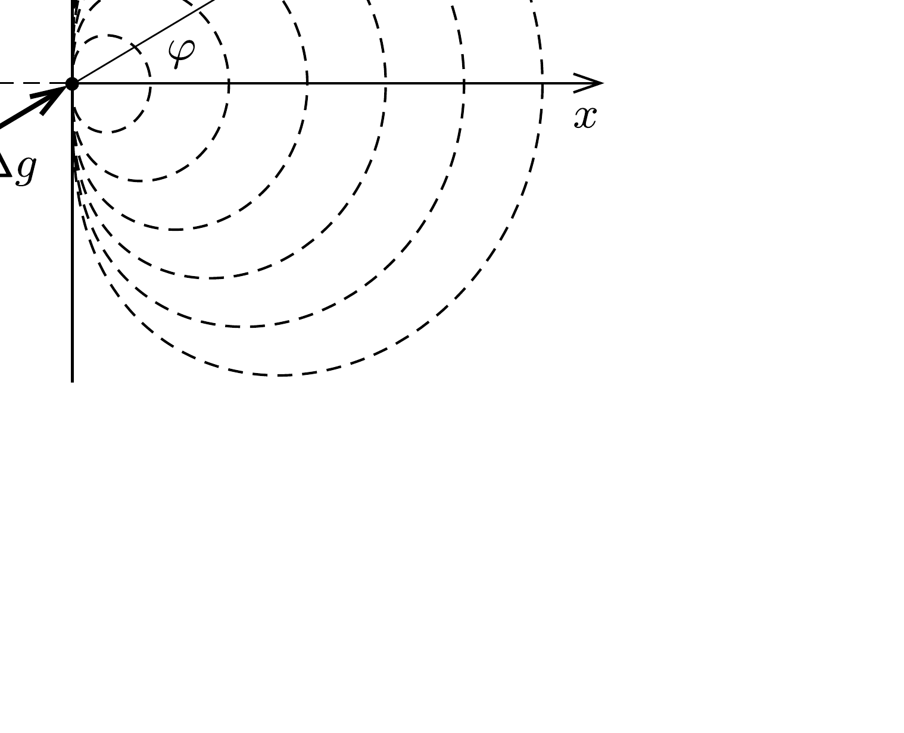

## Útmutatás

Az általánosság megsértése nélkül kitúzhetjük célul, hogy állítsuk elő a koordináta-rendszerünk origójában a lehető legnagyobb, $x$ irányú gravitációs térerősséget. Vizsgáljuk meg, hogy milyen alakú felületre helyezhetünk el adott $\Delta V$ térfogatú, kicsiny gyurmadarabkákat úgy, hogy azok ugyanakkora, $x$ irányú gravitációs térerősség-komponenst állítsanak elő az origóban. Az így kapott felületekre tekinthetünk „szintfelületekként”: egy adott térfogatú gyurmadarab annál
nagyobb $x$ irányú térerősség-komponenst hoz létre az origóban, minél kisebb méretú szintfelületen fekszik.

## Megoldás

Tegyük fel, hogy a koordináta-rendszerünk origójában, $x$ irányban szeretnénk a lehető legnagyobb gravitációs térerósséget létrehozni. Az origótól $r$ távolságra, az $x$ tengelyhez képest $\varphi$ szögben található, $\Delta V$ térfogatú gyurmadarabka az origóban
\[
\Delta g=\gamma \frac{\varrho \Delta V}{r^{2}}
\]
gravitációs térerősséget hoz létre (itt $\varrho$ a gyurma súrúsége). Ennek $x$ irányú komponense $\Delta g_{x}=\Delta g \cos \varphi$, ezért a gyurma egyes darabkái térfogategységenként
\[
\frac{\Delta g_{x}}{\Delta V}=\gamma \varrho \frac{\cos \varphi}{r^{2}}
\]
értékkel járulnak hozzá az $x$ irányú térerősséghez. Ez a térfogategységre vonatkoztatott

„fajlagos $x$ irányú gravitálóképesség” ugyanakkora a gyurma azon pontjaiban, melyekre a $\cos \varphi / r^{2}$ hányados állandó, vagyis az olyan „szintfelületeken”, melyek az
\[
r(\varphi)=a \sqrt{\cos \varphi}
\]
polárkoordinátás egyenlettel írhatók le, ahol $a$ a szintfelületeket jellemző állandó (lásd az ábrát). Minél nagyobb az $a$ tényezó értéke, annál nagyobb a szintfelület mérete, és annál kisebb a felület pontjaiban a $\Delta g_{x} / \Delta V$ fajlagos gravitálóképesség.

Képzeljük el, hogy az adott térfogatú gyurmát éppen szintfelület-alakúra formázzuk, és jelöljük ezt a felületet $S$-sel! Ebből az állapotból kiindulva bárhogyan is deformáljuk a gyurmát, annak egy része (a gyurma térfogatának állandósága miatt) az $S$ felület belsejéből azon kívülre kerül, s így az origóban keltett gravitációs térerősség $x$ irányú komponense biztosan csökken. Az origóban a gravitációs gyorsulás tehát akkor a lehető legnagyobb, ha a gyurmát az (1) egyenlettel megadott alakúra gyúrjuk.

Megjegyzés. A gyurma $V$ térfogatának ismeretében a gyurma alakját leíró (1) egyenletben szereplő $a$ tényezőt számszerúen is meghatározhatjuk. Az $(r, \varphi)$ polárkoordinátákat $(x, y)$ derékszögü koordinátákra átírva:
\[
x=r \cos \varphi=a(\cos \varphi)^{3 / 2}, \quad y=r \sin \varphi=a(\cos \varphi)^{1 / 2} \sin \varphi .
\]
Ezeket felhasználva a gyurma (mint forgástest) térfogata:
\[
V=\int_{0}^{a} \pi y^{2}(x) \mathrm{d} x=-\frac{3 \pi}{2} a^{3} \int_{\pi / 2}^{0}(\cos \varphi)^{3 / 2} \sin ^{3} \varphi \mathrm{~d} \varphi=\frac{4 \pi}{15} a^{3} .
\]
Ebből $a$ kifejezhető, így a $V$ térfogatú gyurma alakját leíró polárkoordinátás egyenlet:
\[
r(\varphi)=\sqrt[3]{\frac{15 V}{4 \pi}} \sqrt{\cos \varphi} .
\]
