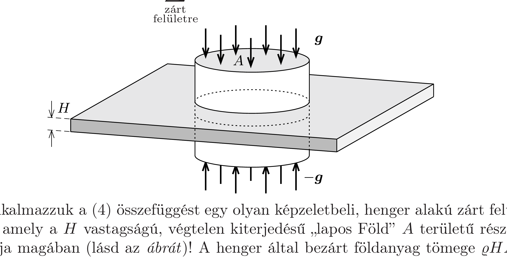

## Útmutatás

A gravitációs mező és az elektrosztatikus mező törvényszerúségei nagyon hasonlók egymáshoz. Használjuk fel ezt az analógiát, és alkalmazzuk Gauss törvényét!

## Megoldás

Az $R$ sugarú, $M$ tömegú, $\varrho$ sứrúségú Föld felületén a gravitációs gyorsulás a következő alakban adható meg:
\[
g_{\text {gömb }}=\gamma \frac{M}{R^{2}}=\gamma \frac{\frac{4}{3} \pi R^{3} \varrho}{R^{2}}=\frac{4}{3} \pi \gamma \varrho R .
\]
A feladat megoldásához meg kell határoznunk egy $H$ vastagságú, végtelen kiterjedésú, $\varrho$ súrúségú „lemez” közelében a gravitációs gyorsulás nagyságát. Viszonylag könnyen célt érhetünk, ha felhasználjuk az elektrosztatikus és a gravitációs erốtörvény közötti analógiát.

A Coulomb-törvény szerint egy $Q$ ponttöltéstől $r$ távolságra az elektromos térerősség nagysága
\[
E(r)=\frac{1}{4 \pi \varepsilon_{0}} \frac{Q}{r^{2}} .
\]

Ugyanez az eredmény megkapható az elektrosztatika Gauss-törvényének felhasználásával is, mely szerint az elektromos térnek egy zárt felületre vonatkoztatott fluxusa arányos a felület által bezárt töltés nagyságával:
\[
\sum_{\substack{\text { zárt } \\ \text { fleliuletre }}} \boldsymbol{E}(\boldsymbol{r}) \Delta \boldsymbol{A}=\frac{1}{\varepsilon_{0}} Q,
\]
ahol $\Delta \boldsymbol{A}$ a zárt felület egy kis darabkájának felületelem-vektora.
Egy pontszerú, $m$ tömegú testtől $r$ távolságban a gravitációs térerősséget a Newton-féle gravitációs törvény adja meg:
\[
g(r)=\gamma \frac{m}{r^{2}},
\]
ami alakilag nagyon hasonló a (2) Coulomb-törvényhez. Az analógiát felhasználva a (3) Gauss-törvényt megfogalmazhatjuk gravitációs mezőre is, ha a $Q$ töltést az $m$ tömegre, az $1 /\left(4 \pi \varepsilon_{0}\right)$ arányossági tényezőt pedig a $\gamma$ gravitációs állandóra cseréljük. A gravitációs térerősség irányát is figyelembe véve a „gravitációs Gausstörvény" tehát a következő alakot ölti:

Alkalmazzuk a (4) összefüggést egy olyan képzeletbeli, henger alakú zárt felületre, amely a $H$ vastagságú, végtelen kiterjedésú „lapos Föld” $A$ területú részét foglalja magában (lásd az ábrát)! A henger által bezárt földanyag tömege $\varrho H A$, a gravitációs térerősség pedig a szimmetria miatt mindenhol merőleges a sík-Föld felszínére, ezért (4) így részletezhető:
\[
-2 g_{\text {sík }} \cdot A=-4 \pi \gamma \cdot \varrho H A .
\]
(A fluxus kiszámításánál figyelembe vettük, hogy a gravitációs térerósség a zárt felület belsejébe mutat.) Ebből a sík Földön a gravitációs gyorsulás nagysága:
\[
g_{\text {sík }}=2 \pi \gamma \varrho H .
\]
Az (1) és (5) kifejezéseket összehasonlítva leolvasható, hogy a feladat $g_{\text {gömb }}=g_{\text {sík }}$ feltétele akkor teljesül, ha a „sík Föld" vastagsága
\[
H=\frac{2}{3} R=\frac{2}{3} \cdot 6370 \mathrm{~km} \approx 4250 \mathrm{~km} .
\]
