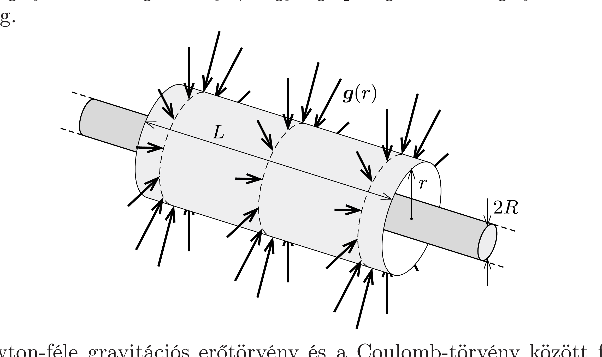

## Útmutatás

A hosszú, henger alakú bolygó gravitációs mezője a bolygó felszínéhez közel az előző feladatban szereplő „gravitációs Gauss-törvény” segítségével határozható meg. Vigyázat: ez az erőtér más jellegú a bolygó közelében, mint a bolygótól a hosszával összemérhető (vagy még annál is sokkal nagyobb) távolságban!

## Megoldás

Egy nagyon hosszú henger körül a gravitációs erótér hengerszimmetrikus, a térerősség iránya (a henger végeitől elegendően távol) radiális, azaz a henger tengelyére merőleges irányú, nagysága pedig csak a tengelytől mért távolságtól függ.

A Newton-féle gravitációs erótörvény és a Coulomb-törvény között fennálló analógiát felhasználva megállapíthatjuk, hogy egy $m$ tömegú testbe „belépő“ gravitációs erốvonalak száma (a $\boldsymbol{g}$ gravitációs gyorsulás és a rá meróleges felület szorzata) $4 \pi \gamma \cdot m$ (lásd még az előzó feladat megoldását). Ez alapján az $R$ sugarú bolygót körülvevő, $L$ hosszúságú és $r>R$ sugarú henger palástján belépő $g$-vonalak száma és a hengerben található tömeg kapcsolata:
\[
g \cdot 2 \pi r L=4 \pi \gamma R^{2} \pi L \varrho, \quad \text { azaz } \quad g(r)=\frac{2 \pi \gamma \varrho R^{2}}{r} .
\]
(A hengerszimmetrikus tömegeloszlásúnak feltételezett bolygó átlagos súrúségét $\varrho$-val jelöltük.)
a) A gravitációs térerősség ismeretében az első kozmikus sebesség (azaz az $R$ sugarú körpályához tartozó sebesség) meghatározható. Egy $m$ tömegứ, pontszerú test $r$ sugarú körpályán való mozgásának feltétele:
\[
m g(r)=m \frac{v_{\mathrm{k}, 1}^{2}}{r},
\]
ahonnan (1) felhasználásával kapjuk a keringés sebességét:
\[
v_{\mathrm{k}, 1}=R \sqrt{2 \pi \gamma \varrho}=9,7 \frac{\mathrm{~km}}{\mathrm{~s}} .
\]
Ez az eredmény független a körpálya sugarától (ugyanekkora $r=R$ esetén is), ekkora tehát a henger alakú bolygón az első kozmikus sebesség. Ez a Földre érvényes
\[
v_{\mathrm{k}, 1}^{\text {Föld }}=\sqrt{\frac{\gamma M_{\text {Föld }}}{R}}=R \sqrt{\frac{4}{3} \pi \gamma \varrho}=7,9 \frac{\mathrm{~km}}{\mathrm{~s}}
\]
értéknél $\sqrt{3 / 2}$-szer nagyobb.
b) Egy $r$ sugarú pályán keringő műhold keringési ideje $2 \pi r / v_{\mathrm{k}, 1}$, ha tehát a bolygó tengely körüli forgásának periódusideje $T_{0}=1$ nap, akkor a szinkronmúhold pályasugara
\[
r_{0}=\frac{T_{0} v_{\mathrm{k}, 1}}{2 \pi}=R \sqrt{\frac{T_{0}^{2} \gamma \varrho}{2 \pi}}=1,33 \cdot 10^{8} \mathrm{~m} .
\]
A Föld esetében ez a távolság
\[
r_{0}^{\text {Föld }}=R \sqrt[3]{\frac{T_{0}^{2} \gamma \varrho}{3 \pi}}=4,2 \cdot 10^{7} \mathrm{~m},
\]
amelynek felhasználásával $r_{0}$ így is írható:
\[
r_{0}=\sqrt{\frac{3\left(r_{0}^{\text {Föld }}\right)^{3}}{2 R}} .
\]
A távközlési szinkronműholdak tehát $r_{0}-R \approx 127000 \mathrm{~km}$ magasan keringenek a hosszú, henger alakú bolygó felszíne felett.
c) A második kozmikus sebesség, azaz a bolygóról való szökési sebesség nagyon nagy, hogy pontosan mekkora, az a bolygó hosszától függ. Végtelen hosszú bolygó esetén a szökési sebesség is végtelen nagy, mert az $1 / r$-es törvény szerint változó erósségú gravitációs térből véges energiabefektetéssel nem lehet megszökni.

Ennek belátására tekintsük a távolságoknak egy mértani haladvány szerint növekvő sorozatát: $r_{n}=r_{0} \alpha^{n}\left(\alpha>1\right.$ és mondjuk $\left.r_{0}=R\right)$. Az $r_{n-1}$ magasságból $r_{n}$ magasságba való feljutáshoz szükséges $E\left(r_{n-1} \rightarrow r_{n}\right)$ energia független $n$-tól: $n$ növelésekor ahányszorosára csökken az erő, annyiszorosára nő az út. Ebből következik, hogy $r_{0}$ magasságból az $r_{N}$ magasságba való feljutáshoz $E\left(r_{0} \rightarrow r_{N}\right)=N E\left(r_{0} \rightarrow r_{1}\right)$ energia kell. Látszik tehát, hogy véges energiával csak véges magasságra lehet feljutni.

Ha a bolygó véges $H$ hosszúságú, akkor amíg a végeitől távol vagyunk, és $r \ll H$, addig az erótörvény $1 / r$-es. Ha viszont $r$ összemérhető $H$-val, akkor az erótörvény jellege megváltozik, és $r \gg H$ esetén már a megszokott $1 / r^{2}$-es lesz. Egy ilyen bolygóról már véges nagyságú kezdősebességgel indulva is meg lehet szökni.

Megjegyzés. Integrálszámítás segítségével belátható, hogy a második kozmikus sebesség az első kozmikus sebességnek kb. $\sqrt{2 \ln (H / R)}$-szerese. (A Föld esetében az arány $\sqrt{2}$.) Ez a logaritmikus faktor még $H \gg R$ esetén sem túlságosan nagy (pl. $H=10 R$-nél $v_{\mathrm{k}, 2} / v_{\mathrm{k}, 1}$ kb. 2,1 és $H=1000 R$ esetén is csak 3,7).
