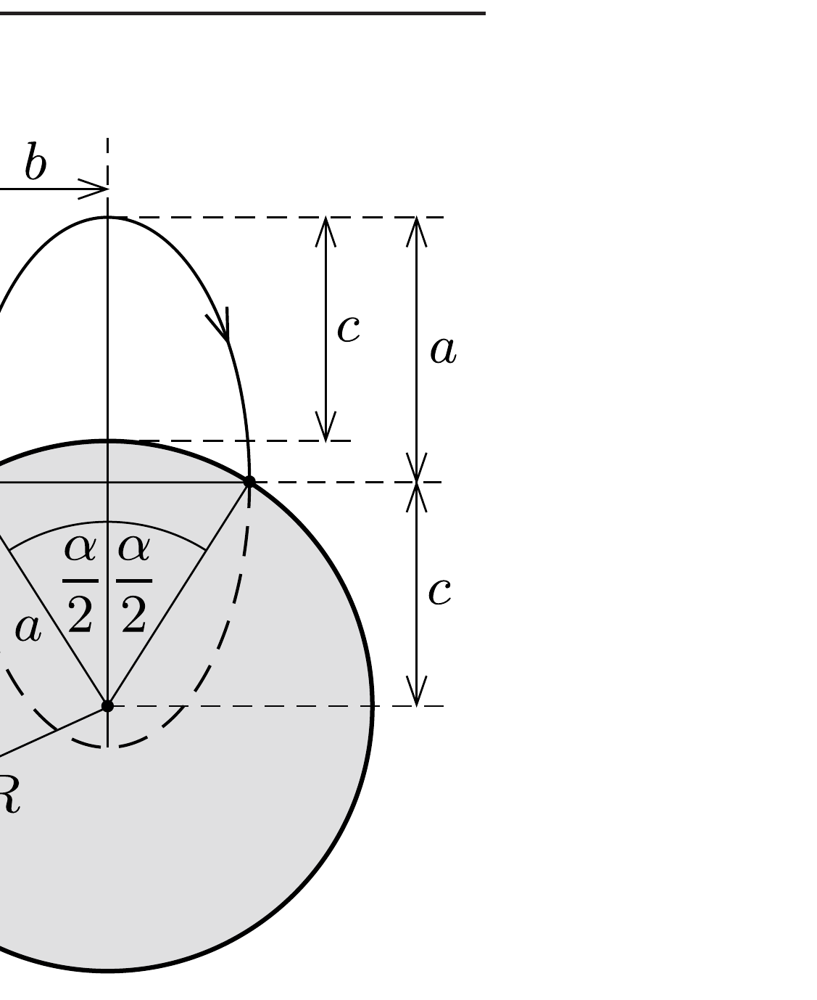
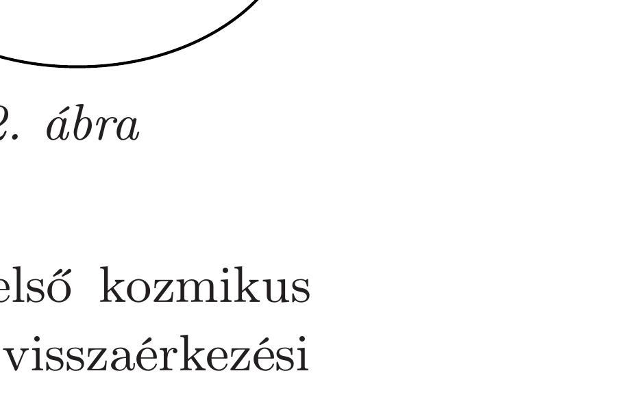

## Útmutatás

A megoldáshoz vezetố út során Kepler mindhárom törvényét alkalmaznunk kell.

## Megoldás

A mesterséges hold pályája Kepler I. törvénye szerint egy olyan ellipszis, melynek egyik fókuszpontja egybeesik a bolygó középpontjával. Az 1. ábráról leolvasható, hogy $(\alpha>0$ esetén) visszaérkezéskor a sebességvektor akkor lesz párhuzamos (és ellentétes irányú) a kilövés sebességével, ha a kilövési és a visszaérkezési pontok az ellipszis kistengelyének végpontjai. Ekkor viszont az ellipszis $2 a$ nagytengelye éppen a bolygó sugarának kétszerese, tehát $a=R$. Az ábra segítségével a mühold földfelszíntől mért legnagyobb eltávolodását is meghatározhatjuk:
\[
c=R \cos \frac{\alpha}{2} .
\]

Kepler III. törvénye értelmében a keringési idők a különböző lapultságú, de azonos nagytengelyú pályákon ugyanakkorák, tehát a szóban forgó ellipszispályán is a teljes keringési idő a megadott $T_{0}$-lal lenne egyenlő. A múhold azonban csak a pálya felét teszi meg. Az ehhez szükséges idő nem a keringési idő fele, hanem (Kepler II. törvénye szerint) a vezérsugár által súrolt területtel arányos. Mivel az ellipszis teljes területe
\[
A_{0}=a b \pi=a^{2} \pi \sin \frac{\alpha}{2},
\]
a pálya felének megtétele alatt a vezérsugár által súrolt terület pedig (az 1. ábra jelöléseivel)

\[
A_{1}=a b \frac{\pi}{2}+b c=\frac{1}{2} a^{2} \pi \sin \frac{\alpha}{2}+a^{2} \sin \frac{\alpha}{2} \cos \frac{\alpha}{2},
\]
ezért a mesterséges hold által az úrben töltött idő
\[
T_{1}=\frac{A_{1}}{A_{0}} T_{0}=T_{0}\left(\frac{1}{2}+\frac{1}{\pi} \cos \frac{\alpha}{2}\right) .
\]

Hátravan még az $\alpha \rightarrow 0$ határeset vizsgálata. Az (1) és (2) összefüggések szerint ekkor
\[
T_{1} \rightarrow T_{0}\left(\frac{1}{2}+\frac{1}{\pi}\right),
\]
a felszíntől való legnagyobb eltávolodás pedig $R$-hez tart. Ezzel szemben $\alpha=0$ esetén (amikor a műholdat sugárirányban lőjük ki, vagyis az indítási és a visszaérkezési pont egybeesik) tetszőleges kilövési sebesség megfelelő, és az eltávolodás nagysága is akármilyen nagy vagy kicsi lehet! Ezek a mennyiségek tehát nem folytonos függvényei $\alpha$-nak az $\alpha=0$ pontban (sőt, a kapcsolat szigorúan véve nem is függvényszerú).

Megjegyzések. 1. Ismert, hogy egy rögzített vonzócentrum körül ellipszispályán mozgó mû́hold energiája csak az ellipszis nagytengelyének hosszától függ, lapultságától nem. Mivel az $\alpha=180^{\circ}$ speciális esetben a múhold végig a bolygó felszínének közelében halad $(c=0)$, sebessége pedig az első kozmikus sebesség, ezért a feladatban leírt ellipszispálya $0<\alpha<180^{\circ}$ esetén is úgy valósítható meg, hogy a műholdat az első koz-

mikus sebességgel indítjuk.
2. Ha $\alpha=0$ és a kilövési sebesség elegendően nagy (legalább az első kozmikus sebességgel egyenlő), akkor a 2. ábrán látható pálya is megvalósítható. A visszaérkezési sebesség ebben az esetben is párhuzamos a kilövési sebességgel, ráadásul még az irányuk is megegyezik. A bolygótól való eltávolodás tetszőlegesen nagy lehet, a mühold repülési ideje pedig legalább $T_{0}$.
