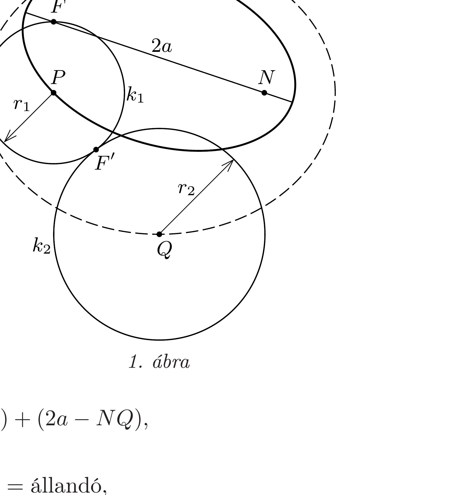
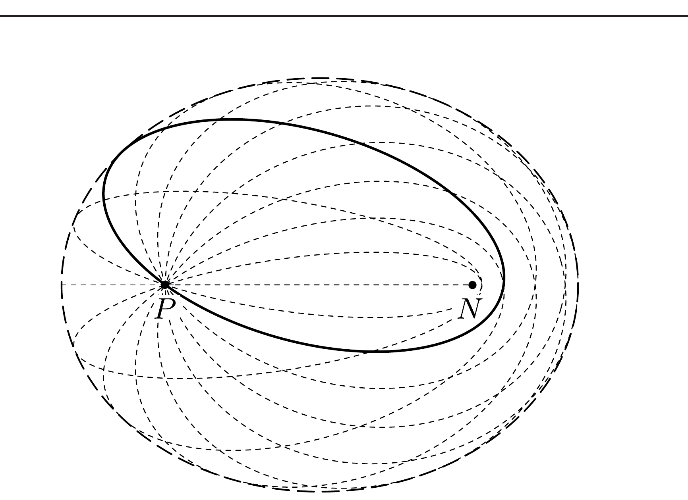

## Útmutatás

A törmelék darabjai azonos nagytengelyú ellipszispályákon mozognak, melyek egyik fókuszpontjában áll a Nap. Keressük meg, hol helyezkedik el az ellipszisek másik fókuszpontja, és használjuk fel, hogy a burkológörbe minden pontja pontosan egy ellipszispályán van rajta!

## Megoldás

Az üstökösök kezdeti összenergiája a parabolapályából következően nulla, így az ütközéskor bekövetkező energiaveszteség miatt az azonos kezdősebességgel induló törmelékdarabok ellipszispályán fognak mozogni. Ismert, hogy a Nap körüli ellipszispályák nagytengelye csak az összenergia fajlagos (tömegegységre eső) értékétől függ, tehát a törmelékdarabok pályájának nagytengelye is azonos. Jelöljük az üstökösök ütközési pontját $P$-vel, a Nap helyét $N$-nel, az ellipszisek nagytengelyét pedig $2 a$-val (1. ábra)!

Felhasználva a probléma forgásszimmetriáját, vizsgálódjunk valamelyik, az $N P$ szakaszt tartalmazó, önkényesen választott síkban! Az ellipszisek egyik fókuszpontja közös: ez a Nap. A másik fókusz távolsága a $P$ ponttól
\[
r_{1}=2 a-N P
\]
adott, hiszen az ellipszis pontjainak a két fókusztól mért távolságának összege éppen a nagytengely hosszával egyenlő. Az ellipszisek $N$ ponton kívüli másik fókuszai tehát a $P$ középpontú, $r_{1}$ sugarú $k_{1}$ körön fekszenek.

Tekintsünk most egy tetszőleges $Q$ pontot a síkban! Ha a $Q$ ponton halad át ellipszis, akkor a fókuszpontjának
\[
r_{2}=2 a-N Q
\]
távolságra kell lennie a $Q$ ponttól. Rajzoljunk $Q$ köré egy $r_{2}$ sugarú $k_{2}$ kört! Három eset lehetséges.
1. Ha $k_{2}$ metszi a $k_{1}$ kört, akkor a $Q$ pont két különböző ellipszisen is rajta van, a keletkező metszéspontok pedig megadják e két ellipszis fókuszpontjait.
2. Ha a $k_{1}$ és $k_{2}$ körnek nincs közös pontja, akkor a $Q$ ponton nem halad át a törmelékdarabok egyik lehetséges pályája sem, tehát $Q$ a burkológörbén kívül helyezkedik el.
3. Az első két esetet elválasztó határhelyzetben, amikor a $k_{1}$ és $k_{2}$ körök érintik egymást (az ábrán látható $F^{\prime}$ pontban), a $Q$ ponton egyetlen ellipszis halad át. Ez azt jelenti, hogy $Q$ éppen rajta van a burkológörbén.

A harmadik esetben fennáll, hogy
\[
P Q=r_{1}+r_{2}=(2 a-N P)+(2 a-N Q),
\]
vagyis
\[
N Q+P Q=4 a-N P=\text { állandó, }
\]
tehát a burkológörbe pontjai egy ellipszisen fekszenek. A forgásszimmetria miatt a törmelékdarabok pályájának burkolója térben egy $4 a-N P$ nagytengelyú, $P$ és $N$ fókuszpontú forgásellipszoid (2. ábra).

