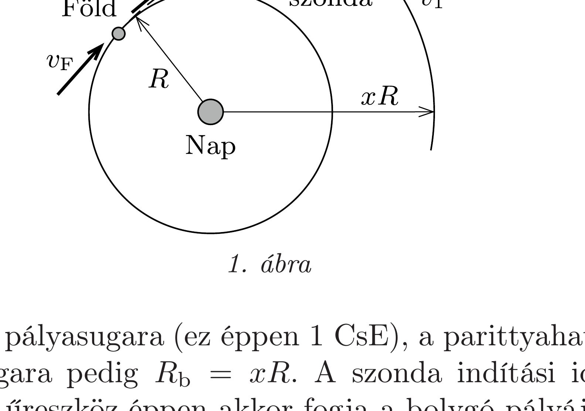
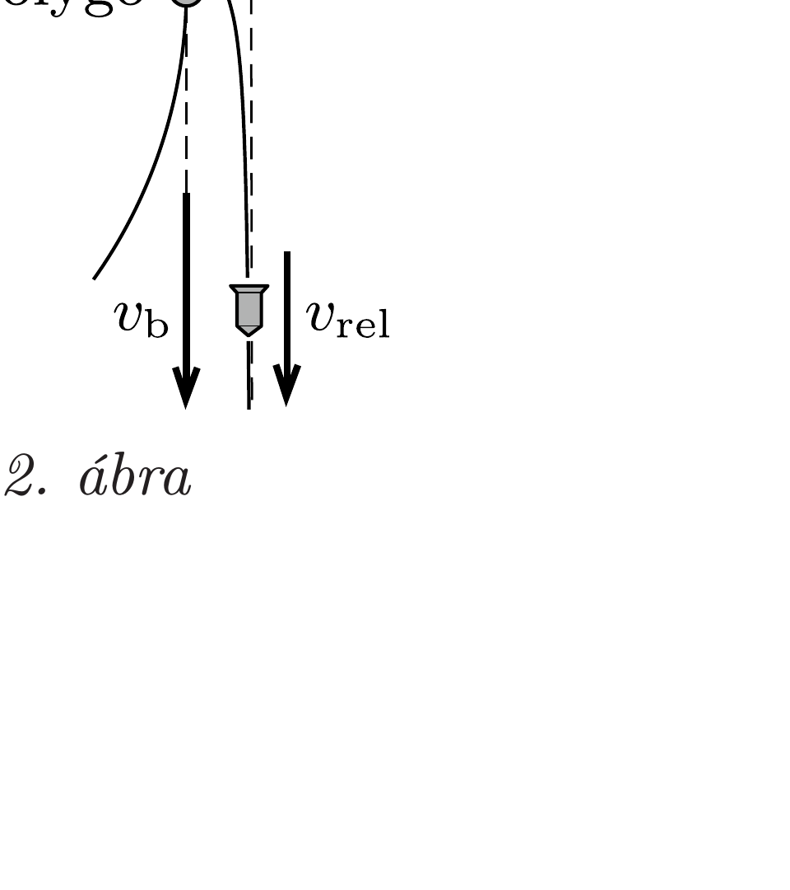
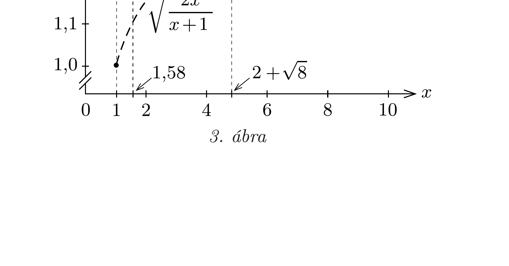

## Útmutatás

A szondát érdemes úgy indítani, hogy a Föld vonzáskörzetének „elhagyása" után a Naphoz viszonyított sebessége a Föld $\boldsymbol{v}_{\mathrm{F}}$ keringési sebességével azonos irányú legyen, hiszen akkor a Föld és a szonda sebességének nagysága összeadódik.

A bolygóközi térben mozgó szondára alkalmazható a Nap gravitációs terével számolt energia- és perdületmegmaradás törvénye, a „hintamanővert” pedig érdemes a bolygóhoz rögzített koordináta-rendszerből tárgyalni.

## Megoldás

Jelöljük $v_{0}$-lal azt a sebességet, amellyel a szonda a Naphoz képest álló vonatkoztatási rendszerben a Föld gravitációs környezetének „elhagyása” után rendelkezik. (Ez a gyakorlatban annyit jelent, hogy a szonda távolsága a Földtől már sokkal nagyobb a Föld sugaránál, de a Nap-Föld távolsághoz képest még elenyészően kicsi.) Feladatunk $v_{0}$ legkisebb (de a Naprendszer elhagyásához elegendő́) értékének meghatározása.

Megjegyzés. A Föld $v_{\mathrm{F}}$ keringési sebességének és tengely körüli forgásának „segítő hatását" figyelembe véve a szondát a Föld felszínéről $v_{0}$-nál kisebb,
\[
v_{\mathrm{i}}=\sqrt{\left(v_{0}-v_{\mathrm{F}}\right)^{2}+(11,2 \mathrm{~km} / \mathrm{s})^{2}}-0,5 \mathrm{~km} / \mathrm{s}
\]
nagyságú sebességgel kell indítani (lásd az 68. feladat megoldását!). Mivel azonban $v_{0}$ monoton növekvő függvénye $v_{\mathrm{i}}$-nek, a legkisebb $v_{\mathrm{i}}$ helyett kereshetjük $v_{0}$ minimálisan elegendő értékét is.

Legyen $R$ a Föld pályasugara (ez éppen 1 CsE), a parittyahatást kiváltó bolygó keresett pályasugara pedig $R_{\mathrm{b}}=x R$. A szonda indítási idejének alkalmas választása esetén az úreszköz éppen akkor fogja a bolygó pályáját elérni, amikor a bolygó is a közelben tartózkodik (1. ábra). A szonda sebességének $v_{1}$ tangenciális és $v_{2}$ radiális komponensét a bolygó pályájánál (de a bolygó hatásával még
nem számolva) a perdületmegmaradásból és az energiamegmaradás törvényéből határozhatjuk meg:
\[
m R v_{0}=m x R v_{1}, \quad \text { vagyis } \quad v_{1}=\frac{v_{0}}{x},
\]
illetve
\[
\frac{1}{2} m v_{0}^{2}-\gamma \frac{M m}{R}=\frac{1}{2} m\left(v_{1}^{2}+v_{2}^{2}\right)-\gamma \frac{M m}{x R} .
\]
( $m$ a szonda tömegét, $M$ pedig a Nap tömegét jelöli.) Érdemes még kiszámítani a Föld és a bolygó keringési sebességét. A centripetális gyorsulásokból
\[
\gamma \frac{M}{R^{2}}=\frac{v_{\mathrm{F}}^{2}}{R},
\]
azaz
\[
v_{\mathrm{F}}^{2}=\frac{\gamma M}{R},
\]
és hasonlóan a bolygó sebessége:
\[
v_{\mathrm{b}}=\sqrt{\frac{\gamma M}{x R}}=\frac{1}{\sqrt{x}} v_{\mathrm{F}} .
\]
(1), (2) és (3)-ból kiszámíthatjuk, hogy
\[
v_{2}=\sqrt{v_{0}^{2}\left(1-\frac{1}{x^{2}}\right)-2 v_{\mathrm{F}}^{2}\left(1-\frac{1}{x}\right)},
\]
ami akkor valós, ha a gyök alatt nemnegatív kifejezés áll, vagyis teljesül, hogy
\[
v_{0} \geq v_{\mathrm{F}} \sqrt{\frac{2 x}{1+x}} .
\]
Ellenkező esetben a szonda nem jut el a bolygó pályasugarának megfelelő (a Naptól $x$ csillagászati egységre lévố) távolságig.

Üljünk bele - gondolatban - a bolygóhoz rögzített koordináta-rendszerbe! Innen nézve a szonda sebessége a Nappal ellentétes irányban $v_{2}$, erre meróleges (tangenciális) irányban pedig $v_{1}-v_{\mathrm{b}}$, a szonda és a bolygó relatív sebessége tehát
\[
v_{\mathrm{rel}}=\sqrt{\left(v_{1}-v_{\mathrm{b}}\right)^{2}+v_{2}^{2}} .
\]
A bolygóval „ütköző“ szonda sebességének iránya - az ütközési paraméterek gondos beállításával - gyakorlatilag tetszőlegesen megváltoztatható, így pl. elérhető (2. ábra),

hogy az ütközés után a szonda Naphoz viszonyított sebessége és a bolygó sebessége azonos irányú legyen. (A Naprendszer elhagyása szempontjából ez a legkedvezóbb eset, hiszen ekkor lesz a szonda Naphoz viszonyított sebessége a lehető legnagyobb.)

Az ütközésnél - a bolygóhoz rögzített rendszerben - a szonda mechanikai energiája megmarad, így a bolygótól eltávolodva ismét $v_{\text {rel }}$ nagyságú lesz. A Nap koordináta-rendszerében a szonda sebessége $v_{\mathrm{rel}}+v_{\mathrm{b}}$, és ha ez eléri a bolygó pályasugarához tartozó $\sqrt{2} v_{\mathrm{b}}$ szökési sebességet, a szonda elhagyhatja a Naprendszert. Ennek feltétele:
\[
v_{\mathrm{rel}}=(\sqrt{2}-1) v_{\mathrm{b}} .
\]
(5), (7) és (8) felhasználásával $v_{0}$-ra egy másodfokú egyenletet kapunk, amelynek $x>1$ feltétel esetén pozitív megoldása:
\[
\frac{v_{0}}{v_{\mathrm{F}}}=\frac{1}{\sqrt{x^{3}}}+\sqrt{\frac{1}{x^{3}}+2-\frac{\sqrt{8}}{x}} \equiv f(x) .
\]
A kapott eredmény $x \leq 2+\sqrt{8}$ esetén teljesíti a (6) feltételt, ennél nagyobb $x$ értékeknél azonban (9) helyett a (6) egyenlettel határozhatjuk meg a minimális indítási sebességet. A Naptól $x$ csillagászati egység távolságra lévő bolygó lendítő hatásával tehát akkor tudja az úrszonda elhagyni a Naprendszert, ha kezdősebessége legalább
\[
\left(\frac{v_{0}}{v_{\mathrm{F}}}\right)_{\min }= \begin{cases}f(x) & \text { ha } 1 \leq x \leq 2+\sqrt{8} \\ \sqrt{\frac{2 x}{x+1}} & \text { ha } x>2+\sqrt{8}\end{cases}
\]

A leghatásosabb hintamanóvert (parittyahatást) előidézni képes bolygó (csillagászati egységekben mért) pályasugarát a (10) kifejezés minimumhelye adja meg. Ha $x \approx 1$ vagy $x \gg 1$, akkor (10) szerint $v_{0} \approx \sqrt{2} v_{\mathrm{F}}$, vagyis a szükséges indítási sebesség megegyezik a parittyahatás nélküli úrprogram esetével. Ez szemléletesen jól érthetős: a Föld (vagy a Földhöz közeli pályán keringő égitest) nem képes nagyot lendíteni a szondán, hiszen a relatív tangenciális sebességük igen kicsi lenne. Egy nagyon távoli égitest (pl. a Pluto) sem lenne hatékony „csúzli”, mert ha a szonda „saját erejéből” odáig eljutott, akkor már majdnem elhagyta a Naprendszert, további segítségre alig van szüksége.

A (10) kifejezést grafikusan ábrázolva megállapíthatjuk, hogy a legkisebb indítási sebességet $x=1,58$-nál kapjuk (lásd a 3. ábrát). Érdekes, hogy ez az érték majdnem pontosan megegyezik a Mars pályasugarával (1,52 CsE), a (közel) optimális hintamanóver tehát ténylegesen megvalósítható!

Megjegyzések. 1. A Mars pályasugarával számolva az úrszonda minimális kezdősebessége a Naphoz képest $v_{0}=1,18 v_{\mathrm{F}} \approx 35,2 \mathrm{~km} / \mathrm{s}$. Ez az érték a parittyahatás nélkül $\sqrt{2} v_{\mathrm{F}} \approx 42,1 \mathrm{~km} / \mathrm{s}$ lenne. Ennél sokkal drámaibb a különbség, ha a szonda földfelszínhez viszonyított $v_{\mathrm{i}}$ indítási sebességére vagyunk kíváncsiak. Az 68. feladatban kapott
\[
v_{\mathrm{i}}=\sqrt{\left(v_{0}-v_{\mathrm{F}}\right)^{2}+(11,2 \mathrm{~km} / \mathrm{s})^{2}}-0,5 \mathrm{~km} / \mathrm{s}
\]
összefüggés szerint hintamanőver nélkül minimálisan 16,2 km/s kilövési sebesség szükséges a Naprendszer elhagyásához, a gravitációs parittya segítségével pedig mindössze 11,9 km/s is elegendő.
2. A Nap vonatkoztatási rendszerében az úrszonda energiája nem marad meg, a hintamanőver során energiát nyer a bolygótól. Ennek következtében a bolygó teljes energiája ugyanennyivel csökken, ami a bolygó pályasugarának észrevehetetlenül kicsiny csökkenéséhez és sebességének minimális növekedéséhez vezet.
