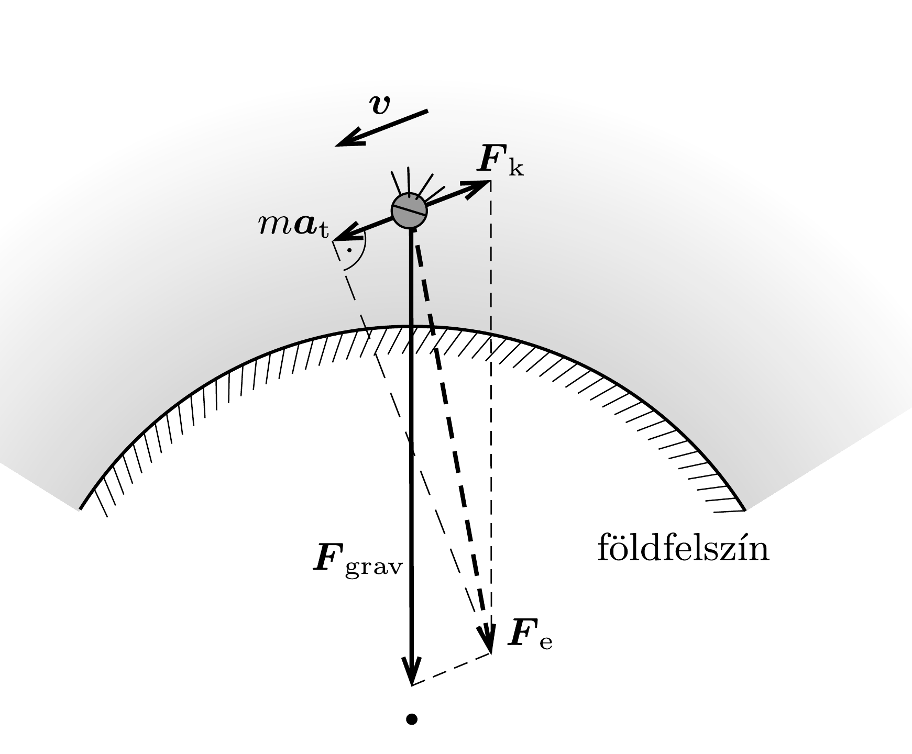

## Útmutatás

A múholdra mozgása során végig jó közelítéssel érvényes marad a körmozgás dinamikai feltétele. Energetikai megfontolások alapján beláthatjuk, hogy a múhold mozgási energiája éppen annyival növekszik, amennyivel az összenergiája csökken, vagyis a közegellenállás okozta veszteség a várakozással ellentétben nem csökkenti, hanem növeli a mühold sebességét. Ennek dinamikai oka, hogy a sebességgel ellentétes irányú közegellenállási erő és a müholdra ható gravitációs eró eredője a „spirális” pálya miatt nem merőleges a múhold sebességére, az eredő erő pályamenti komponense a sebességgel megegyező irányú.

## Megoldás

a) A légkörben súrlódó műhold pályája mindvégig körrel közelíthető, ezért a mozgás dinamikai feltétele
\[
\gamma \frac{m M}{r^{2}}=m \frac{v^{2}}{r},
\]
ahol $m$ és $M$ a múhold, illetve a Föld tömege, $r$ a mühold távolsága a Föld középpontjától, $v$ pedig a múhold sebessége. Ebből a
\[
v=\sqrt{\frac{\gamma M}{r}}
\]
összefüggésre jutunk, ahonnan leolvasható, hogy ha a mühold keringési magassága (pályasugara) csökken, akkor a sebessége növekszik, azaz a mühold a levegó súrlódása következtében felgyorsul! Ezt a meglepő tényt úrhajózási paradoxonnak is szokás nevezni.

A mühold sebességének növekedése dinamikailag is megérthető a (nem méretarányos) ábra segítségével. A közegellenállási erő a sebességgel ellentétes irányú, a gravitációs eró pedig a Föld középpontja felé mutat, az utóbbi viszont a múhold süllyedése miatt nem merőleges a sebességre. A gravitációs eró pályamenti komponense tehát nem nulla, hanem a sebességgel megegyezó irányba mutat. Abban az esetben, ha ez a vetület nagyobb, mint a közegellenállási erő (ahogy azt a $b$ ) részben megmutatjuk), akkor a mühold mozgása valóban felgyorsul.

b) A közegellenállási eró teljesítménye negatív, $\boldsymbol{F}_{\mathrm{k}} \cdot \boldsymbol{v}=-F_{\mathrm{k}} \cdot v$, ez okozza a mühold teljes energiájának csökkenését:
\[
\frac{\Delta E_{\text {össz }}}{\Delta t}=-F_{\mathrm{k}} \cdot v .
\]
A teljes energia a mozgási energiából és a gravitációs potenciális energiából áll:
\[
E_{\text {össz }}=E_{\mathrm{mozg}}+E_{\mathrm{pot}}=\frac{1}{2} m v^{2}+\left(-\gamma \frac{m M}{r}\right) .
\]
Az (1) egyenlet miatt a mozgási és a potenciális energia között mindig fennáll az
\[
E_{\mathrm{pot}}=-2 E_{\mathrm{mozg}}
\]
összefüggés, ezért az összenergiát $E_{\text {össz }}=-E_{\text {mozg }}$ alakban is felírhatjuk. Az összenergia tehát éppen annyit csökken, mint amennyivel a mozgási energia növekszik. Ennek segítségével (2) a következő alakot ölti:
\[
-\frac{\Delta E_{\mathrm{mozg}}}{\Delta t}=-F_{\mathrm{k}} \cdot v,
\]
a mozgási energiát részletezve:
\[
F_{\mathrm{k}} \cdot v=\frac{\Delta\left(\frac{1}{2} m v^{2}\right)}{\Delta t}=m v \frac{\Delta v}{\Delta t} .
\]
A jobb oldalon megjelenő $\Delta v / \Delta t$ nem más, mint a múhold $a_{\mathrm{t}}$ tangenciális (pályamenti) gyorsulása, ezért:
\[
F_{\mathrm{k}}=m a_{\mathrm{t}}, \quad \text { vektorosan } \quad-\boldsymbol{F}_{\mathrm{k}}=m \boldsymbol{a}_{\mathrm{t}} .
\]

Az $m \boldsymbol{a}_{\mathrm{t}}$ kifejezés Newton II. törvénye szerint a müholdra ható $\boldsymbol{F}_{\mathrm{e}}$ eredő erő pályamenti vetületével egyenlő, amely most a gravitációs eró tangenciális komponensének és a közegellenállási erőnek az eredője (lásd az ábrát). A gravitációs
eró pályamenti összetevője (ez növeli a mühold sebességét) tehát (4) értelmében kétszer akkora, mint a közegellenállási erő (ez okozza az energiacsökkenést), így a múhold sebességét éppen a közegellenállási erővel egyenlő nagyságú, de azzal ellentétes irányú erón növeli! (A gravitációs erón sebességre meróleges összetevője okozza a múhold sebességének elfordulását, pályájának görbületét, de ez nem befolyásolja a múhold sebességének nagyságát.)
c) Ismét a mühold teljes energiájának változásából érdemes kiindulnunk, de az összenergiát most ne a mozgási, hanem a gravitációs potenciális energiával fejezzük ki. A (3) összefüggést felhasználva kapjuk, hogy az összes energia és a potenciális energia kis megváltozása közötti kapcsolat:
\[
\Delta E_{\text {össz }}=\frac{1}{2} \Delta E_{\mathrm{pot}} .
\]
A potenciális energia megváltozása kifejezhető a pályasugár kicsiny $\Delta r$ megváltozásával:
\[
\Delta E_{\mathrm{pot}}=\Delta\left(-\gamma \frac{m M}{r}\right)=\gamma \frac{m M}{r^{2}} \Delta r .
\]
Ismert adat, hogy egyetlen ( $2 \pi r / v$ ideig tartó) fordulat során a múhold Föld középpontjától mért távolsága $\varepsilon=100 \mathrm{~m}$-rel csökken, így a műhold pályasugarának változási üteme
\[
\frac{\Delta r}{\Delta t}=-\frac{\varepsilon}{2 \pi r / v} .
\]
A (2), (5), (6), (7) egyenleteket összevetve kifejezhetjük a müholdra ható közegellenállási erốt:
\[
F_{\mathrm{k}}=\frac{1}{4 \pi} \gamma \frac{m M}{r^{3}} \varepsilon .
\]
Felhasználva az (1) összefüggést, valamint azt a tényt, hogy a közegellenállási eró $F_{\mathrm{k}}=c \varrho v^{2}$ alakú, meghatározhatjuk a légkör sürúségét a múhold magasságában:
\[
\varrho=\frac{1}{4 \pi c} \frac{m}{r^{2}} \varepsilon .
\]
Behelyettesítve az $\varepsilon, c$ és $m$ ismert adatokat, valamint a pályasugár $r=6370 \mathrm{~km}+$ $200 \mathrm{~km}=6570 \mathrm{~km}$ értékét:
\[
\varrho=4,0 \cdot 10^{-10} \frac{\mathrm{~kg}}{\mathrm{~m}^{3}} .
\]

Megjegyzések. 1. A légkör ilyen magasan található rétegében (a 85 km-es magasságtól kb. 500 km-ig terjedő termoszférában) ez a rendkívül kicsi súrúség egyáltalán nem szokatlan. A kapott súrúségértékre jellemző, hogy míg szobahőmérsékleten, normál nyomáson a levegő molekulái átlagosan kb. 70 nm utat tesznek meg két ütközés között (ez az átlagos szabad úthossz), addig ugyanez az érték 200 km magasban több mint 200 méter.
2. A termoszférában, a földfelszíntől 330-420 km-es magasságban kering a Nemzetközi Úrállomás is. A közegellenállás miatt az ưrállomás is folyamatosan veszít energiájából, ezért (a Földről felbocsátott üreszközökkel) időről időre magasabb pályára kell „lökni”.
3. Az úrhajózás kezdeti évtizedeiben éppen a feladatban leírt módon, a múholdak pályamagasságának csökkenéséből mérték a termoszférában a légkör sürúségét (ami időben változó adat).
