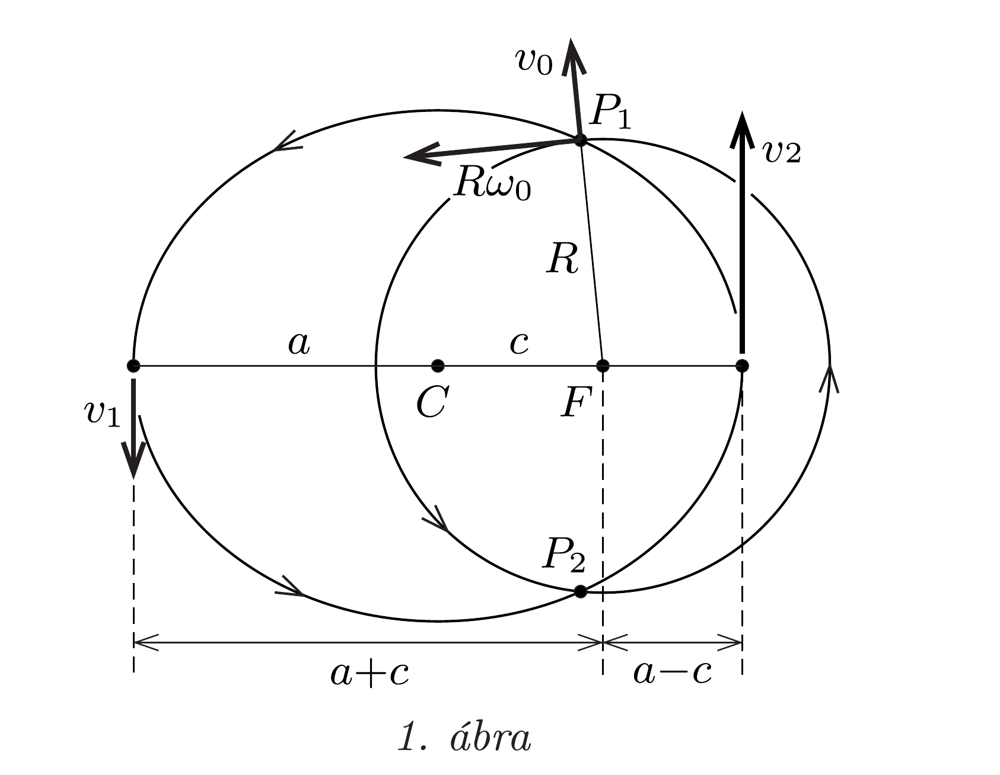
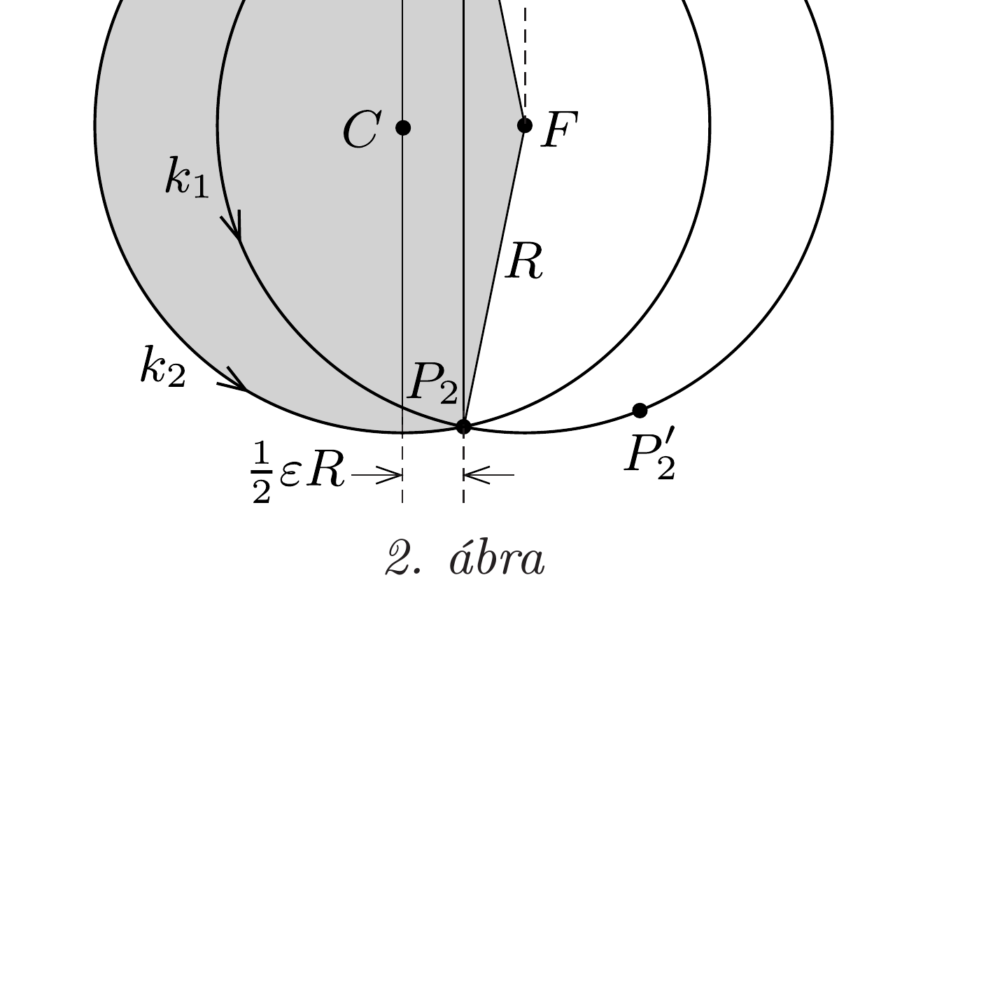

## Útmutatás

A kis kezdősebesség miatt az úrhajós pályája csak nagyon kicsit tér el az ISS pályájától. Célszerú a mozgás leírásához polárkoordinátákat használni. A számolás során megjelenő kicsiny dimenziótlan mennyiségek magasabb hatványait elhanyagolhatjuk.

A Kepler-törvények alkalmazásával is megoldható a feladat. Mindhárom törvényre szüksége lesz annak, aki ezt az utat választja.

## Megoldás

I. megoldás. Az úrállomás $R$ sugarú körpályán $\omega_{0}$ szögsebességgel kering a Föld körül, $T$ keringési ideje mintegy 92 perc. ( $R \approx 6700 \mathrm{~km}$, ez némileg nagyobb, mint a Föld sugara, ezen a pályán a keringési sebesség $R \omega_{0} \approx 7,7 \mathrm{~km} / \mathrm{s}$.)

Írjuk le az úrhajós mozgását az $M$ tömegú Föld középpontjától mért $r(t)$ távolság és a $\varphi(t)$ elfordulási szög segítségével! Ebben a síkbeli polárkoordinátarendszerben az egységnyi tömegre vonatkozó sugárirányú mozgásegyenlet ${ }^{5}$ :
\[
\ddot{r}-r \omega^{2}=-\frac{\gamma M}{r^{2}},
\]
továbbá felírhatjuk a perdületmegmaradás törvényét is:
\[
r^{2} \omega=R^{2} \omega_{0},
\]
ahol $\omega(t)=\dot{\varphi}(t)$. Felhasználtuk, hogy az űrhajós Föld középpontjára vonatkoztatott perdülete a sugárirányú elrugaszkodás során nem változik. Az (1) egyenlet érvényes az úrállomásra is, de ott $r(t) \equiv R$ és $\omega(t) \equiv \omega_{0}$, ahonnan leolvasható, hogy
\[
\omega_{0}=\sqrt{\frac{\gamma M}{R^{3}}} .
\]

Az ürhajós mozgásának kezdeti feltételei:
\[
r(0)=R, \quad \dot{r}(0)=v_{0}, \quad \varphi(0)=0, \quad \dot{\varphi}(0)=\omega(0)=\omega_{0} .
\]
Vegyük most figyelembe azt a tényt, hogy $v_{0} \ll R \omega_{0}$, ami miatt remélhető (a vállalkozó kedvû́ asztronauta mindenesetre reméli), hogy az eltávolodó „test” és az úrállomás mozgása csak kicsit fog eltérni egymástól. Az eltérés „kicsiny" voltát az
\[
\varepsilon=\frac{v_{0}}{R \omega_{0}} \approx 1,3 \cdot 10^{-5}
\]
dimenziótlan szám jellemzi, a továbbiakban ezzel (és ennek hatványaival) fejezzük ki a dimenziótlan mennyiségek nagyságrendjét.

Írjuk fel az úrhajós mozgását jellemző mennyiségeket
\[
r=R(1+\alpha) \quad \text { és } \quad \omega=\omega_{0}(1+\beta)
\]

\footnotetext{
${ }^{5}$ Megmutatható, hogy síkbeli polárkoordináta-rendszerben az $r$ és $\varphi$ koordináták segítségével az $\boldsymbol{a}$ gyorsulásvektor sugárirányú $\left(a_{r}\right)$ és sugárra meróleges $\left(a_{\varphi}\right)$ összetevói ilyen alakot öltenek: $a_{r}=\ddot{r}-r \dot{\varphi}^{2}$ és $a_{\varphi}=r \ddot{\varphi}+2 \dot{r} \dot{\varphi}$. Az itt szereplő $-r \dot{\varphi}^{2}$ tagot centripetális gyorsulásnak, a $2 \dot{r} \dot{\varphi}$ tagot pedig Coriolis-gyorsulásnak nevezzük.

alakban, ahol $\alpha(t)$ és $\beta(t)$ időtől függő, kicsiny, dimenziótlan mennyiségek. A kezdeti feltételek szerint
\[
\alpha(0)=0, \quad \dot{\alpha}(0)=\frac{v_{0}}{R}=\varepsilon \omega_{0}, \quad \beta(0)=0 .
\]
A (4)-ben szereplő kifejezéseket az (1) és (2) egyenletekbe helyettesítve, majd $\alpha$ és $\beta$ 1-nél magasabb kitevőjú hatványait, valamint a szorzatukat elhanyagolva ezt kapjuk:
\[
\begin{gathered}
\ddot{\alpha}=\omega_{0}^{2}(3 \alpha+2 \beta), \\
2 \alpha+\beta=0 .
\end{gathered}
\]
A (7) egyenletból $\beta$-t kifejezve és (6)-ba helyettesítve $\alpha$-ra a rezgőmozgás jól ismert egyenletét kapjuk:
\[
\ddot{\alpha}=-\omega_{0}^{2} \alpha,
\]
amelynek az (5) kezdeti feltételeket is kielégítő megoldása
\[
\alpha(t)=\varepsilon \sin \omega_{0} t, \quad \text { azaz } \quad r(t)=R+R \varepsilon \sin \omega_{0} t .
\]
Látható, hogy $T / 4=\pi /\left(2 \omega_{0}\right) \approx 23$ perc alatt az úrhajós sugárirányban $R \varepsilon \approx 87$ méternyire távolodik el az ISS pályájától.

Ez azonban nem a legnagyobb eltávolodása az úrállomástól, hiszen (4) és (7) szerint
\[
\dot{\varphi}(t)=\omega(t)=\omega_{0}(1-2 \alpha)=\omega_{0}\left(1-2 \varepsilon \sin \omega_{0} t\right),
\]
ami integrálható, és a $\varphi(0)=0$ kezdeti feltételt is figyelembe véve az elfordulás szögére
\[
\varphi(t)=\omega_{0} t+2 \varepsilon\left(\cos \omega_{0} t-1\right)
\]
adódik. Az úrhajós az elrugaszkodását követően $T / 2=\pi / \omega_{0} \approx 46$ perc múlva visszatér a kezdeti pályasugarához, amint ezt a (8) egyenlet mutatja. Azonban ebben az időpillanatban (9) szerint az úrhajós $4 \varepsilon$ szöggel le van maradva az ürállomás mögött, ami $4 R \varepsilon \approx 350$ méter távolságnak felel meg.

A (8) és (9) egyenletekből leolvasható, hogy az ürhajós az úrállomáshoz képest egy $2 R \varepsilon$ kistengelyú és $4 R \varepsilon$ nagytengelyú ellipszis mentén mozog, mind sugárirányban, mind pedig érintőirányban harmonikus rezgést végezve. Az űrállomás ezen ellipszis nagytengelyének végpontjában helyezkedik el, tehát az asztronauta és az ISS legnagyobb távolsága épp az előbb kiszámított $4 R \varepsilon$ érték.

Mivel mind az úrhajós, mind pedig az úrállomás mozgása ugyanazon frekvencia szerint periodikus, így $T=2 \pi / \omega_{0} \approx 92$ perc múlva ugyanazon a helyen lesznek, tehát - ha ennyi időre elegendő oxigénnel rendelkezik - az úrhajós élve visszajuthat az úrállomásra.
II. megoldás. A feladat a Kepler-törvények alkalmazásával is megoldható. Az $m$ tömegü ürhajós az elrugaszkodása után
\[
E=-\frac{\gamma M m}{R}+\frac{1}{2} m\left(R^{2} \omega_{0}^{2}+v_{0}^{2}\right)=-\frac{\gamma M m}{2 R}\left(1-\varepsilon^{2}\right)
\]
energiával rendelkezik (itt $\varepsilon=v_{0} /\left(R \omega_{0}\right)$ az I. megoldásban is szereplő kis paraméter), impulzusmomentuma pedig megegyezik az elrugaszkodás előtti
\[
N=m R^{2} \omega_{0}
\]
értékkel. Pályája - Kepler I. törvénye szerint - olyan ellipszis, amelynek egyik fókuszpontja a Föld $F$ középpontja (lásd az arányaiban erősen torzított 1. ábrát).

Írjuk fel az ellipszis nagytengelyének egyik, illetve másik végpontján áthaladó úrhajós energiájának és perdületének (ismert) értékét! A nagytengelynek a fókuszponttól távolabbi, $a+c$ távolságra lévó végpontján $v_{1}$ sebességgel áthaladó úrhajós energiája:
\[
-\frac{\gamma M m}{a+c}+\frac{1}{2} m v_{1}^{2}=-\frac{\gamma M m}{2 R}\left(1-\varepsilon^{2}\right),
\]
impulzusmomentuma pedig:
\[
m(a+c) v_{1}=m R^{2} \omega_{0} .
\]
$v_{1}$ kiküszöbölése és $\omega_{0}=\sqrt{\gamma M / R^{3}}$ felhasználása után a
\[
-\frac{R}{a+c}+\frac{1}{2} \frac{R^{2}}{(a+c)^{2}}+\frac{1-\varepsilon^{2}}{2}=0
\]
egyenlet adódik. Teljesen hasonló eredményre jutunk, ha a fenti számolást a nagytengely másik végpontjára végezzük el:
\[
-\frac{R}{a-c}+\frac{1}{2} \frac{R^{2}}{(a-c)^{2}}+\frac{1-\varepsilon^{2}}{2}=0 .
\]
A (10) és (11) egyenletek az $x=R /(a \pm c)$ változókra nézve másodfokúak, és tömören így írhatók:
\[
-x+\frac{x^{2}}{2}+\frac{1-\varepsilon^{2}}{2}=0 .
\]

Ennek az egyenletnek két gyöke van, $1 \pm \varepsilon$, vagyis
\[
x_{1}=1-\varepsilon=\frac{R}{a+c} \quad \text { és } \quad x_{2}=1+\varepsilon=\frac{R}{a-c} .
\]
Innen közvetlenül adódik, hogy az ellipszis fél nagytengelye, illetve a fókuszpont és az ellipszis középpontjának távolsága
\[
a=\frac{R}{1-\varepsilon^{2}} \approx R, \quad c=\frac{R \varepsilon}{1-\varepsilon^{2}} \approx R \varepsilon,
\]
az ellipszis fél kistengelye pedig
\[
b=\sqrt{a^{2}-c^{2}}=\frac{R}{\sqrt{1-\varepsilon^{2}}} \approx R .
\]
Látható, hogy a képletekben szereplő kicsiny $\varepsilon=c / a$ dimenziótlan paraméter szemléletesen azt jellemzi, hogy az ellipszis mennyire tér el egy körtől. Ezt - az ellipszis lapultságára jellemző - paramétert numerikus excentricitásnak nevezik.

Az úrhajós pályájának nagytengelye ( $\varepsilon \ll 1$ miatt) jó közelítéssel megegyezik az ISS pályájának nagytengelyével (azaz a körpálya átmérőjével). Kepler III. törvénye szerint emiatt a keringési idejük is (nagy pontosságal) egyenlő, nevezetesen kb. 92 perc. Ennyi idő múlva ismét ugyanazon a helyen lesznek, vagyis találkoznak. Ha az úrhajós oxigénkészlete ennyi időre elegendő, akkor biztonsággal visszajuthat az úrállomásra.

Az ellipszis adataiból leolvasható, hogy az úrhajós pályája sugárirányban legfeljebb $a+c-R \approx R \varepsilon \approx 87$ méterrel tér el az úrállomás körpályájától. Az ürhajós és az úrállomás távolsága azonban ennél nagyobb is lehet, hiszen a két keringő test a körpálya érintő́je irányában is eltávolodik egymástól. A 2. ábra az úrállomás körpályáját $\left(k_{1}\right)$ és az attól eltávolodó úrhajós ellipszis alakú pályáját $\left(k_{2}\right)$ mutatja. Az ellipszis jó közelítéssel körnek tekinthető, amelynek $C$ középpontja $\varepsilon R$ távolságra van az úrállomás körpályájának $F$ középpontjától, vagyis az ellipszis fókuszpontjától. (Az ábrán az ellipszis méretarányait helyesen, a $C F=\varepsilon R$ távolságot viszont erősen eltorzítva tüntettük fel.)

Az ürhajós a $P_{1}$ pontban löki el magát az úrállomástól. Pályájuk egy fél „fordulat" után a $P_{2}$ pontban metszi egymást, de a két test nem találkozik, mert a $k_{2}$ ellipszisíven haladó űrhajós később érkezik $P_{2}$-be, mint a $k_{1}$ körív mentén mozgó úrállomás. Az idók kölönbségét (és ebből a két test egymástól mért távolságát) Kepler II. törvénye alapján számíthatjuk ki. Mindkét test „vezérsugara” a mozgás során időegységenként ugyanakkora területet súrol, hiszen a keringési idejük is és a pályájuk által körülzárt terület is (nagy pontossággal) megegyezik. Ez a területi sebesség
\[
\dot{A}=\frac{R^{2} \pi}{T}=\frac{R^{2}}{2} \omega_{0} .
\]
A $k_{2}$ íven haladó úrhajós vezérsugara által súrolt (a 2 . ábrán sötétebben jelölt) terület egy félkörből, egy „téglalapból” és egy háromszögből tehető össze ( $\varepsilon$ első hatványának pontosságáig):
\[
A_{1}=\frac{R^{2} \pi}{2}+\frac{\varepsilon R}{2} \cdot 2 R+\frac{1}{2} \frac{\varepsilon R}{2} \cdot 2 R,
\]
továbbá ennek a területnek a befutásához szükséges idő:
\[
t_{1}=\frac{A_{1}}{\dot{A}}=\frac{1}{2} T+\frac{3 \varepsilon}{2 \pi} T .
\]
Hasonló módon adódik, hogy az úrállomás $P_{1}$ pontból a $P_{2}$-be történő mozgása során a vezérsugár
\[
A_{2}=\frac{R^{2} \pi}{2}-\frac{\varepsilon R^{2}}{2}
\]
területet súrol, amihez
\[
t_{2}=\frac{A_{2}}{\dot{A}}=\frac{1}{2} T-\frac{\varepsilon}{2 \pi} T
\]
időre van szükség. Látható, hogy az úrhajós
\[
\Delta t=t_{1}-t_{2}=\frac{2 \varepsilon}{\pi} T
\]
idővel később érkezik a $P_{2}$ pontba, mint az úrállomás, ami akkor már egy távolabbi $P_{2}^{\prime}$ pontban található. Így a közöttük lévő távolság akkor, amikor az úrhajós a $P_{2}$ pontba érkezik
\[
P_{2} P_{2}^{\prime}=R \omega_{0} \cdot \Delta t=R \cdot \frac{2 \pi}{T} \cdot \frac{2 \varepsilon}{\pi} T=4 \varepsilon R \approx 350 \mathrm{~m} .
\]
A Kepler-törvények alapján az is belátható, hogy az ürhajós legfeljebb ennyire távolodhat el az úrállomástól.
