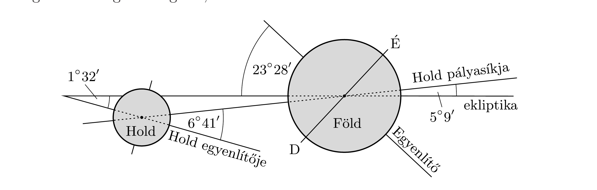
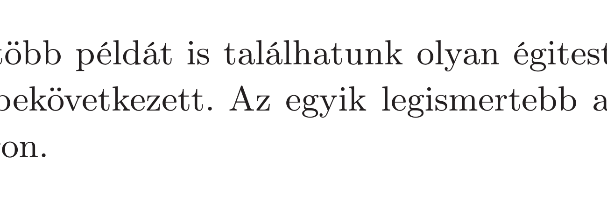
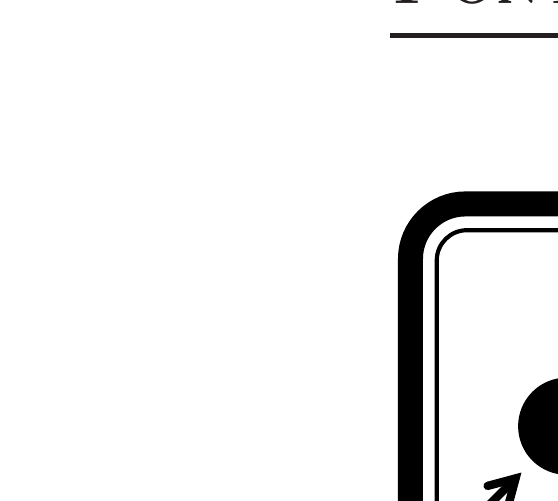

## Útmutatás

A Föld-Hold rendszer (a Nap hatását elhanyagolva) zártnak tekinthető, amelynek teljes perdülete időben állandó marad. A teljes impulzusmomentum az égitestek tengely körüli forgásából származó sajátperdületekből, valamint a közös tömegközéppont körüli keringésből származó pályaperdületekből tevődik össze. Érdemes megbecsülni, hogy mely perdület-járulékok jelentősek, és melyek hanyagolhatók el. A becslésnél mindvégig használhatjuk azt a közelítést, hogy a földi Egyenlítő, a Hold egyenlítője és a Hold pályasíkja egy síkban van. (A Holdat tekinthetjük homogén tömegeloszlású gömbnek, a Föld tömegközéppontra vonatkoztatott tehetetlenségi nyomatékát a könyv végén található adattáblázat tartalmazza.)

A perdületmegmaradás mellett szükségünk van még egy egyenletre, amely összefüggést teremt a Hold keringési szögsebessége és a Föld-Hold távolság között. Ehhez írjuk fel a (közelítőleg körpályán keringő) Hold centripetális gyorsulását!

\section*{Pontrendszerek}

## Megoldás

Jelöljük a Föld tömegét $M$-mel, sugarát $R$-rel, forgási szögsebességét $\Omega$-val, a Hold hasonló adatait pedig $m$-mel, $r$-rel és $\omega$-val. A Hold-Föld távolság
legyen $L$, a tömegközéppont ekkor a Föld középpontjától $\frac{m}{m+M} L$, a Hold középpontjától pedig $\frac{M}{m+M} L$ távolságban található. Mindkét égitest a közös tömegközéppont körül kering, melynek szögsebessége megegyezik a Hold tengely körüli forgásának szögsebességével, $\omega$-val.

Az egyszerúség kedvéért becsléseinknél nem vesszük számításba a földi Egyenlítő síkjának, a Hold keringési síkjának és a Hold egyenlítőjének hajlásszögét, hanem úgy tekintjük, mintha mindezek a mozgások ugyanabban a síkban történnének. Ténylegesen az említett síkok a (nem méretarányos) ábrán látható szögekben hajlanak egymáshoz képest.
a) A Nap hatásától eltekintve a Hold és a Föld zárt rendszernek tekinthető, amelyre érvényes a perdületmegmaradás törvénye. A teljes rendszer perdülete az égitestek saját- és pályaperdületeiből tevődik össze:
\[
N_{\text {teljes }}=N_{\text {saját }}^{\text {Föld }}+N_{\text {pälya }}^{\text {Föld }}+N_{\text {saját }}^{\text {Hold }}+N_{\text {pålya }}^{\text {Hold }}=\text { állandó. }
\]
A Föld tehetetlenségi nyomatékát $\Theta^{\text {Föld }}$-del, a Holdét pedig $\Theta^{\text {Hold }}$-dal jelölve (mindkettőt a saját tömegközéppontjukra vonatkoztatjuk), a rendszer teljes perdülete:
\[
N_{\text {teljes }}=\Theta^{\text {Föld }} \Omega+M\left(\frac{m}{m+M} L\right)^{2} \omega+\Theta^{\text {Hold }} \omega+m\left(\frac{M}{m+M} L\right)^{2} \omega .
\]
Ezen a ponton érdemes összehasonlítanunk a fenti négy tag nagyságrendjét. Az ismert adatokat behelyettesítve azt kapjuk, hogy míg az első és az utolsó tag nagyságrendje megegyezik, addig a második és harmadik tagok értéke ezeknél nagyságrendekkel kisebb. A Föld pályaperdületét és a Hold sajátperdületét tehát a továbbiakban jogosan elhanyagolhatjuk, a rendszer teljes perdületét pedig a Föld sajátperdületének és a Hold pályaperdületének összegeként közelíthetjük:
\[
N_{\text {teljes }} \approx \Theta^{\text {Föld }} \Omega+m L^{2} \omega=\text { állandó. }
\]

A feladat szövege szerint a Hold tömegközéppont körüli mozgásának pályáját jó közelítéssel körnek tekinthetjük, melyre a Newton-féle mozgásegyenlet a
\[
\gamma \frac{m M}{L^{2}}=m \frac{M}{m+M} L \omega^{2}
\]
alakot ölti. Ebből az
\[
L^{3} \omega^{2}=\gamma(m+M)=\text { állandó }
\]
megmaradási törvényre jutunk (amely lényegében Kepler III. törvényének megfogalmazása).

Az (1) és (2) egyenletekből azt olvashatjuk ki, hogy az $L, \Omega$ és $\omega$ mennyiségek nem függetlenek egymástól, bármelyikük (kicsiny) megváltozása maga után vonja a másik két mennyiség változását is. Fejezzük ki pl. $\Delta L$ segítségével $\Delta \Omega$-t és $\Delta \omega$-t. Ha felírjuk (1)-et és (2)-t oly módon, hogy $\Omega$ helyébe $\Omega+\Delta \Omega-\mathrm{t}, \omega$ helyébe $\omega+\Delta \omega$-t és $L$ helyébe $L+\Delta L$-t helyettesítünk, akkor a kicsiny megváltozásokra (a kis mennyiségek szorzatait és magasabb hatványait elhanyagolva) a következő összefüggéseket kapjuk:
\[
\begin{gathered}
\Delta \Omega=-\frac{m L \omega}{2 \Theta^{\text {Föld }}} \Delta L \\
\Delta \omega=-\frac{3 \omega}{2 L} \Delta L
\end{gathered}
\]
Leolvasható, hogy a Föld-Hold távolság növekedésével mind a Föld tengely körüli forgása, mind pedig a Hold keringése lassul. Ez a két egyenlet már elegendő arra, hogy összehasonlíthassuk a Föld és a Hold mozgási energiájának megváltozását. A csillagászati adatok ismeretében könnyen belátható, hogy a Földnek nemcsak a perdülete, de a mozgási energiája is döntő mértékben a saját tengelye körüli forgásból adódik, a Hold-Föld rendszer közös tömegközéppontjához viszonyított transzlációs mozgás energiája elhanyagolható. A Holdnál éppen fordított a helyzet: mozgási energiájának döntő része a keringésből adódik, a forgásából származó energia nem számottevő. Eszerint
\[
E_{\mathrm{mozgási}}^{\text {Fëld }} \approx \frac{1}{2} \Theta^{\text {Föld }} \Omega^{2}, \quad E_{\text {mozgási }}^{\text {Hold }} \approx \frac{1}{2} m L^{2} \omega^{2} .
\]
Ha a Föld tengely körüli forgásának szögsebessége kicsiny $\Delta \Omega$-val, a Hold keringési szögsebessége $\Delta \omega$-val, a Föld-Hold távolság pedig $\Delta L$-lel megváltozik, akkor a mozgási energiák megváltozása
\[
\begin{aligned}
& \Delta E_{\text {mozgási }}^{\text {Föld }}=\Theta^{\text {Föld }} \Omega \cdot \Delta \Omega, \\
& \Delta E_{\text {mozgási }}^{\text {Hold }}=m L \omega^{2} \cdot \Delta L+m L^{2} \omega \cdot \Delta \omega
\end{aligned}
\]
értékú lesz, ahogy arról deriválással vagy a másodrendúen kicsiny tagok elhanyagolásával meggyőződhetünk. A (3) és (4) egyenletek felhasználásával az energiaváltozások tovább alakíthatók:
\[
\Delta E_{\mathrm{mozgási}}^{\mathrm{Fëld}}=-\frac{1}{2} m L \omega \Omega \cdot \Delta L, \quad \Delta E_{\mathrm{mozgási}}^{\mathrm{Hold}}=-\frac{1}{2} m L \omega^{2} \cdot \Delta L .
\]

A mozgási energiák megváltozásának arányára (ami egyenlő a mozgási energiák $\dot{E}=\Delta E / \Delta t$ változási ütemének arányával) tehát az igen egyszerú
\[
\frac{\Delta E_{\text {mozgási }}^{\text {Föld }}}{\Delta E_{\text {mozgási }}^{\text {Hold }}}=\frac{\dot{E}_{\text {mozgási }}^{\text {Föld }}}{\dot{E}_{\text {mozgási }}^{\text {Hold }}}=\frac{\Omega}{\omega}=\frac{27,3 \text { nap }}{1 \text { nap }}=27,3
\]
eredményt kapjuk. Látszik, hogy az árapálykeltő erők elsősorban a Föld mozgási energiáját csökkentik, sokkal nagyobb mértékben, mint a Holdét. További érdekesség, hogy a számolás során a Föld tehetetlenségi nyomatéka „kiesett”, a Föld tömegeloszlására vonatkozóan tehát semmilyen feltevéssel nem kellett élnünk.

Megjegyzés. A Föld-Hold rendszer teljes mechanikai energiája, a mozgási energiák és a gravitációs helyzeti energia összege nem marad változatlan, hanem időben (a Föld és a Hold kőzeteinek, illetve az óceánok belső súrlódásának következtében) lassan csökken. A disszipatív folyamatok miatt tehát a mozgásra nem érvényes a mechanikai energiamegmaradás törvénye!
b) A Föld forgási periódusidejének megváltozása kifejezhető a szögsebesség változásával:
\[
\Delta T^{\text {Föld }}=\frac{2 \pi}{\Omega+\Delta \Omega}-\frac{2 \pi}{\Omega} \approx-\frac{2 \pi}{\Omega^{2}} \Delta \Omega .
\]
(3) felhasználásával a földi nap hosszának megváltozására a
\[
\Delta T^{\text {Föld }}=\frac{\pi m L \omega}{\Theta^{\text {Föld }} \Omega^{2}} \Delta L
\]
összefüggést kapjuk. A Föld tehetetlenségi nyomatékát becsülhetjük a homogén tömegeloszlású gömbre vonatkozó $\frac{2}{5} M R^{2}$ formulával, ekkor évente $\Delta T^{\text {Föld }} \approx$ $18 \mu \mathrm{~s}$-os időtartam-növekedést kapunk. Valójában a Föld kérge kisebb sürúségú, mint a magja, így a tehetetlenségi nyomatéka is kisebb. $\Theta^{\text {Föld }}$ helyére a mérések szerinti $8 \cdot 10^{37} \mathrm{~kg} \mathrm{~m}^{2}$ értéket behelyettesítve (lásd a könyv végén a függeléket) a nap hosszának éves növekedésére valamivel nagyobb, $21 \mu \mathrm{~s}$ adódik. A legpontosabb atomórák mérései szerint a földi nap hossza évente $15 \mu \mathrm{~s}$-mal növekszik, ami (az alkalmazott közelítéseinket figyelembe véve) megnyugtatóan közel áll a becsült értékhez.
c) A szinkronizálódás befejezésekor $\Omega=\omega \equiv \omega_{0}$, ezért az (1) perdületmegmaradást a
\[
\Theta^{\text {Föld }} \Omega+m L^{2} \omega=\Theta^{\text {Föld }} \omega_{0}+m L_{0}^{2} \omega_{0}
\]
alakban írhatjuk fel, a (2) Kepler-törvényből pedig az
\[
L^{3} \omega^{2}=L_{0}^{3} \omega_{0}^{2}
\]
egyenlőség következik. (5) és (6) felhasználásával $\omega_{0}$-ra a következő egyenletre jutunk:
\[
\Theta^{\text {Föld }} \Omega+m L^{2} \omega=\Theta^{\text {Föld }} \omega_{0}+m L^{2} \frac{\omega^{4 / 3}}{\omega_{0}^{1 / 3}} .
\]

Ez egy negyedfokú egyenlet az ismeretlen $\omega_{0}$ szögsebességre. $\omega_{0}$ pontos értékének meghatározása legegyszerúbben numerikusan lehetséges. A pontos eredményt jól közelítő megoldást kaphatunk, ha a jobb oldal első tagját a második tag mellett elhanyagoljuk, remélve, hogy az elhanyagolás jogos (ezt később még ellenőriznünk kell). Ezzel a szinkronizálódott Föld-Hold rendszer közös szögsebességére az
\[
\omega_{0} \approx \omega^{4}\left(\frac{\Theta^{\text {Föld }} \Omega}{m L^{2}}+\omega\right)^{-3}
\]
összefüggés adódik. Az ismert adatok behelyettesítése után (a Föld tehetetlenségi nyomatékára a mért értéket használva) a szögsebességre az $\omega_{0} \approx 1,53 \cdot 10^{-6} 1 / \mathrm{s}$ eredményt kapjuk, amelynek felhasználásával a (7) egyenlet jobb oldalának második tagja mintegy 280-szor nagyobbnak bizonyul az első tagnál: az elhanyagolás tehát jogos volt.

A szinkronizálódás befejeződésekor a földi nap új hossza
\[
T_{0}^{\text {Föld }}=\frac{2 \pi}{\omega_{0}} \approx 47 \text { nap }
\]
értékú lesz, azaz több mint másfél hónap! Az akkori Föld-Hold távolság és a jelenlegi arányára (6) felhasználásával az
\[
\frac{L_{0}}{L}=\left(\frac{\omega}{\omega_{0}}\right)^{2 / 3} \approx 1,45
\]
eredményt kapjuk.
Megjegyzések. 1. A Föld lassuló forgásának és a Föld-Hold rendszer szinkronizálódásának fizikai magyarázata a következő. A Hold nagyobb gravitációs vonzóerőt fejt ki a Föld azon pontjaira, amelyek a Holdhoz közelebb helyezkednek el, mint azokra a pontokra, amelyek a Holdtól távolabb vannak. Ennek következtében a Föld (nagyon kicsiny mértékben) „megnyúlik”, forgási ellipszoiddá alakul (lásd az ábrát). Az ellipszoid nagytengelye azonban a Föld tengely körüli forgása következtében, valamint az óceánok, illetve a Föld kőzeteinek belső súrlódása miatt nem a Hold aktuális irányába mutat, hanem ahhoz képest folyamatosan „siet”. Az így keletkezett dudorokra a Hold gravitációs tere forgatónyomatékot gyakorol, ami lassítja a Föld forgását.

2. A Naprendszerben több példát is találhatunk olyan égitest-párokra, melyeknél a teljes szinkronizáció már bekövetkezett. Az egyik legismertebb a Pluto törpebolygó és legnagyobb holdja, a Charon.

\section*{Pontrendszerek}
