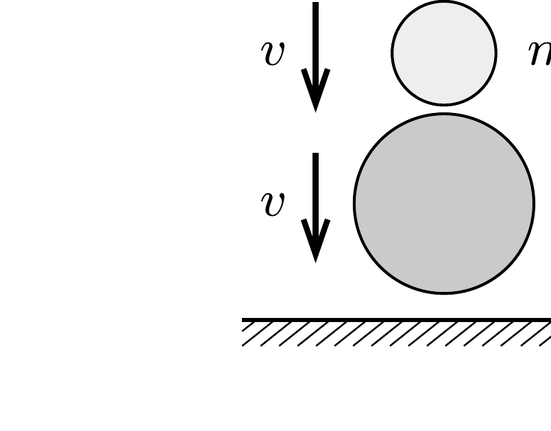
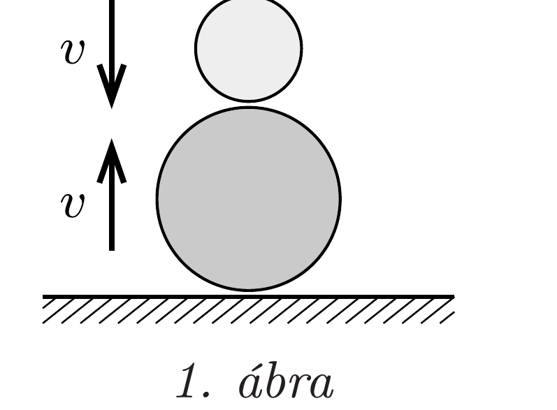
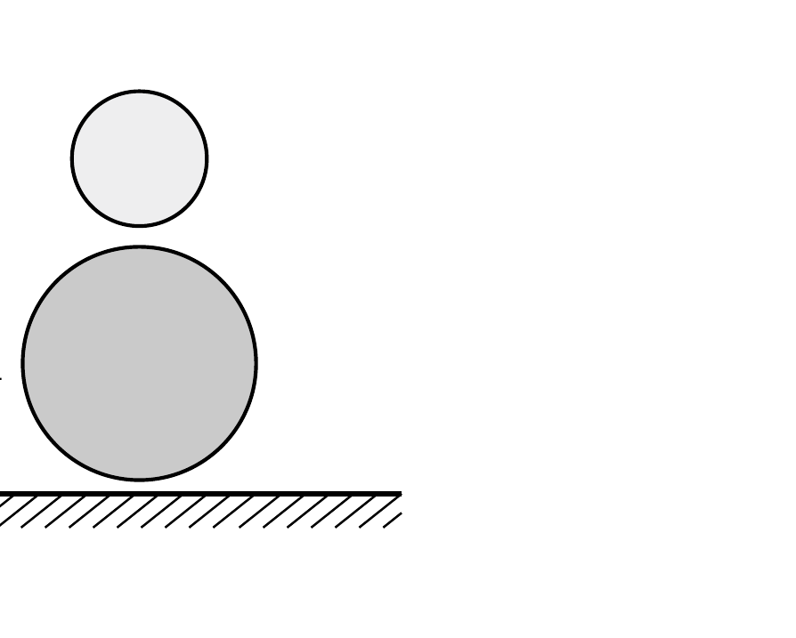

## Útmutatás

A feladatot egymás utáni tökéletesen rugalmas ütközések sorozataként kezelhetjük.

## Megoldás

a) Hanyagoljuk el a közegellenállást és tekintsük a labdákat tökéletesen rugalmasnak. A $h$ magasságból elejtett labdák $v=\sqrt{2 g h}$ sebességgel érik el a talajt. Az alsó labda először a talajjal, majd a felső labdával ütközik. A felső labda akkor részesedik legnagyobb arányban a rendelkezésre álló energiából, ha az alsó labda a két ütközés után éppen nyugalomban marad (lásd az 1. ábrát).

Először az alsó labda függőlegesen felfelé mutató $v$ sebességgel visszapattan a talajról, majd ütközik a $v$ sebességgel lefelé mozgó felső labdával. Mivel az $m_{1}$ tömegú labda ütközés utáni sebessége nulla, a lendület és az energia megmaradását kifejező egyenletek:
\[
m_{1} v-m_{2} v=m_{2} u \quad \text { és } \quad \frac{1}{2} m_{1} v^{2}+\frac{1}{2} m_{2} v^{2}=\frac{1}{2} m_{2} u^{2} .
\]
Ezekből a felső labda ütközés utáni $u$ sebessége és a tömegek aránya kiszámítható:
\[
u=2 v, \quad \text { illetve } \quad \frac{m_{2}}{m_{1}}=\frac{1}{3} .
\]
A kétszeres visszapattanási sebesség miatt ebben az esetben $4 h$ magasra repül fel az $m_{2}$ tömegü labda.
b) Meglepő, de a felső labda ennél magasabbra is felpattanhat! Ha $m_{1} \gg m_{2}$, akkor a felső labda az összes energiának csak nagyon kis hányadát „viszi el” az ütközések után, de a sebessége $3 v$, a felpattanás magassága pedig (ideális esetben) $9 h$ lesz! A gyakorlatban ez az eset valósul meg akkor, ha egy $v$ sebességgel lefelé mozgó pingponglabdát $v$ sebességgel felfelé mozgó ütóvel találunk el. A pingponglabda tömege elhanyagolható az ütőhöz képest, ezért a jó közelítéssel tökéletesen rugalmas ütközés úgy is leírható, hogy az álló ütőhöz képest $2 v$ sebességgel közeledő labda szintén $2 v$ nagyságú, de ellentétes irányú sebességgel pattan vissza. A talajhoz rögzített rendszerben ehhez még hozzá kell adni az ütő $v$ sebességét, így kapjuk meg a pingponglabda $3 v$ sebességét.

Megjegyzés. A feladatot általánosíthatjuk $N$ labdára is, melyeket egymás tetejére rakva egyszerre leejtünk (2. ábra). Az $a$ ) kérdésben leírt helyzet akkor valósul meg, ha az ütközéssorozat végén a legfelső labda kivételével mindegyik megáll, egyedül a legfelső
pattan fel. Megmutatható, hogy ez a különleges eset akkor következik be, ha a második labda $\frac{1}{3}$-szor könnyebb a legalsónál, a harmadik $\frac{2}{4}$-szer a másodiknál, a negyedik $\frac{3}{5}$-ször a harmadiknál, és általában a $k$-adik $\frac{k-1}{k+1}$-szer könnyebb a $(k-1)$-ediknél:
\[
m_{k}=\frac{k-1}{k+1} m_{k-1},
\]
ahol $k=2,3, \ldots, N-1, N$. Ilyen tömegarányok esetén a legfelső labda $N v$ sebességre tesz szert.

A b) rész megoldása $N$ labda esetén annyiban módosul, hogy a legnagyobb magasság eléréséhez a labdák tömegeinek az
\[
m_{1} \gg m_{2} \gg m_{3} \gg \cdots \gg m_{N-1} \gg m_{N}
\]
feltételt kell kielégíteniük. Ekkor a legfelső labda $\left(2^{N}-1\right) v$ sebességgel pattan fel, a legnagyobb emelkedési magasság pedig $\left(2^{N}-1\right)^{2} h$.

A kísérletező hajlamú olvasók próbálkozzanak meg különféle labdák ejtegetésével is, amit három vagy több labda esetén úgy végezhetünk el, ha hosszú csőben ejtjük a labdákat. Nagyon szórakoztatóan pattognak!

