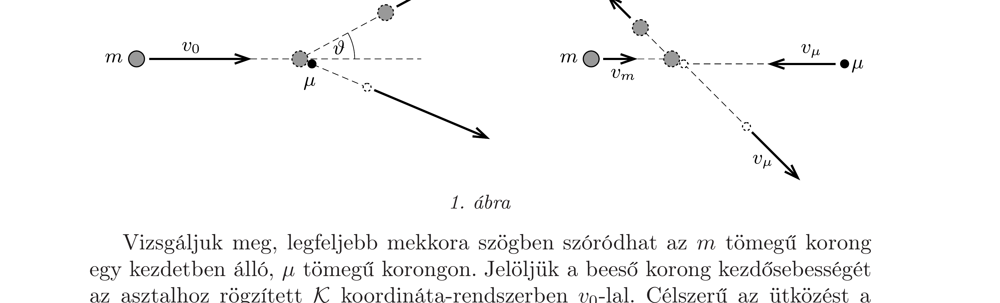
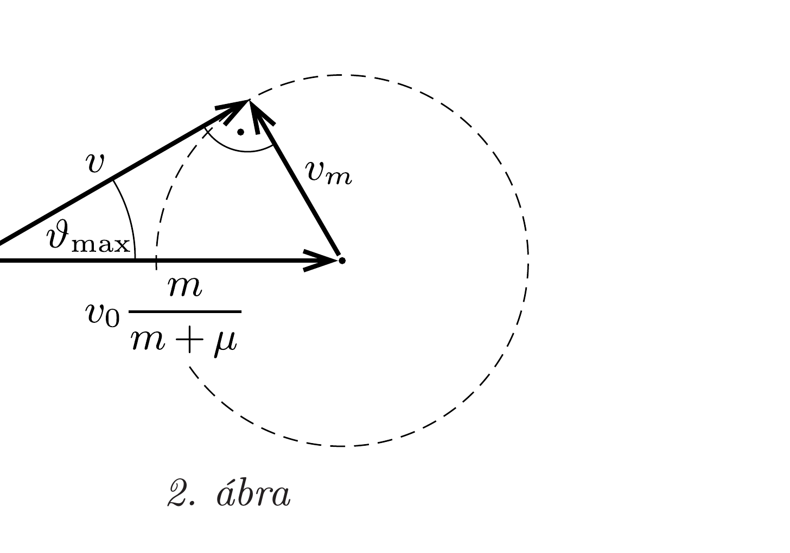

## Útmutatás

A tervünk akkor sikerül, ha az $m$ tömegü korong sebességének iránya az egyes ütközések során $\pi / N$ szöggel fordul el. Ha $M / N<m$, akkor az $m$ tömegú korong nem szóródhat tetszőlegesen nagy szögben egy kezdetben álló, $M / N$ tömegú korongon, a haladási irány egy bizonyos maximális szögnél jobban nem fordulhat el. Határozzuk meg ennek a maximális szögnek a nagyságát $m, M$ és $N$ segítségével!

A feladat $b$ ) részénél szükségünk lesz az exponenciális függvény következő előállítására:
\[
\mathrm{e}^{x}=\lim _{n \rightarrow \infty}\left(1+\frac{x}{n}\right)^{n} .
\]

## Megoldás

a) Ha az $M / m$ tömegarány elegendően nagy, akkor a beesési egyenes finom beállításával mindig elérhető, hogy az $m$ tömegü korong végigpattogjon a $\mu=M / N$ tömegü korongokon. Ekkor az egyes pattogások során az $m$ tömegü korong sebességének iránya (jó közelítéssel) $\pi / N$ szöggel fordul el. Abban az esetben viszont, amikor a kezdetben álló korongok $\mu$ tömege kisebb egy kritikus értéknél, tetszőleges kezdőfeltétellel sem érhető el, hogy az $m$ tömegú korong $\pi / N$ szöggel eltérüljön eredeti mozgásirányától.

Vizsgáljuk meg, legfeljebb mekkora szögben szóródhat az $m$ tömegü korong egy kezdetben álló, $\mu$ tömegü korongon. Jelöljük a beeső korong kezdősebességét az asztalhoz rögzített $\mathcal{K}$ koordináta-rendszerben $v_{0}$-lal. Célszerú az ütközést a tömegközépponttal együttmozgó, $v_{0} m /(m+\mu)$ sebességú $\mathcal{K}^{\prime}$ rendszerből leírni. Itt a korongok kezdősebessége
\[
v_{m}=\frac{\mu}{m+\mu} v_{0} \quad \text { és } \quad v_{\mu}=\frac{m}{m+\mu} v_{0} .
\]

A $\mathcal{K}^{\prime}$ koordináta-rendszerben a két korong összes lendülete nulla, tehát mindig egymással ellentétes irányban, egyenlő nagyságú impulzussal mozognak. Emiatt az energiamegmaradás törvénye csak úgy teljesülhet, ha a korongok impulzusának nagysága (és így a sebességük nagysága is) az ütközés során változatlan marad, csupán az irányuk változik meg (1. ábra).

Az asztalhoz rögzített $\mathcal{K}$ vonatkoztatási rendszerbe úgy térhetünk vissza, ha a $\mathcal{K}^{\prime}$ beli sebességvektorokhoz hozzáadjuk a két koordináta-rendszer relatív sebességét. Az $m$ tömegú korongocska ütközés utáni sebessége a 2. ábrán látható kör valamelyik pontjába mutató vektor, amely akkor zárja be a lehető legnagyobb szöget a kezdeti sebességgel, ha az ütközés utáni $v$ hosszúságú sebességvektor

éppen érinti a kört.

A 2. ábráról leolvasható:
\[
v_{m}=v_{0} \frac{m}{m+\mu} \sin \vartheta_{\max },
\]
ebből (1) felhasználásával kapjuk azt a legnagyobb $\vartheta_{\text {max }}$ szöget, amiben az $m$ tömegú korong szóródhat:
\[
\sin \vartheta_{\max }=\frac{\mu}{m}=\frac{M / N}{m} .
\]
A tervünk akkor sikerül, ha $\vartheta_{\text {max }} \geq \pi / N$. Mivel az $N \rightarrow \infty$ határesetet kell vizsgálnunk, alkalmazhatjuk a $\sin \vartheta_{\text {max }} \approx \vartheta_{\text {max }}$ közelítést:
\[
\frac{\pi}{N} \leq \frac{M / N}{m}, \quad \text { ebből } \quad \frac{M}{m} \geq \pi .
\]

Megjegyzés. Hosszadalmas számolással megmutatható, hogy egy álló, $\mu$ tömegü részecskén szóródó $m$ tömegú részecske lehetséges legnagyobb $\vartheta_{\text {max }}$ szögeltérülését relativisztikus esetben is a (2) formula adja meg.
b) A továbbiakban csak a kritikus $M / m=\pi$ tömegarány esetére kell szorítkoznunk. A 2. ábrán látszik, hogy maximális szögeltérülésnél az $m$ tömegü korong ütközés előtti és ütközés utáni sebességei között a következő kapcsolat áll fenn:
\[
v^{2}=\left(\frac{m}{m+\mu}\right)^{2} v_{0}^{2}-v_{m}^{2}=\frac{m^{2}-\mu^{2}}{(m+\mu)^{2}} v_{0}^{2} .
\]
A $v$ sebesség $\mu \ll m$ miatt így közelíthető:
\[
v=v_{0} \sqrt{1-\frac{2 \mu}{m+\mu}} \approx\left(1-\frac{\mu}{m}\right) v_{0} .
\]

Az $m$ tömegú korong sebessége tehát minden pattanásnál $(1-\mu / m)$-szeresére változik, ezért $N$ pattanás után a végsebesség és a kezdeti sebesség hányadosa:
\[
\frac{v_{\text {végső }}}{v_{\text {kezdeti }}}=\left(1-\frac{M}{N m}\right)^{N} \approx \mathrm{e}^{-M / m}=\mathrm{e}^{-\pi} \approx 0,043 .
\]
Mivel $N$ nagyon nagy, ezért felhasználtuk az útmutatásban megadott határértékformulát. Az $m$ tömegú korong tehát a kezdeti sebességének kb. 4\%-ával távozik.
