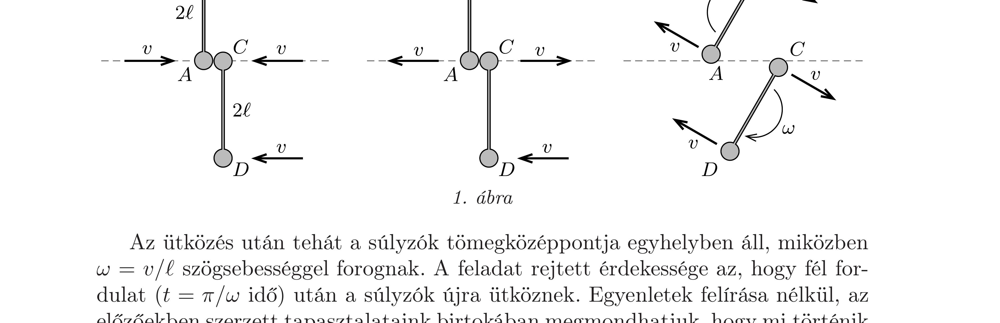
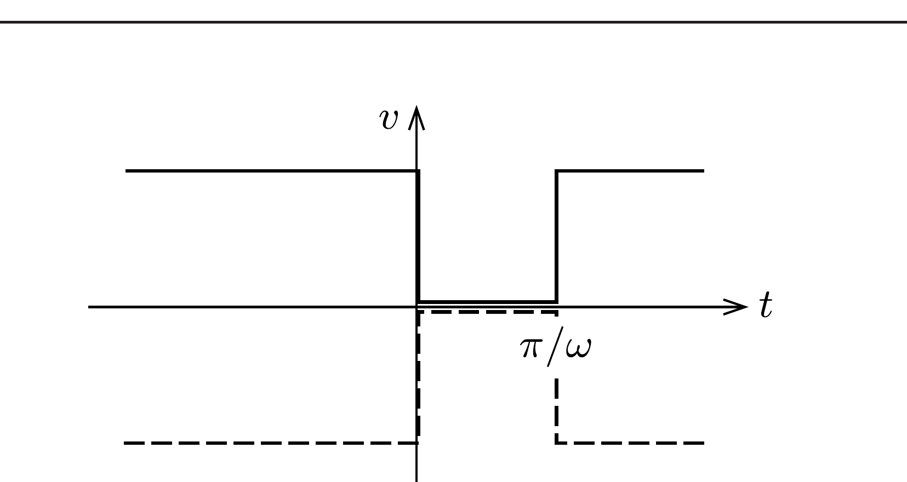
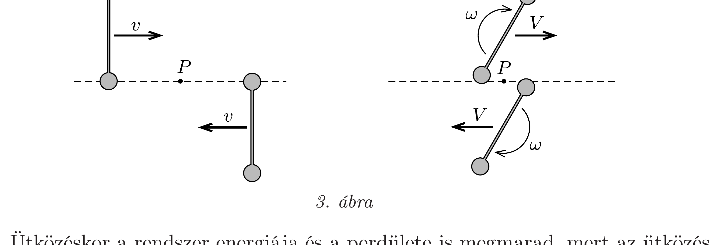

## Útmutatás

Tekinthetünk a súlyzókra pontrendszerként. Ekkor vizsgáljuk meg, mekkora eró ébredhet az elhanyagolható tömegü rúdban az ütközés rövid időtartama alatt, és ez hogyan befolyásolja a súlyzó végén lévő kis korongok lendületét.

Egy másik lehetséges megoldási mód, ha a súlyzókat merev testként kezeljük. Ebben az esetben használjuk fel, hogy az ütközések során az egész rendszer lendülete, mechanikai energiája és perdülete megmarad.

## Megoldás

I. megoldás. Kezeljük a súlyzókat pontrendszerként! Az ütközés rövid időtartama alatt az 1. ábrán látható $A$ és $C$ jelú korongocskák érintkezési pontjában hirtelen óriási erő ébred, melynek erólökése véges nagyságú. Az „elhanyagolható tömegü"' rudakra eközben nem hathat sem véges erőlökés, sem forgatólökés, hiszen a rudak sebességének és szögsebességének megváltozása (a nullának vehető tömegük és tehetetlenségi nyomatékuk miatt) végtelen nagy lenne. A rudakban hosszirányú erőlökés sem keletkezhet, ellenkező esetben a végeiken található korongok közeledni vagy távolodni kezdenének, ami a rudak állandó hossza miatt lehetetlen. Mindebből az következik, hogy az ütközés során a súlytalan rudak által a végükön elhelyezkedő korongokra kifejtett erőlökés zérus.

A $B$ és $D$ korongok tehát a sebességükkel párhuzamosan nem kapnak erőlökést, így ütközés után $v$ sebességgel, eredeti mozgásirányukban haladnak tovább. Ugyanezen okból az $A$ és $C$ jelú korongok ütközésére érvényes a lendületmegmaradás törvénye. Az ütközés tökéletesen rugalmas, ezért az összes mozgási energiának is meg kell maradnia, ami csak úgy lehetséges, hogy az $A$ és $C$ korongok sebességet cserélnek.

Az ütközés után tehát a súlyzók tömegközéppontja egyhelyben áll, miközben $\omega=v / \ell$ szögsebességgel forognak. A feladat rejtett érdekessége az, hogy fél fordulat ( $t=\pi / \omega$ idő) után a súlyzók újra ütköznek. Egyenletek felírása nélkül, az előzőekben szerzett tapasztalataink birtokában megmondhatjuk, hogy mi történik a második ütközés során. A súlyzók forgó mozgása megszűnik, újra ugyanakkora sebességgel haladnak, mint az első ütközés előtt, pályájuk is ugyanaz az egyenes marad, azonban mozgásukat „fejjel lefelé” folytatják. A két ütközés közötti időt tehát a súlyzók azzal töltik, hogy „fejre állnak”. A súlyzók tömegközéppontjának sebességét az idő függvényében a 2. ábra mutatja.

II. megoldás. Úgy is megoldhatjuk a feladatot, hogy a súlyzókat nem két tömegpontból álló rendszerként, hanem merev testként kezeljük. Mivel a súlyzók azonos sebességgel haladnak egymás felé, lendületük összege a légpárnás asztalhoz rögzített (tömegközépponti) koordináta-rendszerben nulla. A lendület megmaradása így annyit jelent, hogy a két súlyzó tömegközéppontja mindig egyforma nagyságú, ellentétes irányú sebességgel mozog.

Ütközéskor a rendszer energiája és a perdülete is megmarad, mert az ütközés tökéletesen rugalmas, továbbá a súlyzókra külső forgatónyomaték sem hat. Írjuk fel az energia- és perdületmegmaradást, ez utóbbit vonatkoztassuk a súlyzók $P$ érintkezési pontjára. Az ütközés előtti és utáni állapotokat a 3. ábra mutatja. Ütközés előtt a súlyzóknak csak a haladó mozgásból származik mozgási energiája, az ütközés után azonban megjelenik a forgásból származó járulék is:
\[
2\left(\frac{1}{2} 2 m v^{2}\right)=2\left(\frac{1}{2} 2 m V^{2}+\frac{1}{2} 2 m \ell^{2} \omega^{2}\right)
\]

Az ütközés előtt a súlyzóknak csak pályamenti perdületük volt, az ütközés után azonban a tömegközéppont körüli forgásból származó sajátperdületük is megjelenik:
\[
2(\ell \cdot 2 m v)=2\left(\ell \cdot 2 m V+2 m \ell^{2} \omega\right)
\]

A fenti egyenletrendszer nemtriviális $(v \neq V, \omega \neq 0)$ megoldására $V=0$ adódik, vagyis a súlyzók tömegközéppontja megáll az ütközés után. A forgás szögsebessége ekkor $\omega=v / \ell$, amiből az is következik, hogy az ütköző tömegpontok sebességet cserélnek, míg a nem ütközők változatlan sebességgel folytatják útjukat, ahogy azt az I. megoldásban láttuk.
