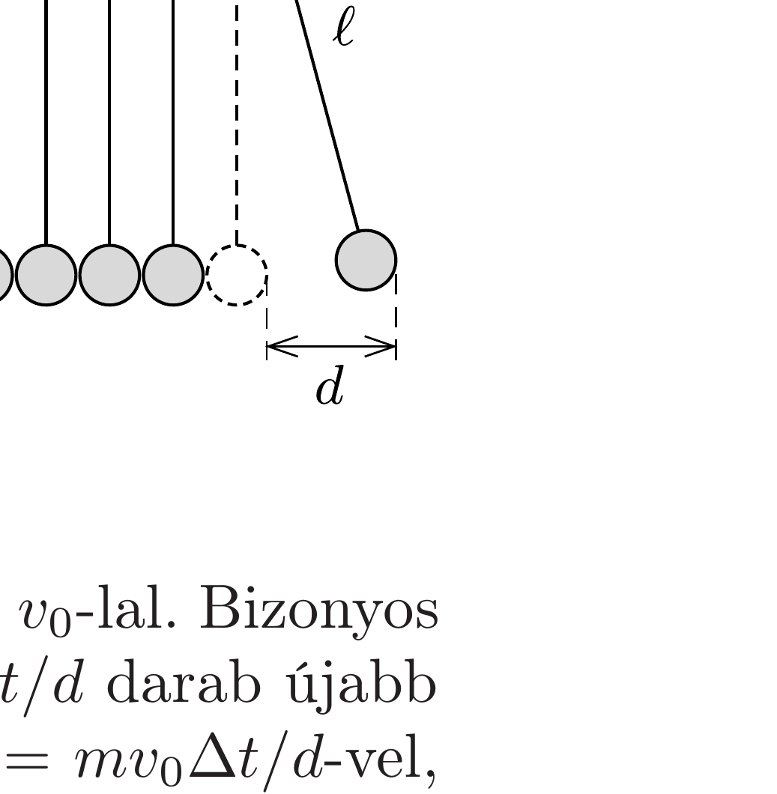

## Útmutatás

Kis kitérések esetén az ingák lengésideje a kitéréstől független, emiatt a golyók mindig a felfüggesztési pont alatt fognak ütközni. Ha a közegellenállás hatása egy-egy lengés alatt nem számottevő, akkor a szétpattanó golyók ugyanakkora sebességgel érkeznek vissza a pályájuk megmélyebb pontjához, mint amekkorával elindultak, majd ismét ütköznek. Az ütközéseknél a mechanikai energia csökken, a lendületek összege viszont állandó marad.

## Megoldás

A golyók sebessége a tömegközépponti rendszerben minden ütközésnél ugyanolyan arányban, tehát mértani sorozat szerint csökken, és elegendően hosszú idő múlva nullává válik. A golyók egymáshoz viszonyított (relatív) sebessége is ütközésről ütközésre fokozatosan csökken. Ugyanez mondható el a golyók ütközés előtti sebességének különbségéről a laboratóriumi koordináta-rendszerben is, hiszen a relatív sebesség minden vonatkoztatási rendszerben ugyanakkora.

Elegendően sok ütközés után tehát a két golyó együtt fog lengeni, egymáshoz viszonyított sebességük nulla lesz. Mivel az ütközések során a rendszer összes lendülete nem változik, továbbá két ütközés között a gravitációs eró is csak a lendület előjelét változtatja meg, ezért az együtt lengő golyók összes lendülete éppen akkora lesz, mint amekkora a legelső ütközésnél volt.

A harmonikus rezgőmozgás ismert összefüggéseiből tudjuk, hogy a lengés amplitúdója arányos a lengő test maximális sebességével. Közvetlenül az elsó ütközés előtt a kimozdított (a feladat ábráján a jobb oldali) golyó sebessége $v_{0}=\omega \cdot d$ (ahol $\omega=\sqrt{g / \ell}$ az inga körfrekvenciája), a másik golyó pedig áll. A sok ütközés után együtt lengő golyók maximális sebessége (a lendületmegmaradás miatt) $v_{0} / 2$, amplitúdójuk tehát $d / 2$. Ezek után már nem történnek ütközések, és a mozgást - hosszabb idő elteltével - csak a légellenállás fogja megállítani.

Megjegyzés. 1. Az $n$-edik ütközés után a tömegközépponti rendszerben a golyók sebességének nagysága
\[
v_{n}^{(\mathrm{tkp})}=k^{n} \frac{v_{0}}{2},
\]
tehát a laboratóriumi rendszerból nézve közvetlenül az ütközés után a golyók
\[
v_{n}=\frac{v_{0}}{2}\left(1+k^{n}\right) \quad \text { és } \quad u_{n}=\frac{v_{0}}{2}\left(1-k^{n}\right)
\]
nagyságú sebességekkel indulnak el, méghozzá ugyanabban az irányban. Páratlan számú ütközés után a bal oldali, páros számú ütközést követően pedig a jobb oldali golyó mozog a nagyobb $\left(v_{n}\right)$ sebességgel, míg az $u_{n}$ sebesség a másik testre vonatkozik. Látszik, hogy az $n \rightarrow \infty$ határesetben mindkét sebesség $v_{0} / 2$-höz tart.
2. Közismert játék az ábrán látható Newton-bölcső (angolul Newton's cradle), amely szorosan egymás mellé függesztett acélgolyókból áll. Ha a szélső golyót $d$ távolsággal kitérítve mozgásba hozzuk a játékot, akkor (a feladatban tárgyalt „két golyós“ változathoz hasonlóan) viszonylag rövid idő múlva már nem ütköznek tovább a golyók, hanem a golyósor együtt lengve kollektív ingamozgást végez azonos fázisban. Ilyenkor a kezdeti impulzus egyenletesen oszlik el a játék $n$ golyója között, tehát a kialakuló amplitúdó a kezdőlökést adó golyó eredeti kitérésének $n$-ed

része, $d / n$ lesz.
