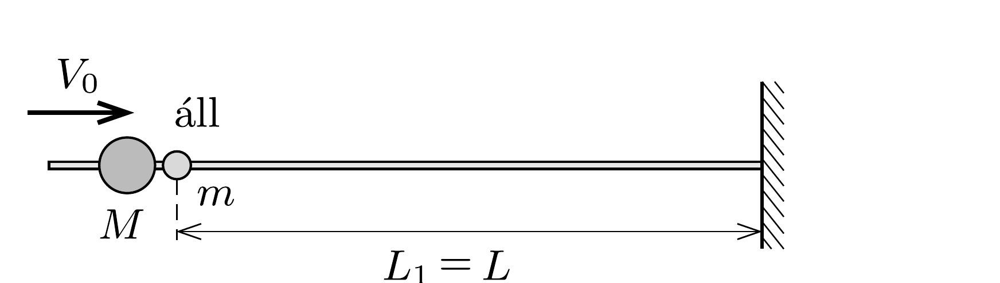
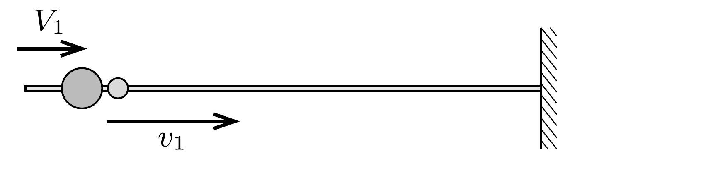
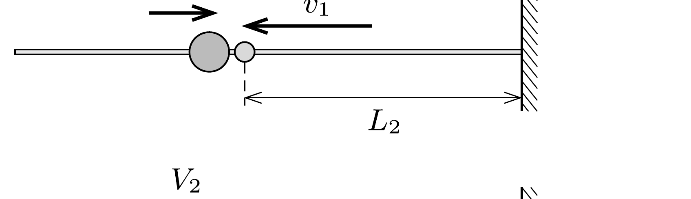
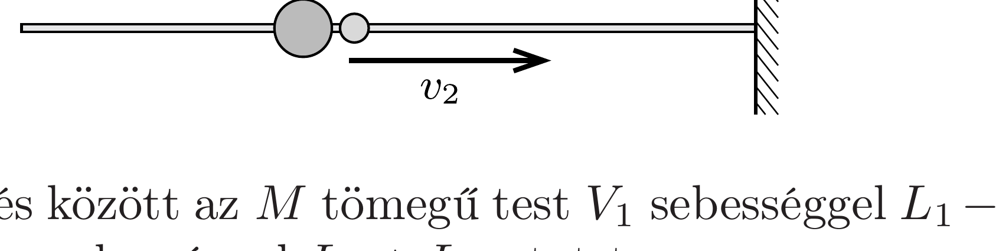

## Útmutatás

A rugalmas ütközések megmaradási törvényeiből kiindulva lássuk be, hogy minden egyes ütközés után a két test sebességkülönbségének és az ütközési pont faltól mért távolságának szorzata ugyanakkora. Ebbő́l és az energiamegmaradás törvényéből kaphatjuk meg a keresett távolságot.

Egy másik (közelítő) megoldást adhatunk a feladatra, ha az $m$ tömegú testet egydimenziós, egyetlen molekulából álló „gáznak” tekintjük, amit egy nekicsapódó, $M$ tömegú dugattyú adiabatikusan összenyom.

## Megoldás

I. megoldás. Jelöljük az $M$ tömegú golyó $n$-edik ütközés utáni sebességét $V_{n}$-nel, az $m$ tömegú golyó sebességét $v_{n}$-nel, az $n$-edik ütközés helye és a fal közötti távolságot pedig $L_{n}$-nel. (Az első két ütközés hely- és sebességadatait az ábra mutatja.) A két golyó ütközéseire érvényes a lendület és a mechanikai energia megmaradásának törvénye. Írjuk fel ezeket a megmaradási törvényeket az $(n+1)$-edik ütközésre:
\[
\frac{1}{2} M\left(V_{n}^{2}-V_{n+1}^{2}\right)=\frac{1}{2} m\left(v_{n+1}^{2}-v_{n}^{2}\right),
\]
\[
M\left(V_{n}-V_{n+1}\right)=m\left(v_{n+1}+v_{n}\right) .
\]
A fenti két egyenletet egymással elosztva, rendezés után kapjuk a következőt:
\[
V_{n}+v_{n}=v_{n+1}-V_{n+1} .
\]
1. ütközés előtt:

1. ütközés után:

2. ütközés előtt:

2. ütközés után:

Az ábrán szereplő két ütközés között az $M$ tömegü test $V_{1}$ sebességgel $L_{1}-L_{2}$ utat, az $m$ tömegü test pedig $v_{1}$ sebességgel $L_{1}+L_{2}$ utat tesz meg ugyanannyi idő alatt:
\[
\frac{L_{1}-L_{2}}{V_{1}}=\frac{L_{1}+L_{2}}{v_{1}},
\]
amiből
\[
L_{2}=L_{1} \frac{v_{1}-V_{1}}{v_{1}+V_{1}} .
\]
Hasonló összefüggés áll fönn az $L_{n-1}$ és $L_{n}$ távolságok között is:
\[
L_{n}=L_{n-1} \frac{v_{n-1}-V_{n-1}}{v_{n-1}+V_{n-1}} .
\]
A (3) összefüggés szerint (4) nevezőjében $v_{n-1}+V_{n-1}$ helyébe $v_{n}-V_{n}$ írható, vagyis fennáll, hogy
\[
L_{n}\left(v_{n}-V_{n}\right)=L_{n-1}\left(v_{n-1}-V_{n-1}\right) .
\]

Találtunk tehát egy olyan mennyiséget, az $L_{k}\left(v_{k}-V_{k}\right)$ kifejezést, amely minden $k$-ra ugyanakkora, így a legelső és a falhoz legközelebb történő $N$-edik ütközésre is megegyezik:
\[
L_{N}=L_{1} \frac{v_{1}-V_{1}}{v_{N}-V_{N}} .
\]

Az elsó ütközés helye a faltól $L_{1}=L$ távolságra történik, továbbá a (3) egyenlet alapján $v_{1}-V_{1}=v_{0}+V_{0}=V_{0}$ (hiszen kezdetben az $m$ tömegú golyó nyugalomban volt, azaz $v_{0}=0$ ). Ezek szerint
\[
L_{N}=L \frac{V_{0}}{v_{N}-V_{N}} .
\]
Tegyük fel, hogy az $M$ tömegú golyó sebessége az $N$-edik ütközés után éppen nullára csökken $\left(V_{N}=0\right)$. (Ha az $N$-edik ütközésnél nem is áll meg teljesen az $M$ tömegü golyó, biztos, hogy a következó ütközés után már „visszafelé" halad. Ekkor is jó közelítéssel nullának vehető a $V_{N}$ sebesség, hiszen az $M \gg m$ feltétel azt jelenti, hogy a nagyobb tömegú golyó sebessége csak nagyon kis adagokban csökken.)

Mivel a nagyobb golyó sebessége nulla, ezért már a teljes kezdeti mozgási energiát átadta a kis golyónak:
\[
\frac{1}{2} M V_{0}^{2}=\frac{1}{2} m v_{N}^{2},
\]
ahonnan
\[
v_{N}=V_{0} \sqrt{\frac{M}{m}} .
\]
Visszahelyettesítve (7)-be, és figyelembe véve a $V_{N}=0$ feltételt is, végül a keresett távolságra az
\[
L_{\min }=L_{N}=L \sqrt{\frac{m}{M}}
\]
eredményt kapjuk.
II. megoldás. Az I. megoldás jelöléseit követjük. Az energia- és a lendületmegmaradás törvényéből következik, hogy az $m$ tömegú golyó az elsó ütközés után
\[
v_{1}=\frac{2 V_{0}}{1+\frac{m}{M}} \approx 2 V_{0}
\]
sebességgel kezd mozogni, tehát a mozgási energiája
\[
E_{1}=\frac{1}{2} m v_{1}^{2} \approx 2 m V_{0}^{2}
\]

Ezek után úgy is felfoghatjuk az eseményeket, mintha a nagy golyó egy kis (kezdetben $A L$ térfogatú) csőben adiabatikusan összenyomna egy olyan gázt, amelynek belső energiája a kis golyó mozgási energiájával (azaz kezdetben $E_{1}$-gyel) egyenlő, és szabadsági fokainak száma 1 (mivel a „gázrészecske” csak egyetlen dimenzióban, a vízszintes rúd irányában mozdulhat el). A cső $A$ keresztmetszetét önkényesen választhatjuk, nagysága a továbbiak szempontjából lényegtelen.

Megjegyzés. Ez a leírás nem teljesen pontos, hiszen a szokásos esettel ellentétben itt most egyetlen részecske alkotja a „gázt”, és emiatt a „dugattyú" (vagyis az $M$ tömegü
test) nem folyamatosan, hanem lökésszerúen fejt ki erốt a másik testre. Igaz ugyan, hogy ezek az erólökések csak kezdetben ritkák, a kis test sebességének növekedtével egyre jobban összesúrúsödnek, majdnem folytonossá válnak. Az egyetlen részecske okozta problémát még kikerülhetjük, ha nagyon nagy számú vízszintes rudat képzelünk el, mindegyiken egy-egy $m$ tömegü, kezdetben álló golyóval, és ezeknek ütközik egyetlen, nagy tömegú „dugattyú". Ez a kép már jobban emlékeztet a kinetikus gázelmélet leírásmódjára, de a dugattyú kezdetben lökésszerú erókifejtését nem oldja meg.

A leírtak miatt a „gázmodell” alapján számított eredményt nem fogjuk számszerúen pontosnak tekinteni, inkább csak nagyságrendi becslésként értelmezhetjük.

Adiabatikus állapotváltozás esetén
\[
p_{1} V_{1}^{\kappa}=p_{2} V_{2}^{\kappa},
\]
ahol $\kappa=(f+2) / f$, jelen esetben $f=1$ miatt $\kappa=3$. A gáz belső energiája
\[
E=\frac{f}{2} p V,
\]
vagyis a kezdeti és a (legjobban összenyomott) végállapotra felírva:
\[
\frac{E_{1}}{E_{2}}=\frac{p_{1} V_{1}}{p_{2} V_{2}} .
\]
Ez az arány (8) felhasználásával így is írható:
\[
\frac{E_{1}}{E_{2}}=\frac{V_{1}^{1-\kappa}}{V_{2}^{1-\kappa}}=\frac{V_{2}^{2}}{V_{1}^{2}}=\left(\frac{L_{2}}{L_{1}}\right)^{2} .
\]

A kezdeti állapotban $L_{1}=L$ és $E_{1}=2 m V_{0}^{2}$, a végállapotban pedig $L_{2}=L_{\text {min }}$ a keresett megközelítési távolság. Tudjuk még, hogy a 2-es állapotban a „gáz" energiája
\[
E_{2}=\frac{1}{2} M V_{0}^{2},
\]
hiszen a „dugattyú" sebessége a falhoz legközelebbi helyzetben (jó közelítéssel) nulla, így a rendszer teljes mechanikai energiája a „gázrészecskére” jut.

Ezek szerint a keresett távolságra fennáll:
\[
\frac{L_{\min }}{L}=\sqrt{\frac{E_{1}}{E_{2}}}=\sqrt{\frac{2 m V_{0}^{2}}{\frac{1}{2} M V_{0}^{2}}}=2 \sqrt{\frac{m}{M}} .
\]
Ez az eredmény egy 2-es faktorban tér el az I. megoldás „pontos” végeredményétől, az eltérés az előzőekben említett okokkal magyarázható.
