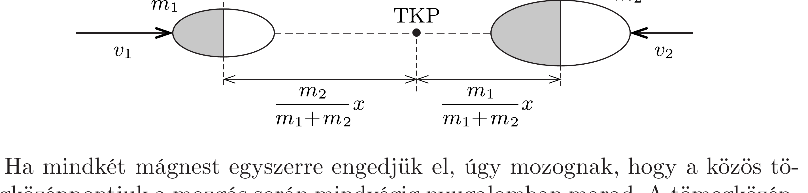

## Útmutatás

Alkalmazzuk az energia- és az impulzusmegmaradás törvényét! A véges kiterjedésú mágnesek kölcsönhatási energiáját nem szükséges expliciten ismernünk, elegendő azt felhasználni, hogy ez az energia a mágnesek távolságának valamilyen (elvben kiszámítható vagy méréssel meghatározható) függvénye.

\section*{Merev testek dinamikája}

## Megoldás

Jelöljük a mágnesek tömegét $m_{1}$-gyel és $m_{2}$-vel, a tömegközéppontjuk közötti távolságot pedig $x$-szel (ennek értéke a mozgás során a kezdeti $d+d_{0}$ értékről $d_{0}$-ra csökken). Legyen továbbá a mágnesek kölcsönhatási energiája a tömegközéppontjaik tetszőleges $x$ távolságú helyzetében $-W(x)$, és válasszuk ezen energia nullpontját a kezdeti $d+d_{0}$ távolságnál: $W\left(d+d_{0}\right)=0$.

Ha a két mágnes tömegközéppontja $x$ távolságra közelíti meg egymást, a közöttük ható erők munkája éppen $W(x)$. Ez a függvény a mágnesek jellemző tulajdonságai és a magnetosztatika törvényei ismeretében elvben kiszámítható, de konkrét alakjára a továbbiakban - szerencsére - nem lesz szükség.

Ha az $m_{1}$ tömegú mágnest engedjük el, sebességének nagysága az energiamegmaradás törvénye szerint számolható ki:
\[
\frac{1}{2} m_{1} v_{1}^{2}=W(x), \quad \text { ebből } \quad v_{1}(x) \equiv-\frac{\mathrm{d} x}{\mathrm{~d} t}=\sqrt{\frac{2 W(x)}{m_{1}}},
\]
ahonnan az ütközésig eltelt idő:
\[
T_{1}=-\int_{d+d_{0}}^{d_{0}} \frac{1}{v_{1}(x)} \mathrm{d} x=\sqrt{m_{1}} \int_{d_{0}}^{d+d_{0}} \frac{1}{\sqrt{2 W(x)}} \mathrm{d} x .
\]
Hasonló módon kapjuk meg a másik test elengedésétől az ütközésig eltelt időt:
\[
T_{2}=\sqrt{m_{2}} \int_{d_{0}}^{d+d_{0}} \frac{1}{\sqrt{2 W(x)}} \mathrm{d} x .
\]

Ha mindkét mágnest egyszerre engedjük el, úgy mozognak, hogy a közös tömegközéppontjuk a mozgás során mindvégig nyugalomban marad. A tömegközéppont a tömegek arányában osztja a két mágnes közötti távolságot (lásd az ábrát), és ugyanez igaz a testek sebességére is:
\[
\frac{v_{1}}{v_{2}}=\frac{m_{2}}{m_{1}} .
\]
Ebben az esetben az energiamegmaradás törvénye így írható:
\[
\frac{1}{2} m_{1} v_{1}^{2}+\frac{1}{2} m_{2} v_{2}^{2}=W(x),
\]
ahonnan (3) felhasználásával az egyik (mondjuk a bal oldali) test sebessége:
\[
-\frac{m_{2}}{m_{1}+m_{2}} \frac{\mathrm{~d} x}{\mathrm{~d} t} \equiv v_{1}(x)=\sqrt{\frac{2 W(x)}{m_{1}\left(1+m_{1} / m_{2}\right)}} .
\]
Ennek megfelelően az összeütközésig eltelt idő így számítható ki:
\[
T_{3}=\sqrt{\frac{m_{1} m_{2}}{m_{1}+m_{2}}} \int_{d_{0}}^{d+d_{0}} \frac{1}{\sqrt{2 W(x)}} \mathrm{d} x .
\]

Az (1), (2) és (4) egyenletekből három egymással egyenlő hányadost képezhetünk, melyek éppen az egyenletekben szereplő (a mágnesek alakjának ismeretében elvileg kiszámítható) integrállal egyenlőek. Négyzetre emelés után a hányadosokat így írhatjuk fel:
\[
\frac{m_{1}}{T_{1}^{2}}=\frac{m_{2}}{T_{2}^{2}}=\frac{m_{1} m_{2}}{m_{1}+m_{2}} \frac{1}{T_{3}^{2}} .
\]
Ebből a többszörös egyenlőségből kiküszöbölhetjük a tömegeket:
\[
\frac{1}{T_{3}^{2}}=\frac{1}{T_{1}^{2}}+\frac{1}{T_{2}^{2}},
\]
amiből a keresett $T_{3}$ időtartamra a következő eredmény adódik:
\[
T_{3}=\frac{T_{1} T_{2}}{\sqrt{T_{1}^{2}+T_{2}^{2}}}=0,48 \mathrm{~s} .
\]

Megjegyzés. Ha feltesszük, hogy a testek a mozgás során nem fordulnak el, akkor a testek közötti bármilyen erőtörvényre ugyanaz az eredmény adódik. Ha az erő a távolság négyzetével fordítottan arányos, amint ez Newton tömegvonzási törvényében gömbszimmetrikus testekre teljesül, vagy ha az eró a Hooke-törvényt követve lineáris (mert mondjuk ideális, megnyújtott rugó köti össze a testeket), akkor az egyes esetekben az elengedéstől az összeütközésig eltelt idő a megoldásban szereplő határozott integrál kiszámításával explicit módon külön-külön meghatározható. A számszerú eredmények természetesen minden esetben igazolják a megoldásunkban leírt általános összefüggést.

\section*{Merev testek dinamikája}
