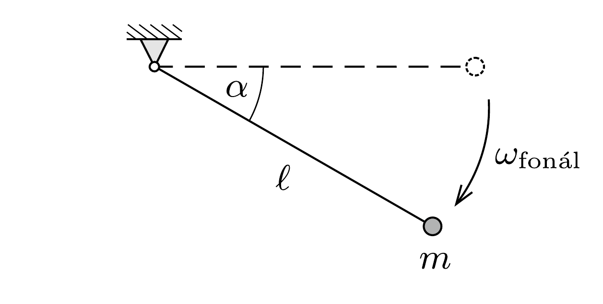
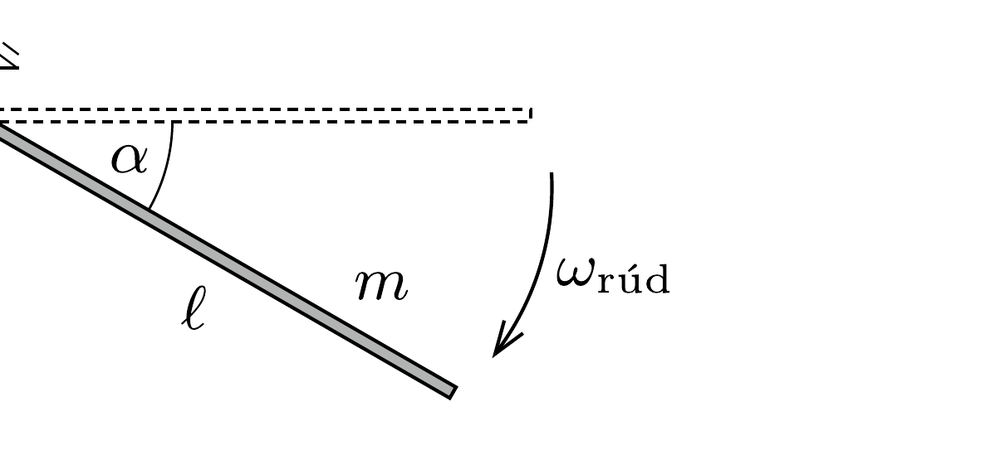

## Útmutatás

Hasonlítsuk össze a két inga szögsebességét azonos szögállású helyzetekben!

## Megoldás

Tekintsünk egy $\ell$ hosszúságú fonálingát és egy ugyancsak $\ell$ hosszúságú homogén rúdingát. Engedjük el mindkettőt vízszintes helyzetből, és számítsuk ki, mekkora lesz a szögsebességük $\alpha$ szögelfordulás után (lásd az ábrát).

A mechanikai energia megmaradásának tétele a fonálingára:
\[
\frac{1}{2} m \ell^{2} \omega_{\text {fonál }}^{2}=m g \ell \sin \alpha, \quad \text { azaz } \quad \omega_{\text {fonál }}=\sqrt{\frac{2 g}{\ell} \sin \alpha},
\]
a rúdingára pedig
\[
\frac{1}{2} \frac{m \ell^{2}}{3} \omega_{\text {rúd }}^{2}=m g \frac{\ell}{2} \sin \alpha, \quad \text { tehát } \quad \omega_{\text {rúd }}=\sqrt{\frac{3 g}{\ell} \sin \alpha} .
\]
Látszik, hogy a rúdinga szögsebessége minden helyzetben $\sqrt{3 / 2}$-szer nagyobb, mint a fonálinga szögsebessége, ugyanakkora szögelforduláshoz tehát a rúdingának $\sqrt{3 / 2}$-szer kevesebb időre van szüksége. Így
\[
T_{\text {rúd }}=\sqrt{\frac{2}{3}} T_{\text {fonál }} .
\]
Ez a megállapítás nemcsak a vízszintes, hanem tetszőleges, egyforma kezdőhelyzetből történő indítás esetén is érvényes. A fenti összefüggés kis szögtérésú lengéseknél is fennáll, amint az a fonálinga és a fizikai inga kis lengéseinek ismert képleteiből is adódik.
