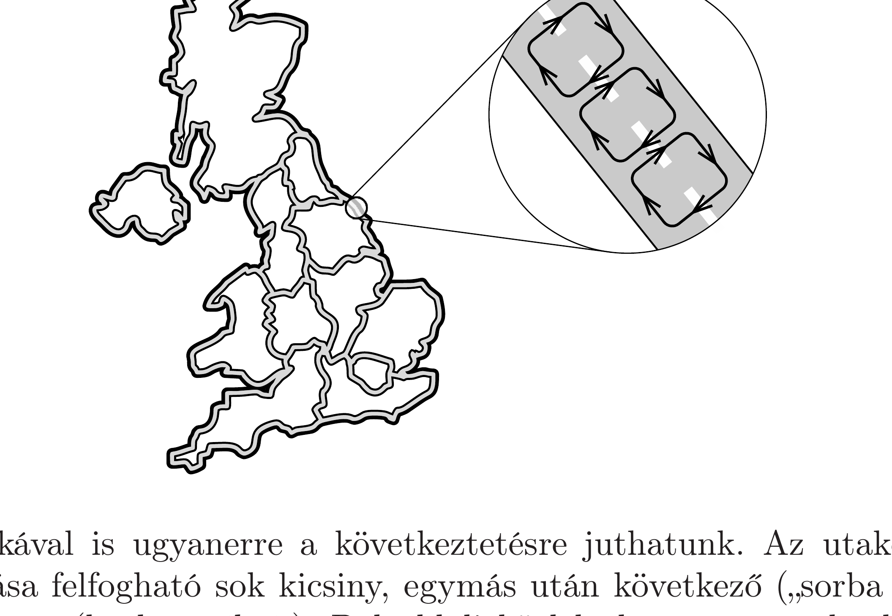

## Útmutatás

Vizsgáljuk meg, hogyan változna a Nagy-Britannia útjain haladó autók eredő perdülete, ha a forgalom iránya megváltozna. Alkalmazzuk a perdületmegmaradás törvényét az egész Földre!

## Megoldás

Tekintsük a nyugatról keletre forgó Föld forgásirányát pozitívnak. Ha Nagy-Britanniában végrehajtanák a változtatást, akkor a pozitív perdületjárulékot képviselő, keleti irányba haladó gépkocsik egy kicsit távolabb kerülnének a Föld forgástengelyétől, így (változatlan átlagsebességet feltételezve) perdületük megváltozása pozitív lenne. A negatív impulzusnyomatékú nyugati irányú forgalom ezzel szemben közeledne a forgástengelyhez, ami szintén pozitív irányú perdületváltozást eredményezne. Az utakon haladó autók impulzusnyomatéka tehát növekedne, és mivel a rendszer teljes perdülete nem változhat meg, a Föld forgási szögsebessége csökkenne, a nap hossza pedig ennek megfelelően növekedne.

Más logikával is ugyanerre a következtetésre juthatunk. Az utakon haladó autók mozgása felfogható sok kicsiny, egymás után következő („sorba kapcsolt”) körforgalomként (lásd az ábrát). Bal oldali közlekedés esetén ezeknek az elemi körforgalmaknak a Föld forgástengelyével párhuzamos perdületkomponense negatív. A jobb oldali közlekedésre való áttéréskor az elemi körforgalmak forgásiránya megfordul, így a perdületvektoruk is előjelet vált. A Nagy-Britannia autós forgalmából és a Föld többi részéből álló rendszer teljes perdülete csak úgy maradhat változatlan, ha a Föld szögsebessége lecsökken, azaz a nap hossza kis mértékben növekszik.

Megjegyzés. A nap hosszának (a feladatban leírt okokra visszavezethető) megváltozásából ténylegesen semmit nem vennénk észre, ugyanis annak mértéke a legpontosabb atomórák mérési pontossága alatt maradna. A Földön ennél sokkal lényegesebb tömegátrendeződéssel járó folyamatok is végbemennek, például a lombhullató fák levelének őszi lehullása, amely önmagában ugyancsak nagyon kicsiny változást okoz a nap hosszában.
