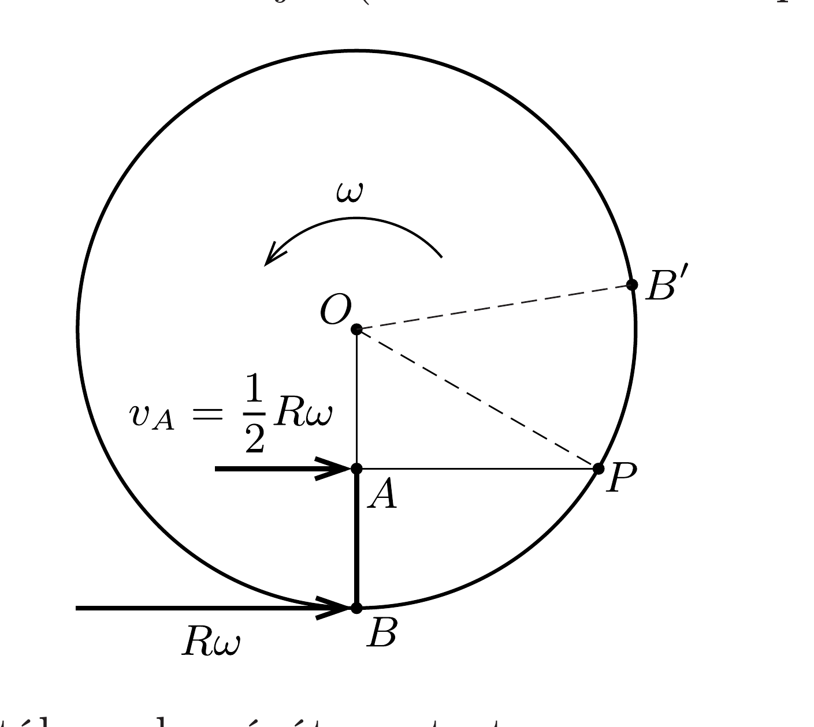

## Útmutatás

a) Ne felejtsük el figyelembe venni az úrhajó mozgási energiájának a megváltozását is!
b) Érdemes a macska mozgását inerciarendszerből vizsgálni.

## Megoldás

a) Az $\omega$ szögsebességgel forgó ürhajó padlójánál az ott lévő $m$ tömegü testre $m R \omega^{2}$ nagyságú, tengelyirányú erốt kell kifejteni, hogy a test az ürhajóhoz képest nyugalomban maradjon. A forgó rendszerből nézve tehát minden test $g=R \omega^{2}$ erősségú, látszólagos gravitációs teret „érez". Ez akkor egyezik meg a megadott $g$ értékkel, ha a szögsebesség
\[
\omega=\sqrt{\frac{g}{R}}=1 \frac{1}{\mathrm{~s}} .
\]

Az $R / 2$ magasságig lassan felmászó macskának a megtett úttal lineárisan csökkenő erőt kell kifejtenie a mászórúdra, így a munkavégzése az átlagerőből számolható:
\[
W=\frac{1}{2}\left(m g+\frac{m g}{2}\right) \frac{R}{2}=\frac{3}{8} m g R=150 \mathrm{~J} .
\]
A mozgási energiája eközben megváltozik, hiszen a kezdeti ( $R \omega$ nagyságú) sebessége éppen a felére csökken, így az energiaváltozása:
\[
\Delta E_{\text {mozgási }}=\frac{1}{2} m\left[\left(\frac{R \omega}{2}\right)^{2}-(R \omega)^{2}\right]=-\frac{3}{8} m R^{2} \omega^{2}=-\frac{3}{8} m g R=-150 \mathrm{~J} .
\]

A mászás közben végzett munka csak nagyságát tekintve egyezik meg a mozgási energia megváltozásával, az előjele ellentétes! A macska pozitív munkát végzett, mozgási energiája mégsem növekedett, hanem éppen ellenkezőleg: (ugyanannyit) csökkent. Vajon hová tünt a „hiányzó" 300 J energia?

Vegyük figyelembe, hogy a macska csak az úrhajóval együtt alkot zárt rendszert! Az úrhajó tömege sokkal nagyobb, mint a macskáé, emiatt a mászás közben a forgás szögsebessége alig változik. Ezt a munka kiszámításánál hallgatólagosan már ki is használtuk, amikor a mászórúd tetején lévó macska sebességét a kezdeti $\omega$ segítségével adtuk meg. Ha most mégis számításba akarjuk venni a szögsebesség kicsiny $\Delta \omega$ megváltozását, akkor a $\Theta$ tehetetlenségi nyomatékú úrhajó forgási energiájának megváltozását így írhatjuk fel:
\[
\Delta E_{\text {forgási }}=\frac{1}{2} \Theta\left[(\omega+\Delta \omega)^{2}-\omega^{2}\right] \approx \Theta \omega \Delta \omega .
\]
A szögsebesség változásának nagyságát a perdületmegmaradás törvénye alapján számíthatjuk ki:
\[
\Theta \omega+m R^{2} \omega=\Theta(\omega+\Delta \omega)+m \frac{R}{2} \frac{R \omega}{2} .
\]
Felhasználtuk, hogy $\Theta \gg m R^{2}$, emiatt a fenti egyenlet jobb oldalának második tagjában elhanyagoltuk a szögsebesség kicsiny $\Delta \omega$ megváltozását, hiszen az egy másik kis mennyiséggel, $m$-mel szorzódik. Eszerint
\[
\Delta \omega=\frac{3 m R^{2} \omega}{4 \Theta},
\]
az úrhajó forgási energiájának megváltozása pedig
\[
\Delta E_{\text {forgási }}=\Theta \omega \Delta \omega=\frac{3}{4} m R^{2} \omega^{2}=\frac{3}{4} m g R=+300 \mathrm{~J} .
\]

Megnyugodhatunk, a munkatétel az ürben is érvényes:
\[
W=\Delta E_{\text {mozgási }}+\Delta E_{\text {forgási }} .
\]
b) Az úrhajó tömegközéppontjával együtt mozgó inerciarendszerből szemlélve a macska sebessége a mászórúd tetején (az ábrán látható $A$ pontban) $v_{A}=R \omega / 2$.

Ha elválik a mászórúdtól, a sebességét megtartva egyenes vonalú, egyenletes mozgással jut el a tornaterem talaján található $P$ pontba. Az $A P$ szakasz hossza a Pitagorasz-tételből $\sqrt{3} R / 2$, így a macska „esésének” ideje:
\[
t_{A P}=\frac{A P}{v_{A}}=\frac{\sqrt{3}}{\omega} \approx 1,7 \mathrm{~s} .
\]

A mászórúd legalsó $(B)$ pontja az esés ideje alatt egy olyan $B^{\prime}$ pontba kerül, melynek a padló mentén „ívesen“ mért távolsága $B$-től
\[
s_{B B^{\prime}}=R \omega t_{A P}=\sqrt{3} R \approx 17,3 \mathrm{~m} .
\]
Ugyanakkor a $P$ pontban a padlóra érkező macska $B$-től csak
\[
s_{B P}=R \arccos \left(\frac{R / 2}{R}\right)=R \frac{\pi}{3} \approx 10,5 \mathrm{~m}
\]
távolságra jut el. Az űrhajóban tartózkodók (azzal együtt forgó megfigyelők) azt látják, hogy a mászórúd tetejéről leeső macska nem a rúd aljánál, hanem attól a forgás irányához képest „visszafelé”,
\[
\Delta s=s_{P B^{\prime}}=s_{B B^{\prime}}-s_{B P} \approx 6,8 \mathrm{~m}
\]
távolságban éri el talajt. Ezt a furcsa „hanyattesést” a forgó rendszerben ülő úrhajósok (akik természetesen jártasak a tehetetlenségi erők témakörében) a Corioliserốnek tulajdonítják. A rúdról leeső úrmacskának a forgó úrhajóhoz viszonyított mozgása csak meglehetősen bonyolult módon számítható ki, míg ugyanennek a mozgásnak az időbeli leírása és a pálya alakja inerciarendszerből nézve igen egyszerú.
