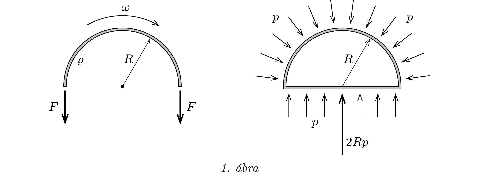
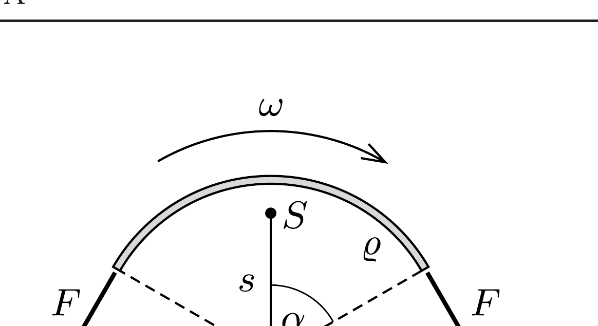
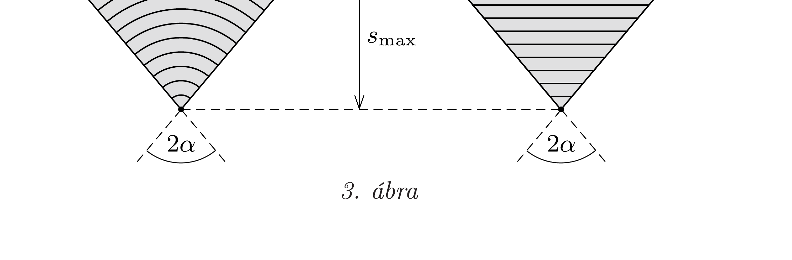

## Útmutatás

Képzeljünk el egy homogén tömegeloszlású körgyürút, amelyet a középpontja körül valamekkora szögsebességgel megforgatunk - mondja Jancsi. Gondoljuk végig, mekkora eró feszíti a körgyürüt, és ha képzeletben kivágnánk ennek a gyúrúnek egy darabját, erre a körívre hogyan teljesülne a tömegközépponti mozgásegyenlet.

## Megoldás

Jancsi így kezdi gondolatmenetét: Képzeljünk el egy $R$ sugarú, homogén tömegeloszlású körgyürüt, amelynek hosszegységre jutó tömege $\varrho$, és a középpontja körül állandó $\omega$ szögsebességgel forog. Számítsuk ki, mekkora $F$ erő feszíti ezt a gyűrút!

Vizsgáljuk a körgyürú egyik felét dinamikai szempontból! A kerületi pontok centripetális gyorsulása $R \omega^{2}$, a gyúrú egységnyi hosszúságú (kicsiny) darabkáit tehát $\varrho R \omega^{2}$ nagyságú erő tartja körpályán. Éppen ekkora erő hat egy $R$ sugarú, 1 méter magas félhenger alakú tartály íves oldalának egységnyi hosszú szakaszára is, ha a tartályt $p=\varrho R \omega^{2}$ túlnyomású gázzal vesszük körül (1. ábra).

A gyürú kicsiny darabkáira ható erők vektori összege éppen a gyürüben ébredő eró kétszeresével, $2 F$-fel egyenlő. A félhenger alakú tartály íves oldalára ható eredó eró pedig ugyanakkora, mint a $2 R$ területú, téglalap alakú oldallapra ható $p \cdot 2 R$ erő, hiszen egy gázba helyezett testre a gáz által kifejtett eredő erőnek zérusnak kell lennie (ellenkező esetben a tartály gyorsulni kezdene, így örökmozgót készíthetnénk). Az analógia alapján tehát
\[
2 F=\varrho R \omega^{2} \cdot 2 R,
\]
amiből a gyűrút feszítő erőre az $F=\varrho R^{2} \omega^{2}$ eredményt kapjuk.
Tekintsük ezek után a forgó körgyürünek egy $2 \alpha$ középponti szöghöz tartozó ívét, és nézzük meg, hogyan teljesül erre a darabra a Newton-féle mozgásegyenlet - folytatja Jancsi. Az $m=2 \alpha R \varrho$ tömegü körívre ható erők eredője $2 F \sin \alpha$, a tömegközéppontjának centripetális gyorsulása pedig $a=s \omega^{2}$, ahol $s$ a körív súlypontjának a körgyürú középpontjától mért távolságát jelöli (2. ábra). Newton törvénye szerint
\[
2 F \sin \alpha=m a,
\]
ahonnan az $F$ eróre korábban kapott összefüggést felhasználva
\[
s=R \frac{\sin \alpha}{\alpha}
\]
adódik. Félkörívre például (ez volt Karcsi eredeti problémája) $\alpha=\pi / 2$, ilyenkor $s=2 R / \pi$.

Amennyiben egy körcikk tömegközéppontját akarjuk meghatározni, ezt képzeletben feldarabolhatjuk vékony körívekre. Mindegyik körív helyettesíthető a tömegközéppontjába helyezett, alkalmas tömegú pontszerú testtel, és ugyanez érvényes egy vékony csíkokból összerakható háromszögre is (3. ábra). Ebből viszont az következik, hogy egy $R$ sugarú körcikk tömegközéppontja pontosan ott van, ahol egy $s_{\text {max }}=R \frac{\sin \alpha}{\alpha}$ magasságú, egyenlő szárú háromszögé, tehát a csúcspontjától
\[
s_{\text {körcikk }}=\frac{2}{3} R \frac{\sin \alpha}{\alpha}
\]
távolságban - fejezi be az igazán nem mindennapi logikát követő érvelését Jancsi.

