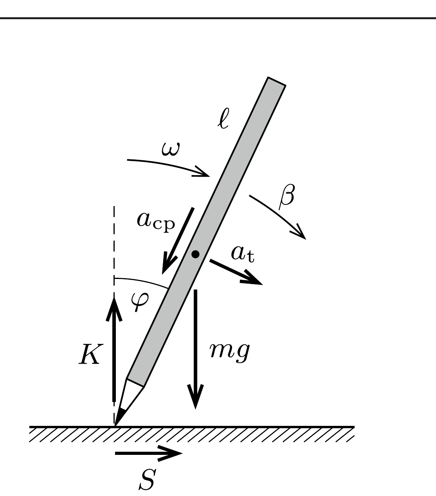
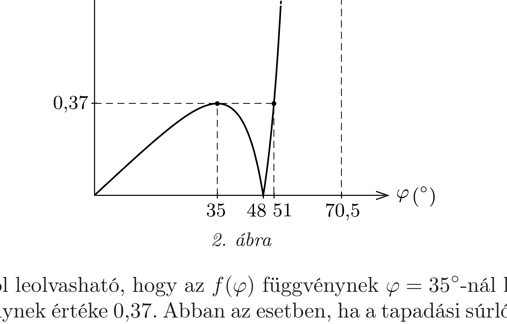
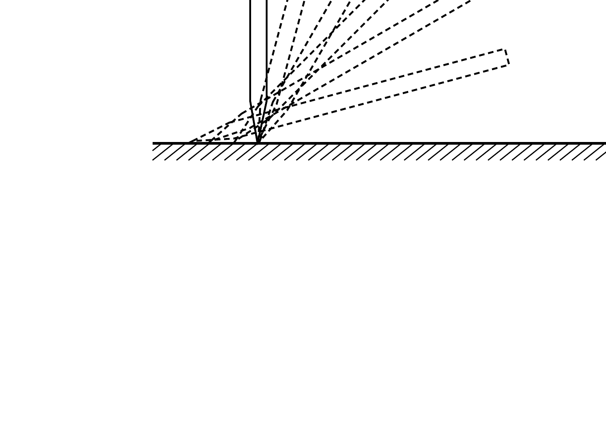
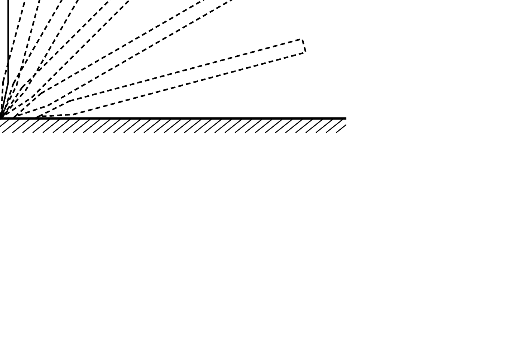

## Útmutatás

A kérdésre nem tudunk egyértelmú választ adni, mert az elcsúszás iránya függ a ceruza hegye és az asztallap közötti tapadási súrlódási együttható nagyságától. Ha a súrlódási tényezó kicsi, akkor a ceruza hegye hátrafelé (a dőlés irányával ellentétesen), ellenkező esetben pedig előrefelé csúszik. A két esetet elválasztó kritikus súrlódási tényezőt meghatározhatjuk, ha felírjuk a ceruza tömegközéppontjának mozgását és a tömegközéppont körüli forgást leíró egyenleteket.

## Megoldás

Képzeljük el, hogy az asztal lapja nagyon sima (azaz nagyon kicsi a súrlódási együttható). A ceruza tömegközéppontja eleinte a dőlés irányában gyorsul, méghozzá egyre nagyobb mértékben. Ezt a gyorsulást a súrlódási erő hozza létre, és mivel az asztallap sima, a ceruza hegye előbb-utóbb megcsúszik, a dóléssel ellentétes irányban.

Ha a súrlódás nagyon nagy, akkor a ceruza sokáig nem csúszik meg. A körpályán mozgó tömegközéppont vízszintes irányú sebessége eleinte (a dőlés irányában) növekszik, majd csökkenni kezd, és - ha a ceruza egészen a vízszintes helyzetéig így mozogna - nullához tartana. A tömegközéppont vízszintes gyorsulásának iránya, és ezzel együtt a súrlódási erő előjele tehát a mozgás során megváltozik. Ha a ceruza csúszásmentesen ,átvészeli" az első mozgásszakaszt, akkor már csak „elórefele”, a dólés irányába csúszhat meg.

Eddigi kvalitatív megállapításainkat számolással is alátámaszthatjuk. Jelöljük a (homogén rúdnak tekintett) ceruza tömegét $m$-mel, hosszát $\ell$-lel, a ceruzára ható tapadási súrlódási erốt $S$-sel, az asztal által kifejtett kényszererőt pedig $K$-val.

Tekintsük az eldőlő ceruzának azt az állapotát, amikor a függőlegessel $\varphi$ szöget zár be, és a hegye még nem csúszott meg (1. ábra). A ceruza $\omega$ szögsebességét az energiamegmaradás törvényéből kaphatjuk meg:
\[
m g \frac{\ell}{2}(1-\cos \varphi)=\frac{1}{2} \cdot \frac{1}{3} m \ell^{2} \omega^{2},
\]
amiból
\[
\omega=\sqrt{\frac{3 g}{\ell}(1-\cos \varphi)} .
\]

A ceruza tömegközépontjának gyorsulása két összetevőre bontható: az asztallal való érintkezési pont felé mutató $a_{\mathrm{cp}}$ centripetális gyorsulásra és az erre merőleges $a_{\mathrm{t}}$ tangenciális (érintőleges) gyorsulásra. Az előbbi gyorsuláskomponenst a ceruza szögsebessége határozza meg:
\[
a_{\mathrm{cp}}=\frac{\ell}{2} \omega^{2},
\]
az érintőleges gyorsulást pedig az
\[
a_{\mathrm{t}}=\frac{\ell}{2} \beta
\]
összefüggés alapján számolhatjuk ( $\beta$ a ceruza szöggyorsulása).
A tömegközéppont függőleges irányú mozgásegyenlete:
\[
m g-K=m\left(a_{\mathrm{t}} \sin \varphi+a_{\mathrm{cp}} \cos \varphi\right),
\]
a vízszintes irányú gyorsulást pedig a tapadási súrlódási eró okozza:
\[
S=m\left(a_{\mathrm{t}} \cos \varphi-a_{\mathrm{cp}} \sin \varphi\right) .
\]
Végül felírhatjuk a forgómozgás alapegyenletét a ceruza asztallal való érintkezési pontjára:
\[
m g \frac{\ell}{2} \sin \varphi=\frac{1}{3} m \ell^{2} \beta .
\]

Az (1)-(6) egyenletekből kifejezhetjük a $K$ kényszererőt és az $S$ tapadási súrlódási erốt:
\[
K=m g\left(\frac{3 \cos \varphi-1}{2}\right)^{2}, \quad S=\frac{3}{4} m g \sin \varphi(3 \cos \varphi-2) .
\]
A ceruza hegye addig nem csúszik meg, amíg $|S| \leq \mu K$, ahol $\mu$ a ceruza és az asztallap közötti tapadási súrlódási együttható. Annak meghatározásához, hogy melyik irányba mozdul el a ceruza hegye, ábrázoljuk az
\[
f(\varphi)=\left|\frac{S}{K}\right|=\frac{|3 \sin \varphi(3 \cos \varphi-2)|}{(3 \cos \varphi-1)^{2}}
\]
kifejezést a $\varphi$ dőlési szög függvényében (2. ábra). Ha a (7) kifejezés számlálója nullára csökken $(\cos \varphi=2 / 3)$, akkor a tapadási eró iránya megfordul; ez $\varphi \approx 48^{\circ}$ -nál következik be. A kényszererő nagysága nullára csökken, ha $\cos \varphi=1 / 3$, ami $\varphi=70,5^{\circ}$-nak felel meg. Eddig a helyzetig a ceruza biztosan nem jut el megcsúszás nélkül, hiszen az végtelen nagy súrlódási együtthatót igényelne.

A 2. ábráról leolvasható, hogy az $f(\varphi)$ függvénynek $\varphi=35^{\circ}$-nál lokális maximuma van, melynek értéke 0,37. Abban az esetben, ha a tapadási súrlódási együttható kisebb a kritikus $\mu_{\text {krit }}=0,37$ értéknél, a ceruza hegye valamilyen $\varphi<35^{\circ}$ szögnél hátrafelé csúszik meg. $\mu>\mu_{\text {krit }}$ esetén viszont a ceruza csúszás nélkül túléli a kezdeti mozgásszakaszt, és csak az $51^{\circ}<\varphi<70,5^{\circ}$ tartományban csúszik meg: ilyenkor a hegye előrefelé mozdul. A ceruza dólésének néhány mozzanatát a 3. ábra szemlélteti a két esetben.

