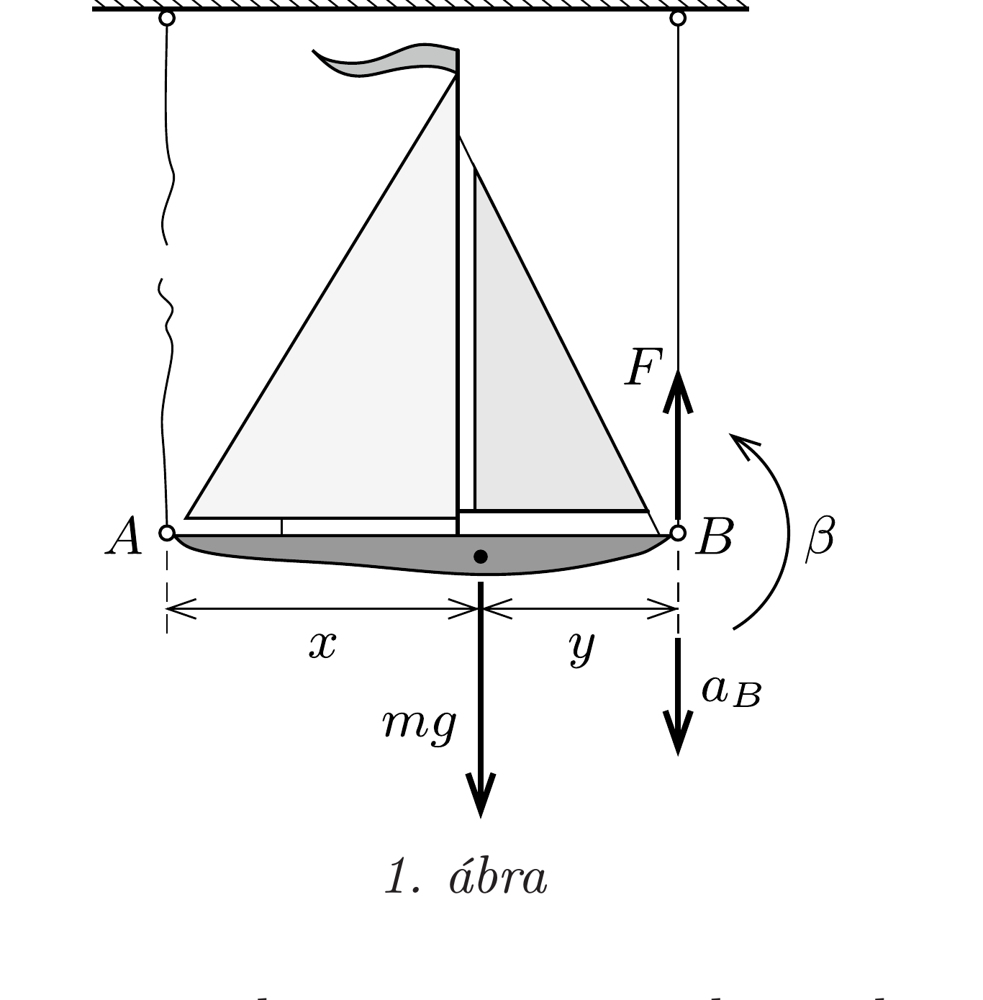
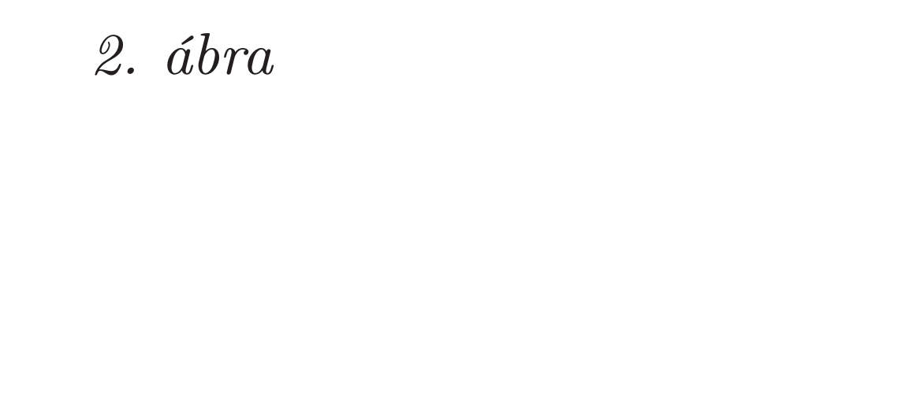

## Útmutatás

A megmaradt gumiszálat feszítő erő csak a megnyúlásától függ, ami nem tud hirtelen megváltozni. A mozgás- és forgásegyenletek felírásával nézzük meg, mi annak a feltétele, hogy a $B$ pont felfelé mozduljon. Belátható, hogy ez a feltétel tetszőleges tömegeloszlású hajótestnél teljesül.

## Megoldás

Jelöljük a tömegközéppont távolságát az $A$ ponttól $x$-szel, a $B$ ponttól pedig $y$-nal. (A feladat szövege szerint a hajó függőleges mérete a hosszához képest kicsi, emiatt a tömegközéppont jó közelítéssel az $A B$ szakaszon található.)

Kezdetben az $m$ tömegú hajóra ható erők és forgatónyomatékok eredője egyaránt zérus, így a jobb oldali szálat feszítő erő a bal oldali szál elvágása előtt
\[
F=m g \frac{x}{x+y},
\]
és ugyanennyi marad közvetlenül az elnyisszantás után is, hiszen a gumiszál hossza nem tud hirtelen megváltozni.

Az 1. ábra jelöléseit alkalmazva a hajó mozgásegyenlete
\[
m g-F=m a,
\]
a forgást leíró egyenlet pedig
\[
y F=\Theta \beta,
\]
ahol $a$ a tömegközéppont függőlegesen lefelé irányuló gyorsulása, $m$ a hajó tömege, $\Theta$ a tehetetlenségi nyomatéka a tömegközéppontjára vonatkoztatva, $\beta$ pedig a szöggyorsulása.

A $B$ pont gyorsulása a tömegközéppont gyorsulásának és a $\beta$ szöggyorsulásból származó érintőleges gyorsulásnak az előjeles összege:
\[
a_{B}=a-y \beta=g \frac{y}{x+y}\left(1-\frac{m x y}{\Theta}\right),
\]
ahol a függőlegesen lefelé mutató irányt választottuk pozitívnak. Látható, hogy a $B$ pont felfelé indul el, ha
\[
\Theta<m x y .
\]

A következőkben megmutatjuk, hogy ez az egyenlőtlenség biztosan teljesül. Osszuk fel az $\ell=x+y$ hosszúságú hajótestet képzeletben $m_{i}$ tömegǘ, a $B$ ponttól $y_{i}$ távolságra lévő, pontszerúnek tekinthető részekre $(i=1,2, \ldots)$ a 2. ábrán látható módon. Ezekkel a jelölésekkel a hajó össztömege és tömegközéppontjá-

nak helye így írható:
\[
\sum m_{i}=m, \quad y=\frac{\sum m_{i} y_{i}}{m} .
\]

A tömegközéppontra vonatkoztatott tehetetlenségi nyomatékot a Steiner-tétel segítségével fejezhetjük ki:
\[
\Theta=\sum m_{i} y_{i}^{2}-m y^{2} .
\]
Mindezek felhasználásával a bizonyítandó egyenlőtlenség így alakul:
\[
\sum m_{i} y_{i}^{2}<\ell \sum m_{i} y_{i},
\]
ami igaz, hiszen mindegyik $y_{i}$ kisebb $\ell$-nél.
Ezzel beláttuk, hogy a hajó tömegeloszlásától (vagyis a tömegközéppont helyzetétől és a tehetetlenségi nyomaték nagyságától) függetlenül az egyik gumiszál elvágása után a másik szál végpontja biztosan felfelé kezd mozogni.
