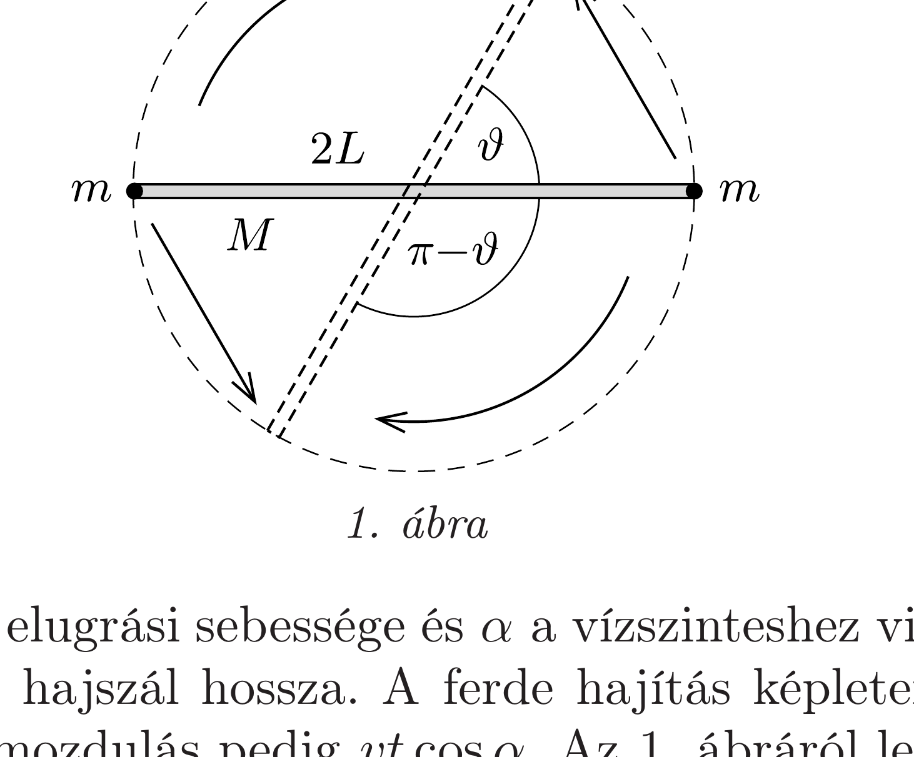
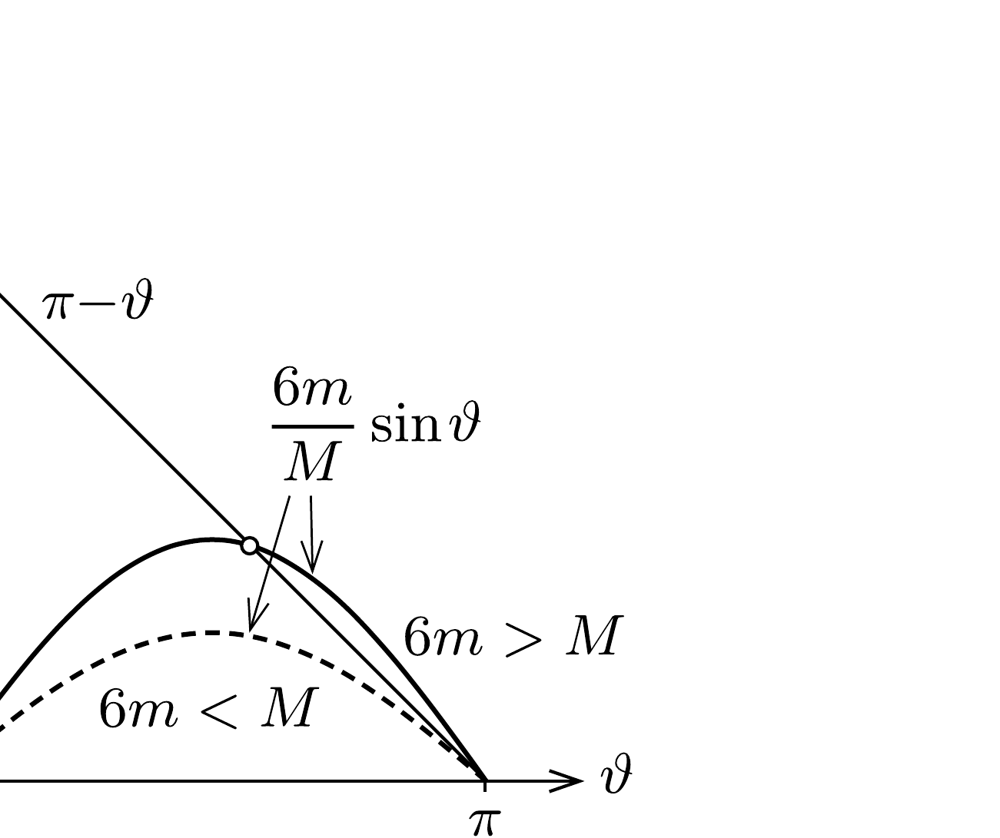

## Útmutatás

A bolhák nem ugorhatnak közvetlenül egymás felé, mert akkor összeütköznek a levegőben félúton. Tehát valamilyen más irányba kell ugraniuk, miközben a rendszer szimmetriája megmarad. Gondoljunk arra, miért lényeges a hajszál megadott tömege!

## Megoldás

Az ugrás akkor sikerülhet összeütközés nélkül, ha a bolhák pályái és a hajszál nincsenek egy síkban. Tegyük fel, hogy felülnézetben a bolhák a hajszál kezdeti irányához képest $\frac{1}{2}(\pi-\vartheta)$ szögben ugranak el (1. ábra). A két bolha elrugaszkodáskor egyforma erőlökést fejt ki a hajszál végeire, aminek következtében az ellenkezó irányban forgásba jön. Sikeres ugrás esetén a hajszál a bolhák landolásáig éppen $\pi-\vartheta$ szöggel fordul el.

Legyen $v$ a bolhák elugrási sebessége és $\alpha$ a vízszinteshez viszonyított elugrási szögük, továbbá $2 L$ a hajszál hossza. A ferde hajítás képleteiből a repülési idő $t=(2 v \sin \alpha) / g$, az elmozdulás pedig $v t \cos \alpha$. Az 1. ábráról leolvasható, hogy ez az elmozdulás $2 L \sin (\vartheta / 2)$-vel egyenlő. Az elrugaszkodás alatt a rendszerre nem hat vízszintes irányú eredő erő, ezért a hajszál és a bolhák függőleges irányú eredő perdülete az ugrást követő pillanatban ugyanúgy zérus, mint előtte:
\[
2 m v L \cos \alpha \cos \frac{\vartheta}{2}-\Theta \omega=0, \quad \text { ahol } \quad \Theta=\frac{1}{12} M(2 L)^{2}=\frac{1}{3} M L^{2} .
\]
Tudjuk továbbá, hogy a hajszál szögelfordulása $\omega t=\pi-\vartheta$.
Az eddig felírt összefüggésekből $\alpha, t$ és $\omega$ kiküszöbölésével $\vartheta$-ra a következő egyenletet kapjuk:
\[
\frac{6 m}{M} \sin \vartheta=\pi-\vartheta .
\]

Az a kérdés, hogy mekkora $m / M$ tömegarány esetén létezik ennek a transzcendens egyenletnek $0<\vartheta<\pi$ megoldása. Ennek megválaszolásához ábrázoljuk az egyenlet jobb és bal oldalát $\vartheta$ függvényében különböző tömegarányok esetén (2. ábra). Az egyenlet jobb oldala egy -1 meredekségú egyenest ír le, amely $\vartheta=\pi$-nél metszi a vízszintes tengelyt. A bal oldal $\vartheta=\pi$-nél szintén nulla értéket vesz fel, és mivel a szinuszfüggvény meredeksége ezen a helyen éppen -1 , ezért $m=M / 6$ esetén a két ábrázolt grafikon éppen érinti egymást. Ha

tehát $m<M / 6$, akkor a fenti egyenletnek nincs a számunkra érdekes intervallumon megoldása, az $m>M / 6$ esetben azonban a bolhák tervezett ugrása valóban kivitelezhető. (Ha $M$ elegendően kicsiny, akkor a hajszál többszöri körülfordulásával is megoldható a mutatvány.)
