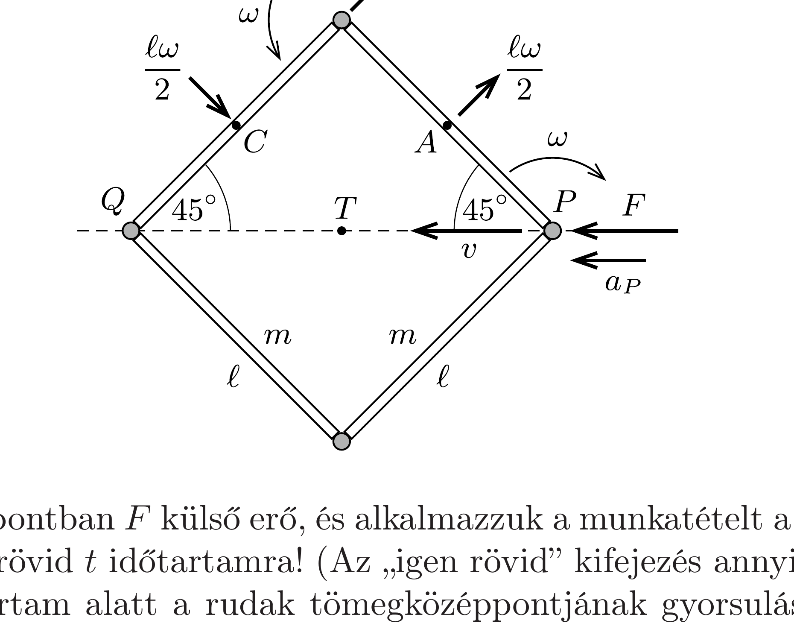

## Útmutatás

Felírhatjuk a dinamika és a forgómozgás alapegyenletét minden egyes rúd tömegközéppontjának gyorsulására és szöggyorsulására, ezek azonban nagyon sok ismeretlent tartalmaznak (pl. a rudak között ható erőket és azok irányát), és csak hosszas számolás után vezetnek eredményre. Egyszerúbben célhoz érünk, ha a munkatételt alkalmazzuk egy, az indulást követő igen rövid időtartamra.

## Megoldás

Jelöljük a rudak tömegét $m$-mel, hosszát $\ell$-lel (középpontjukra vonatkoztatott tehetetlenségi nyomatékuk ekkor $\Theta=\frac{1}{12} m \ell^{2}$ ), az ábra felső felén látható rudak középpontját $A$-val és $C$-vel, közös végpontjukat $B$-vel, a rendszer tömegközéppontját pedig $T$-vel.

Hasson a $P$ pontban $F$ külső erő, és alkalmazzuk a munkatételt a kezdőpillanatot követő igen rövid $t$ időtartamra! (Az „igen rövid” kifejezés annyit jelent, hogy a vizsgált időtartam alatt a rudak tömegközéppontjának gyorsulása és a rudak szöggyorsulása állandónak tekinthető.)
\[
F \cdot \frac{a_{P}}{2} t^{2}=E_{\text {forgási }}+E_{\text {transzlációs }} .
\]

A rendszer teljes mozgási energiája kifejezhető a $P$ pont $v=a_{P} t$ sebességével és a rudak $\omega=\beta t$ szögsebességével. (A rudak szögelfordulása egy adott pillanatban ugyanakkora nagyságú, emiatt a szögsebességük és a szöggyorsulásuk nagysága is megegyezik.) Mivel az $A$ pont a $P$ pont körül $\ell / 2$ sugarú körpályán
mozog $\omega$ szögsebességgel, az asztalhoz viszonyított sebessége a $P$ pont sebességének és a $P$ körüli forgásból adódó sebességének a vektori összege, négyzete tehát
\[
v_{A}^{2}=\left(v-\frac{\ell \omega}{2 \sqrt{2}}\right)^{2}+\left(\frac{\ell \omega}{2 \sqrt{2}}\right)^{2}=a_{P}^{2} t^{2}+\frac{\ell^{2} \beta^{2} t^{2}}{4}-\frac{a_{P} \ell \beta t^{2}}{\sqrt{2}} .
\]
(Az ábrán a $P$ pontnak az asztalhoz viszonyított sebességét tüntettük fel, az $A$ és $B$ pontoknak viszont csak a $P$-hez viszonyított mozgását, $C$-nek pedig $B$-hez viszonyított sebességét jelöltük.)

Hasonlóan számítható a $C$ pont sebességének négyzete is a $B$ pont $P$-hez viszonyított $\ell \omega$ nagyságú sebességéből és a $B$ körüli forgás $\frac{1}{2} \ell \omega$ nagyságú sebességéből:
\[
v_{C}^{2}=\left(v-\frac{\ell \omega}{\sqrt{2}}-\frac{\ell \omega}{2 \sqrt{2}}\right)^{2}+\left(\frac{\ell \omega}{\sqrt{2}}-\frac{\ell \omega}{2 \sqrt{2}}\right)^{2}=a_{P}^{2} t^{2}+\frac{5 \ell^{2} \beta^{2} t^{2}}{4}-\frac{3 a_{P} \ell \beta t^{2}}{\sqrt{2}} .
\]
A munkatétel tehát így alkalmazható:
\[
F \cdot \frac{a_{P}}{2} t^{2}=4 \cdot \frac{1}{2} \cdot \frac{1}{12} m \ell^{2} \omega^{2}+2 \cdot \frac{1}{2} m v_{A}^{2}+2 \cdot \frac{1}{2} m v_{C}^{2},
\]
ami a fenti képletek felhasználásával (és $t^{2}$-tel való egyszerúsítés után) a következő összefüggésre vezet:
\[
F \frac{a_{P}}{2 m}=\frac{5}{3} \ell^{2} \beta^{2}+2 a_{P}^{2}-\frac{4}{\sqrt{2}} a_{P} \ell \beta .
\]

A négy rúd $T$ tömegközéppontjának gyorsulása megegyezik a $B$ pont gyorsulásának $P Q$ irányú vetületével. Kezdetben, amikor a szögsebesség és a centripetális gyorsulás is nulla, ez így írható:
\[
a_{T}=a_{P}-\frac{\ell \beta}{\sqrt{2}} .
\]
Ez a gyorsulás (Newton II. törvénye értelmében) kifejezhető a rendszerre ható külső erővel:
\[
a_{T}=\frac{F}{4 m} .
\]
Az (1)-(3) egyenletekből
\[
a_{T}=\frac{a_{P}+a_{Q}}{2}=\frac{2}{5} a_{P}, \quad \text { vagyis } \quad a_{Q}=-\frac{1}{5} a_{P}
\]
következik. Érdekes, hogy a $Q$ pont a $P$ pont felé, annak gyorsulásával ellentétes irányban kezd el mozogni.
