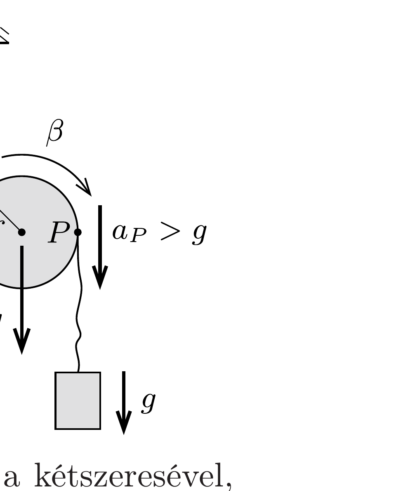

## Útmutatás

Látszólag túl kevés a rendelkezésre álló adat, de legyünk bátrak, és írjuk fel a henger tömegközéppontjának mozgását és a forgómozgást leíró egyenleteket!

## Megoldás

Először vizsgáljuk meg, hogyan mozogna a henger, ha a súlyos test nem lenne ráakasztva. A hengerre a tömegközéppontjában támadó nehézségi erő és a
fonalakban ébredő erők hatnak, utóbbiak eredőjét jelöljük $F$-fel (lásd az ábrát). Az $m$ tömegü, $r$ sugarú és $\Theta$ tehetetlenségi nyomatékú henger tömegközéppontjának gyorsulását az
\[
m g-F=m a
\]
mozgásegyenletből számolhatjuk, a forgást leíró egyenlet pedig
\[
r F=\Theta \beta,
\]
ahol $\beta=a / r$ a henger szöggyorsulása.
A fenti egyenletekből a henger tömegközéppontjának gyorsulására
\[
a=g \frac{m r^{2}}{m r^{2}+\Theta}
\]
értéket kapunk. Mivel $0<\Theta \leq m r^{2}$, így
\[
\frac{g}{2} \leq a<g .
\]

A hengernek az ábrán jelölt $P$ pontja ennek a gyorsulásnak a kétszeresével, tehát legalább $g$ gyorsulással kezd mozogni. Ha a súlyos testet ráakasztjuk a hengerre, a nehezék fonalának $P$-vel érintkező pontja is $g$, vagy annál nagyobb gyorsulással indul meg, a nehezék viszont legfeljebb $g$ gyorsulással, azaz a fonál meglazul. A súlyos test tehát szabadeséssel kezd zuhanni a rendszer elengedése után.
