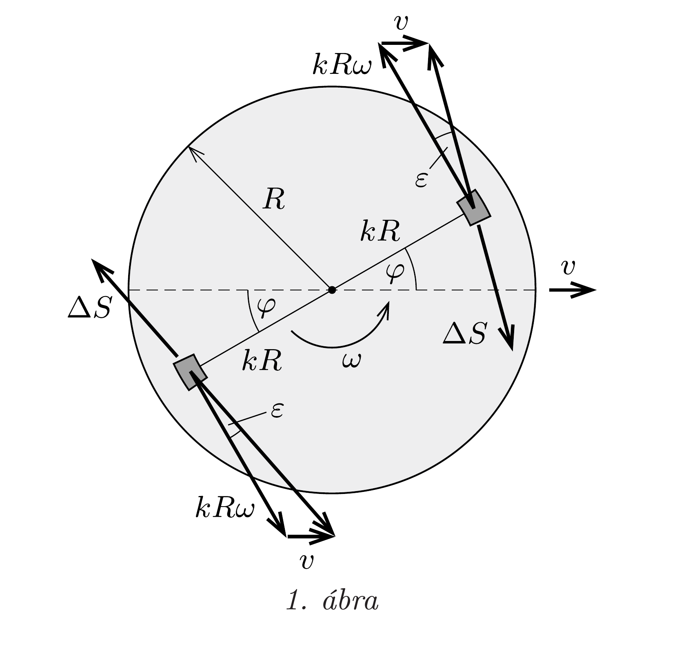
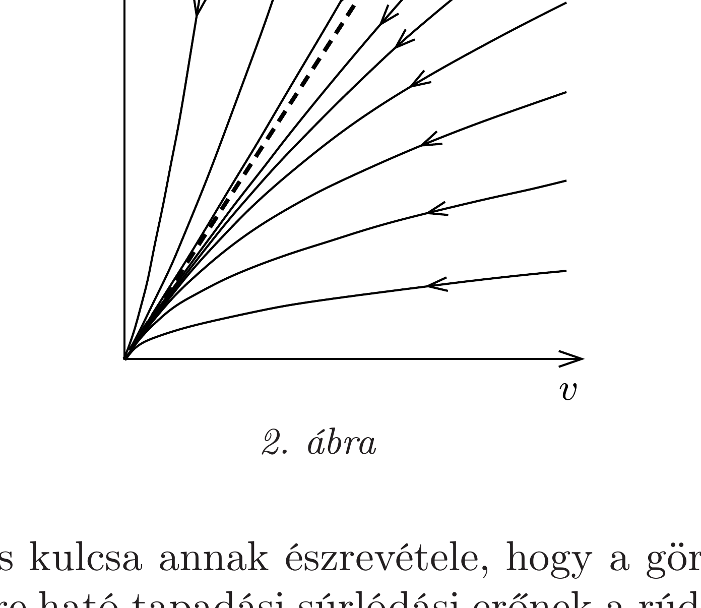

## Útmutatás

Mutassuk meg, hogy sem a korong haladó mozgása, sem pedig a forgása nem állhat le előbb. Ehhez gondoljuk meg, hogy mekkora erő fékezi a haladást, amikor a tömegközéppont már csak nagyon lassan mozog, illetve mekkora forgatónyomaték fékezi a forgást, amikor a szögsebesség már nagyon kicsi.

## Megoldás

Tételezzük fel, hogy a haladó mozgás áll le hamarabb, azaz a korong még számottevő $\omega^{*}$ szögsebességgel rendelkezik, amikor a tömegközéppont sebessége nullára csökken. Vizsgáljuk a mozgást rövid idővel a megállás pillanata előtt, amikor a korong $\omega>\omega^{*}$ szögsebességgel forog, középpontjának sebessége pedig $v \ll R \omega^{*}$ (itt $R$ a korong sugara).

Tekintsük a korongnak két egyforma, a középpontra nézve szimmetrikusan elhelyezkedő kicsiny darabkáját az 1. ábrán látható módon. A feladat szövege szerint a korong egyenletesen nyomja a jeget, így az azonos területú darabkákra
ható $\Delta S$ súrlódási erő nagysága is azonos. A súrlódási erő iránya az egyes darabkák jéghez viszonyított sebességével ellentétes irányú, ezért nem meróleges a korong középpontjából a darabkákhoz húzott sugárra, hanem attól kicsiny $\varepsilon$ szöggel eltér. Geometriai megfontolásokból kapjuk az $\varepsilon$ szög nagyságát:
\[
\varepsilon \approx \frac{v \cos \varphi}{k R \omega},
\]
ahol $k R$ a vizsgált két felületdarabka távolsága a korong közepétől $(0<k \leq 1)$.

A korong haladó mozgását a $\Delta S$ nagyságú súrlódási erốjárulékok sebességgel ellentétes irányú összetevője lassítja:
\[
\Delta F=\Delta S \sin (\varphi+\varepsilon)-\Delta S \sin (\varphi-\varepsilon) .
\]
Használjuk fel, hogy $\varepsilon \ll 1$ miatt $\sin \varepsilon \approx \varepsilon$, illetve $\cos \varepsilon \approx 1$, így (1) figyelembevételével
\[
\Delta F \approx 2 \varepsilon \Delta S \cos \varphi=\frac{2 \Delta S \cos ^{2} \varphi}{k} \cdot \frac{v}{R \omega} .
\]
A (2) összefüggésből leolvasható, hogy minden $\varphi$ és $k$ érték esetén $\Delta F$ egyenesen arányos a $v /(R \omega)$ hányadossal, ezért az összes felületdarabka járulékának összegzésével kapott eredő erő (és így a korong gyorsulása is) arányos $v /(R \omega)$-val.

A korong tömegközéppontjának mozgásegyenlete tehát
\[
\frac{\Delta v}{\Delta t}=-C \cdot \frac{v(t)}{R \omega(t)}
\]
alakban írható, ahol $C$ a súrlódási együtthatótól, a korong sugarától és a nehézségi gyorsulástól függő állandó. Ebben az egyenletben $v$ és $\omega$ is változik. Ha $\omega(t)$ helyére a megálláskor mérhető $\omega^{*}$ szögsebességet írnánk, akkor a korong gyorsulásának
abszolút értékére a valóságosnál nagyobb értéket kapnánk, és (3) a radioaktív bomlások egyenletéhez hasonlítana. Ez viszont időben exponenciálisan csökkenő $v(t)$ sebességet jelentene, azaz a korong tömegközéppontja véges idő alatt nem állna meg. Valójában $-\omega(t)$ időbeli csökkenése miatt - a tömegközéppont sebessége még ennél is lassabban változik, ami ellentétben áll kezdeti feltevésünkkel, miszerint rövid idővel a megállás pillanata előtt vagyunk. Ellentmondásra jutottunk, tehát a korong haladó mozgása nem állhat meg előbb, mint a forgása.

Teljesen hasonló gondolatmenettel azt is beláthatjuk, hogy a forgás szögsebessége sem csökkenhet nullára mindaddig, amíg a tömegközéppont sebessége számottevő. Ilyen állapothoz közeledve ugyanis az eredő forgatónyomaték majdnem nullára csökken (mert az egymással szemközti felületdarabkákra ható súrlódási erő ugyanakkora, ezek forgatónyomatéka viszont páronként majdnem teljesen kiejti egymást), az eredő erő viszont véges értek marad. Ebben a helyzetben a forgás lassulási üteme nagyon lecsökken, a haladó mozgás viszont erósen fékeződik.

Ha sem a forgás, sem a tömegközépont mozgása nem tud előbb leállni, mint a másik, akkor csak az a lehetőség marad, hogy egyszerre áll le mindkét mozgás.

Megjegyzés. Bonyolultabb számolással és numerikus szimulációkkal belátható, hogy a nyugalmi helyzethez közeledve a kétféle mozgás sebességének arányára jellemző $R \omega / v$ szám a kezdőfeltételektől függetlenül ugyanakkorává válik: az 1,531 értéket közelíti meg. A 2. ábrán látható $(v, R \omega)$ síkon ez úgy jelenik meg, hogy a különböző kezdőfeltételekkel indított korongok trajektóriái az origóhoz közeledve hozzásimulnak a szaggatott vonallal jelölt, 1,531 meredekségú egyeneshez.

