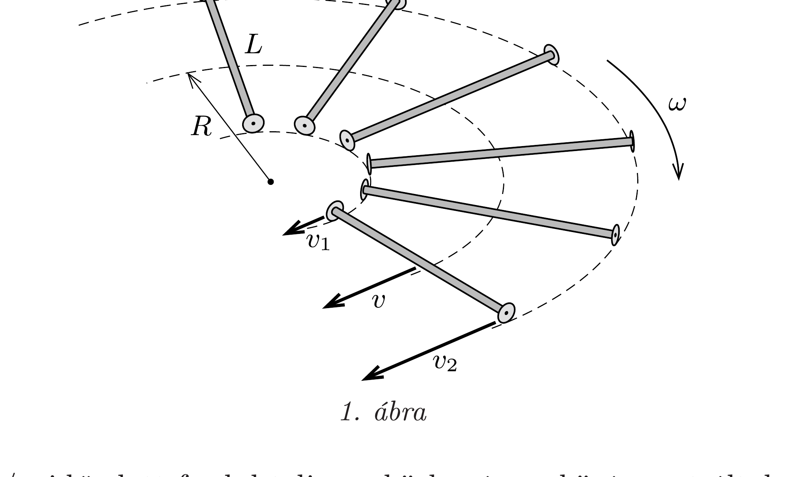
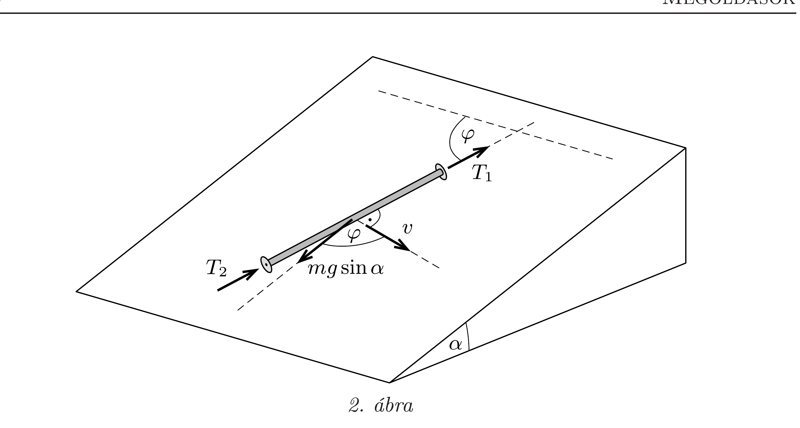
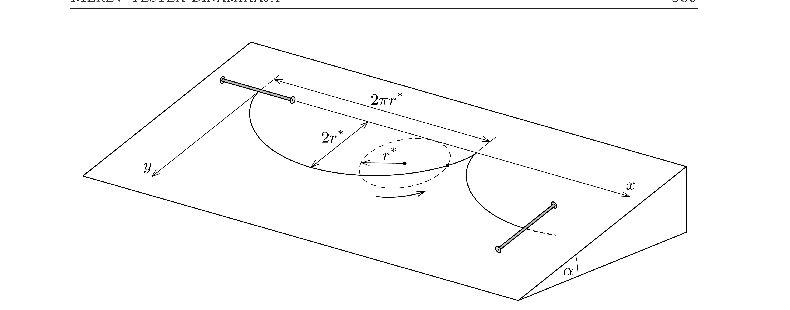

## Útmutatás

Azt kell észrevennünk, hogy a görgők kis tömege miatt a görgőkre ható tapadási súrlódási erőnek a rúdra merőleges irányú komponense elhanyagolhatóan kicsi. A rúdra tehát nem hat forgatónyomaték, így szögsebessége mindkét esetben állandó.

## Megoldás

A megoldás kulcsa annak észrevétele, hogy a görgők elhanyagolható tömege miatt a görgőkre ható tapadási súrlódási erőnek a rúdra merőleges irányú $T_{\perp}$ komponense elhanyagolhatóan kicsiny. Ez ugyanis az egyetlen erő, aminek van forgatónyomatéka az $r_{\mathrm{g}}$ sugarú görgő tengelyére vonatkoztatva, így annak szöggyorsulása a $T_{\perp} /\left(m_{\mathrm{g}} r_{\mathrm{g}}\right)$ mennyiséggel lesz arányos. (Felhasználtuk, hogy a görgők tehetetlenségi nyomatéka arányos $m_{\mathrm{g}} r_{\mathrm{g}}^{2}$-tel.) A görgők tiszta gördülését kifejező kényszerfeltétel szerint a görgők rúdra merőleges irányú gyorsulása arányos $T_{\perp} / m_{\mathrm{g}}$-vel, ami csak úgy lehet véges érték, ha $m_{\mathrm{g}}$-hez hasonlóan $T_{\perp}$ is elhanyagolhatóan kicsi.
a) Az eddigiekből következik, hogy a rúdra ható forgatónyomatékok eredője zérus, azaz a rúd szögsebessége időben állandó:
\[
\omega(t)=\omega=\frac{\left|v_{2}-v_{1}\right|}{L} .
\]
Mivel a rúdra csak a tengelyével párhuzamos erők hatnak, a tömegközéppontjának $v$ sebessége (ami a tapadás miatt csak a a rúdra merőleges irányú lehet) időben állandó nagyságú:
\[
v=\frac{v_{1}+v_{2}}{2} .
\]
Ez a sebesség a rúd forgása miatt időben egyenletesen, $\omega$ szögsebességgel fordul körbe, vagyis a rúd középpontja körpályán mozog (lásd az 1. ábrát).

A rúd $2 \pi / \omega$ idő alatt fordul teljesen körbe, így a középpont által ez idő alatt befutott út:
\[
\frac{2 \pi}{\omega} v=2 \pi R,
\]
ebből a tömegközéppont pályájának sugara
\[
R=\frac{v}{\omega}=\frac{v_{1}+v_{2}}{\left|v_{2}-v_{1}\right|} \frac{L}{2} .
\]
A két végpont a periódusidő alatt egy-egy $R+L / 2$, illetve $R-L / 2$ sugarú köríven fut végig.
b) A lejtő síkjában a rúdra ható erőket a 2. ábra mutatja, amikor az $m$ tömegú rúd éppen $\varphi$ szöget zár be kezdeti helyzetével. Továbbra is igaz az, hogy a rúdra ható eredó forgatónyomaték nulla, azaz a középpont körüli forgómozgás szögsebessége mindvégig $\omega_{0}$. A tömegközéppont mozgásegyenlete a rúdra merőleges irányban:
\[
m \dot{v}(t)=m g \sin \alpha \cdot \cos \varphi .
\]

Mivel $\varphi(t)=\omega_{0} t$, ezért a tömegközéppont sebességének nagysága éppen úgy változik az időben, ahogy egy (egydimenziós) harmonikus rezgőmozgást végző test sebessége. Az analógiát felhasználva, és a $v(t=0)=0$ kezdeti feltételt is figyelembe véve kapjuk a sebesség nagyságának időfüggését:
\[
v(t)=\frac{g \sin \alpha}{\omega_{0}} \sin \omega_{0} t
\]
A sebesség iránya mindig merőleges a pálcára, ezért a 3. ábrán látható koordinátarendszert használva a sebesség $x$ és $y$ irányú komponense a következőképp fejezhető ki:
\[
\boldsymbol{v}(t) \equiv\binom{v_{x}(t)}{v_{y}(t)}=\frac{g \sin \alpha}{\omega_{0}} \sin \omega_{0} t \cdot\binom{\sin \omega_{0} t}{\cos \omega_{0} t} .
\]
Rövid trigonometrikus átalakítás után:
\[
\boldsymbol{v}(t)=\frac{g \sin \alpha}{2 \omega_{0}}\binom{1-\cos 2 \omega_{0} t}{\sin 2 \omega_{0} t} .
\]
A kapott kifejezésből leolvasható, hogy a sebességvektor végpontja egy
\[
\frac{g \sin \alpha}{2 \omega_{0}}\binom{1}{0} \text { középpontú, } v^{*}=\frac{g \sin \alpha}{2 \omega_{0}} \text { sugarú }
\]
körön söpör végig. A rúd középpontja tehát úgy mozog, mint egy, az $x$ tengelyen $v^{*}$ sebességgel tisztán gördülő kör egy kerületi pontja, azaz a pálya közönséges (csúcsos) ciklois. A „gördülő kör” sugarát is meghatározhatjuk, ha felhasználjuk, hogy a mozgás periódusideje $\pi / \omega_{0}$, így a kör sugara:
\[
r^{*}=\frac{1}{2 \pi} \frac{\pi}{\omega_{0}} v^{*}=\frac{g \sin \alpha}{4 \omega_{0}^{2}} .
\]
Az eddigiekből az is következik, hogy a pálca középpontja $y=2 r^{*}$-ig süllyed le a lejtőn. A pálca középpontjának pályája és a gördülő kör a 3. ábrán látható.

