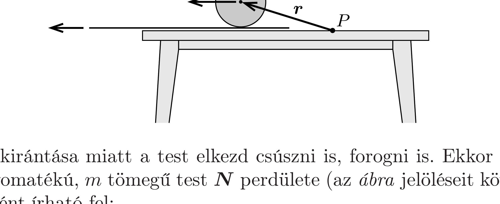

## Útmutatás

Vizsgáljuk meg, mekkora perdülete van a golyónak az asztal valamely, az ábra síkjában lévő, rögzített pontjára vonatkoztatva. Megváltozhat-e ez a perdület a golyó mozgása során?

## Megoldás

Válasszunk ki az asztal felületén egy, az ábra síkjában elhelyezkedő $P$ pontot, és vizsgáljuk a golyó perdületét erre a pontra nézve. A súrlódási eró hatásvonala átmegy a $P$ ponton, tehát erre vonatkoztatva nincs forgatónyomatéka. A nehézségi erőnek és az asztal által kifejtett kényszererőnek a forgatónyomatéka összességében szintén nulla. Más erő nem hat a testre, így a kiválasztott pontra nézve a perdülete állandó marad, és mivel kezdetben a golyó állt, ezért a perdület értéke nulla.

A terítő kirántása miatt a test elkezd csúszni is, forogni is. Ekkor a $\Theta$ tehetetlenségi nyomatékú, $m$ tömegú test $\boldsymbol{N}$ perdülete (az ábra jelöléseit követve) két tag összegeként írható fel:
\[
\boldsymbol{N}=\Theta \boldsymbol{\omega}+\boldsymbol{r} \times(m \boldsymbol{v}),
\]
ahol az első tag az úgynevezett sajátperdület (spin), a második pedig a tömegközéppont mozgásából származó pályamenti perdület. A két perdületjárulék párhuzamos egymással, így összegük csak úgy lehet nulla, ha a sajátperdület vektora és a pályamenti perdület vektora ellentétes irányú, vagyis a terítő kirántása következtében a golyó „visszafelé" kezd el forogni. A vektorok irányának figyelembe vételével a teljes perdület nagysága $N=-\Theta \omega+m v R$ alakban is felírható, ahol $R$ az acélgolyó sugara.

Könnyen belátható, hogy tiszta gördülés esetén a $P$ pontra vonatkoztatott pályaperdület és a sajátperdület mindig egyforma előjelú. A kettő összegének
viszont mindvégig nullának kell maradnia. Ez a két feltétel csak úgy egyeztethető össze, ha végül a test megáll az asztalon. (Ezt az eredményt kísérletileg is könnyen ellenőrizhetjük.)

A végállapot nem függ sem a súrlódás értékétől, sem a test adataitól (bármilyen hengerszimmetrikus testet használhatunk), sem pedig a terítő kirántásának módjától (húzhatjuk a terítőt egyenletesen, egyenletesen gyorsítva, vagy akár többszöri rángatással is). Fontos azonban, hogy a légellenállás és a gördülési ellenállás ne legyen számottevő, hiszen ezek a hatások képesek megváltoztatni a $P$ pontra vonatkoztatott perdületet.
