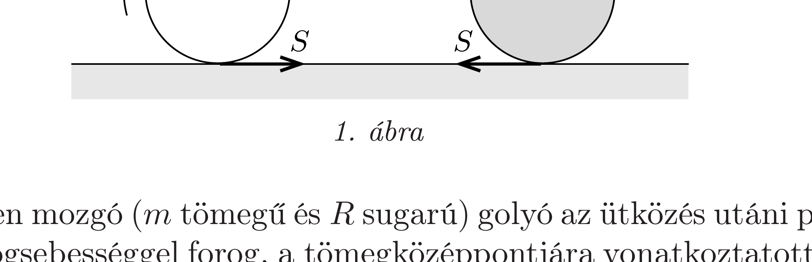
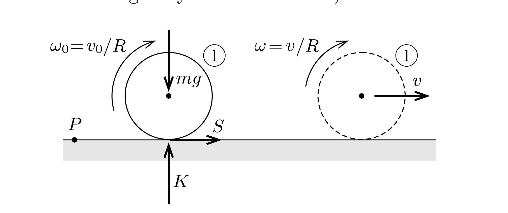
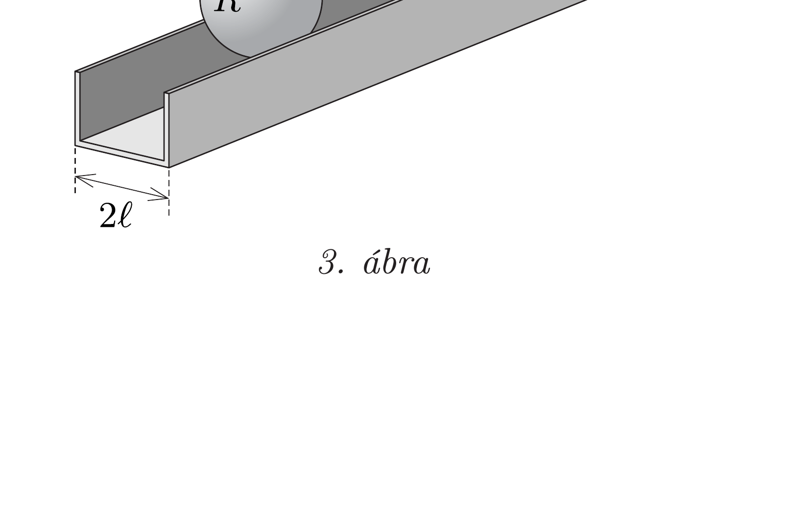

## Útmutatás

Ha a jelenségről egy lassított felvételt készítünk, azt látjuk, hogy közvetlenül az ütközés után az elsó golyó középpontja megáll, miközben a golyó forgása az ütközés alatt egyáltalán nem áll le, gyakorlatilag változatlan marad. A rendkívül gyors ütközésben tehát az első golyó csak lendületet ad át a másodiknak, perdületet azonban nem.

Az ütközés után a súrlódási eró az első golyót előrefelé gyorsítja, a forgását pedig fékezi. A meglökött golyót viszont a haladó mozgásában fékezi a súrlódás, ugyanakkor egyre gyorsabb forgásba hozza. A továbbiakban a golyók perdülete az asztal valamely, alkalmasan választott pontjára vonatkoztatva (külön-külön) állandó marad.

## Megoldás

A két golyó között a súrlódás elhanyagolható, ezért ütközésükkor csak a felületükre meróleges erőket fejthetnek ki egymásra. A pillanatszerú ütközés alatt a két golyóból álló rendszerre vízszintes irányban csak az asztal csúszási súrlódási ereje hathat, ennek nagysága azonban véges, ezért a rendszer teljes lendülete és mozgási energiája megmarad. Ez csak úgy teljesülhet, ha az ütközés után az első golyó középpontja megáll, a második pedig átveszi az első golyó $v_{0}$ sebességét. A golyók forgásában azonban nem következik be változás, tehát közvetlenül az ütközés után az első golyó egyhelyben forog, míg a második forgás nélkül, $v_{0}$ sebességgel csúszik.

A golyók további mozgása során az asztallap által kifejtett súrlódási erő már lényeges szerepet játszik. Az első golyó haladását az $S$ csúszási súrlódási erő előrefelé gyorsítja, míg a másodikat ugyanekkora erő - az 1. ábrán látható módon - fékezi. Eközben az első golyó szögsebességét a súrlódás csökkenti, a másodikét pedig növeli. Ez a folyamat addig tart, amíg mindkét golyó a tiszta gördülés állapotába nem jut, ezután gyakorlatilag állandósult mozgással haladnak tovább. Be fogjuk látni, hogy a golyók végső mozgásállapota nem függ a súrlódási együtthatótól, sőt az sem számít, ha a súrlódási erố esetleg helyről helyre változik.

A kezdetben mozgó ( $m$ tömegú és $R$ sugarú) golyó az ütközés utáni pillanatban $\omega_{0}=v_{0} / R$ szögsebességgel forog, a tömegközéppontjára vonatkoztatott perdülete tehát
\[
\Theta \omega_{0}=\frac{2}{5} m R^{2} \cdot \frac{v_{0}}{R}=\frac{2}{5} m R v_{0} .
\]
Ugyanekkora a golyó perdülete az asztallap tetszőleges, az ábrák síkjában fekvő $P$ pontjára vonatkozólag is, hiszen a golyó tömegközéppontja áll, így haladó mozgásból származó pályaperdülete nincs. A mozgás további szakaszában a súrlódási
erón nem tudja megváltoztatni a golyó $P$-re vonatkoztatott perdületét, mert hatásvonala átmegy a $P$ ponton. (A nehézségi eró és az asztal kényszerereje kioltják egymást, így ezek eredő forgatónyomatéka is nulla.)

A $v$ sebességgel tisztán gördülő biliárdgolyó $P$-re vonatkoztatott perdülete a $\frac{2}{5} m R v$ sajátperdület és a tömegközéppont mozgásából származó $m R v$ perdület összege. A 2. ábrán az első (bal oldali) golyót és a rá ható erőket ábrázoltuk közvetlenül az ütközés utáni pillanatban, illetve a tiszta gördülés állapotában. A perdületmegmaradás tétele szerint
\[
\frac{2}{5} m R v_{0}=\frac{2}{5} m R v+m R v, \quad \text { ahonnan } \quad v=\frac{2}{7} v_{0} .
\]

Hasonló érveléssel adódik, hogy a másik golyó végsebessége (a súrlódási erő nagyságától függetlenül) $\frac{5}{7} v_{0}$.

Megjegyzések. 1. Az az érdekes eredmény, hogy a már tisztán gördülő két golyó végsebességének összege éppen az első golyó kezdeti sebességével egyezik meg, nem véletlen egybeesés, hanem a két golyóból álló rendszer $P$ pontra vonatkoztatott teljes perdületének megmaradásából következik.
2. Érdekes és meglepő kísérletet állíthatunk össze két biliárdgolyóból és egy elegendően mély, szögletes, U-alakú vályúból (3. ábra). Ha a vízszintes helyzetú vályúban egyforma sebességgel egymás felé gurítjuk a golyókat (amik a vályú felső́ peremén tisztán gördülnek), akkor az első ütközésük után megtörténhet, hogy a második (sőt, elvben végtelen sok) ütközés is megvalósul. Ennek feltétele, hogy a vályú $2 \ell$ szélessége nagyobb legyen egy kritikus értéknél (de természetesen kisebb a golyók $2 R$ átmérójénél).

A második ütközéshez szükséges kritikus vályúszélességet is a perdületmegmaradásból határozhatjuk meg. Mindkét golyó perdülete állandó marad a vályú azon középvonalának bármely pontjára, ami a vályú peremére illeszkedő vízszintes síkban fekszik, $r=\sqrt{R^{2}-\ell^{2}}$ távolságra a golyók középpontja alatt. Az első ütközés előtt $v_{0}$ sebességgel mozgó golyó középpontjának sebessége az ütközés után megfordul, szögsebessége viszont marad az ütközés előtti tiszta gördülésnek megfelelő $v_{0} / r$ érték. Az első ütközést követő köszörülő mozgás során a golyó mozgásiránya akkor fog megfordulni (és a második ütközés bekövetkezni), ha a teljes perdületre fennáll a
\[
\frac{2}{5} m R^{2} \frac{v_{0}}{r}-m r v_{0}>0
\]
egyenlőtlenség, amiből az $r<\sqrt{2 / 5} R$, vagyis az $\ell>\sqrt{3 / 5} R$ feltételt kapjuk.
