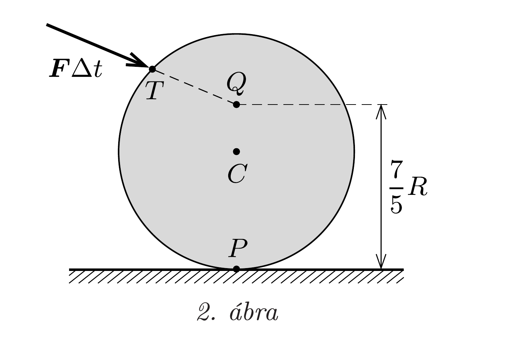

## Útmutatás

Mindkét esetben keressünk olyan rögzített pontot, amelyre nézve a golyó perdülete a gyorsítási folyamat során megmarad.

## Megoldás

a) A pillanatszerú lökés után a biliárdgolyó általában csúszva gördülő mozgásba kezd, mert az asztallal érintkező pontjának sebessége nem zérus. Ez a „köszörülés" addig tart, amíg a csúszási súrlódási eró hatására az érintkezési pont asztalhoz viszonyított relatív sebessége nullára csökken, ezután a golyó tisztán gördülve folytatja mozgását.

Tekintsük az asztalnak azt a $P$ pontját, amely lökés előtt érintkezett a golyóval! Fontos, hogy $P$ az asztallap egy rögzített pontját jelöli, nem pedig a golyó és az asztal mindenkori (az erőlökés és a köszörülés során gyorsulva mozgó) érintkezési pontját. Erre a pontra nézve a golyó teljes perdülete a lökés előtt zérus csakúgy, mint a csúszva gördülés befejeződésekor (megálláskor). A köszörülő mozgás során a golyóra ható erők $P$ pontra vonatkoztatott eredő forgatónyomatéka nulla, mert a nehézségi eró és az asztalban ébredő kényszererő eredője nulla, a súrlódási erő hatásvonala pedig minden pillanatban átmegy a $P$ ponton. A golyó perdülete a $P$ pontra nézve tehát csak úgy maradhat végig nulla, ha az indítás során sem változik meg: az indító erőlökés hatásvonalának tehát át kell mennie a $P$ ponton (1. ábra).
b) A golyó akkor kezd a lökés után biztosan (nagyon kicsi tapadási súrlódási együttható esetén is) tisztán gördülni, ha az erőlökés ideje alatt nem ébred tapadási súrlódási eró az asztallal való érintkezési pontnál. Keressünk most is egy olyan rögzített pontot, amelyre vonatkozóan a golyó perdülete a mozgás során végig állandó (zérus) marad!

Az erólökés rövid ideje alatt a golyó tömegközéppontjának $v$ sebessége és a tömegközéppont körüli forgás $\omega$ szögsebessége között mindvégig fenn kell állnia a
\[
v=R \omega
\]
feltételnek, ahol $R$ a golyó sugara, és a 2. ábrán jobbra haladás esetén a forgás az óramutató járásával megegyező irányú. Az $m$ tömegú golyó perdülete bármely
rögzített, a TCP síkban elhelyezkedő, az asztaltól $h$ távolságra található pontra
\[
N=\frac{2}{5} m R^{2} \omega+(R-h) m v,
\]
amely az (1) kényszerfeltételt is figyelembe véve akkor nulla, ha a választott vonatkoztatási pont az asztaltól $\frac{7}{5} R$ távolságban van.

Válasszuk vonatkoztatási pontnak azt a rögzített $Q$ pontot, amely éppen az asztalnak a golyóval kezdetben érintkező $P$ pontja fölött, attól $\frac{7}{5} R$ távolságban található (2. ábra)! A $Q$ pontra nézve a golyó perdülete az indítás alatt (és utána is) végig zérus marad. Mivel a lökés során az ugrásszerúen megnövő kényszererőnek a forgatónyomatéka $Q$-ra nézve nulla, ezért a perdületmegmaradás (és a tiszta gördülés) akkor teljesül biztosan, ha a külső erőlökés $T Q$ irányú.

Megjegyzések. 1. A feladat $a$ ) részének megoldásából látszik, hogy ha a $T$ pontban támadó erőlökés hatásvonala a $T P$ szakasznál „meredekebb”, akkor a köszörülő mozgás befejeződésekor a biliárdgolyó „visszafelé" gurul, ellenkező esetben pedig „előre”.
2. A biliárdasztal és a golyó közötti tapadási súrlódási együttható függ a golyó bevonatától és az asztalt borító szövet minőségétől. Ha a $b$ ) részben megengedjük, hogy az indítás közben tapadási eró is ébredjen az asztal és a golyó között, akkor a dákóval kifejtett erőlökés hatásvonalának nem kell átmennie a $Q$ ponton, hanem a $T Q$ egyenestől (bizonyos szögtartományban) eltérhet.

Ha - a feladat ábrájával ellentétben - a $T$ pont a $Q$ pont alá kerül, akkor a pillanatszerú lökés következtében a golyó felemelkedhet az asztalról.
