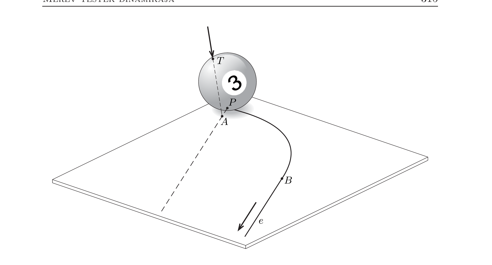

## Útmutatás

Lássuk be, hogy a golyó asztallal érintkező pontjának sebessége a köszörülő mozgás során végig ugyanolyan irányú! A b) kérdést a perdületmegmaradás ügyes alkalmazásával válaszolhatjuk meg.

## Megoldás

$a)$ Jelöljük a biliárdgolyó $C$ középpontjából a golyó legalsó (asztallal érintkező) pontjába mutató vektort $\boldsymbol{R}$-rel, a golyó tömegét $m$-mel, a golyó tömegközéppontjának sebességét $\boldsymbol{v}$-vel, szögsebességét $\boldsymbol{\omega}$-val.

A Coriolis-massé lökés esetén a golyó legalsó pontjának
\[
\boldsymbol{v}_{P}=\boldsymbol{v}+\boldsymbol{\omega} \times \boldsymbol{R}
\]
sebessége már a mozgás kezdetén sem lesz párhuzamos a golyó középpontjának sebességével. Hasonló összefüggés érvényes a gyorsulások és a szöggyorsulás között is:
\[
\dot{\boldsymbol{v}}_{P}=\dot{\boldsymbol{v}}+\dot{\boldsymbol{\omega}} \times \boldsymbol{R} .
\]

A „köszörülő" mozgás során a golyó vízszintes irányú gyorsulását és szöggyorsulását az $\boldsymbol{S}$ súrlódási erő okozza, ezért a dinamika alapegyenlete és a forgómozgás egyenlete a következőképp írható:
\[
\begin{aligned}
\boldsymbol{S} & =m \dot{\boldsymbol{v}}, \\
\boldsymbol{R} \times \boldsymbol{S} & =\frac{2}{5} m R^{2} \dot{\boldsymbol{\omega}} .
\end{aligned}
\]
Fejezzük ki ezekből a $\dot{\boldsymbol{v}}$ és $\dot{\boldsymbol{\omega}}$ változási gyorsaságokat, és írjuk be az (1) egyenletbe:
\[
\dot{\boldsymbol{v}}_{P}=\frac{1}{m} \boldsymbol{S}+\frac{5}{2 m R^{2}}(\boldsymbol{R} \times \boldsymbol{S}) \times \boldsymbol{R} .
\]
A jobbkéz-szabállyal vagy a hármas vektorszorzatra érvényes kifejtési tétellel belátható, hogy $(\boldsymbol{R} \times \boldsymbol{S}) \times \boldsymbol{R}=R^{2} \boldsymbol{S}$, így végül a
\[
\dot{\boldsymbol{v}}_{P}=\frac{7}{2 m} \boldsymbol{S}
\]
kifejezést kapjuk. A csúszási súrlódási erő nagysága $\mu m g$ (itt $\mu$ a súrlódási együttható), iránya pedig ellentétes a golyó legalsó pontjának sebességével:
\[
\boldsymbol{S}=-\mu m g \frac{\boldsymbol{v}_{P}}{\left|\boldsymbol{v}_{P}\right|} .
\]
Ezt az egyenletet (2)-vel összevetve a
\[
\dot{\boldsymbol{v}}_{P}=-\frac{7}{2} \mu g \frac{\boldsymbol{v}_{P}}{\left|\boldsymbol{v}_{P}\right|}
\]
összefüggésre jutunk.
A (4) egyenletbő́l látszik, hogy a golyó legalsó pontjának sebessége a csúszva gördülés során végig ugyanolyan irányú, és nagysága időben egyenletesen, $-\frac{7}{2} \mu g$ gyorsulással nullára csökken. Ez (3) értelmében azt jelenti, hogy a súrlódási erőnek nemcsak a nagysága, hanem az iránya is állandó. Mivel ez az irány nem esik egybe a tömegközéppont kezdeti sebességével, a biliárdgolyó az ábrán látható parabola alakú pályán mozog.

Amikor a golyó legalsó pontjának sebessége zérussá válik (ez az ábrán a $B$ pontnál következik be), a golyó csúszásmentes gördüléssel, a parabola érintőjének irányában folytatja mozgását addig, amíg a közegellenállás és a gördülési ellenállás le nem fékezi.
b) A biliárdgolyó végső mozgásirányát a perdületmegmaradás alkalmazásával találhatjuk ki. Vizsgáljuk a golyó $P A$ egyenesre vonatkoztatott perdületét!

Megjegyzés. A perdület vektormennyiség, amelyet általában a tér valamely rögzített, kiválasztott pontjára vonatkoztatunk. A perdületvektor adott irányú komponensét azonban tekinthetjük a kiválasztott ponton átmenő, az adott iránnyal párhuzamos tengelyre vonatkoztatott mennyiségnek. Ebben a feladatban például - mint látni fogjuk - a golyó $P$ pontra vonatkoztatott impulzusnyomatéka nem marad meg, viszont a perdület $P A$ egyenessel párhuzamos komponense (azaz a $P A$ tengelyre vonatkoztatott perdület) igen.

Kezdetben a golyó áll, így a perdülete nulla. A lökés időtartama alatt a golyóra ható összes erőnek (a dákó által kifejtett erőnek, az asztalban ébredő kényszererónek, a súrlódási erônek és a nehézségi erónek is) a hatásvonala átmegy a $P A$ egyenesen, a golyó perdülete tehát a lökés utáni pillanatban is zérus. Ez a helyzet a $P B$ parabolaíven történő mozgás során sem változik meg, hiszen a nehézségi eró és az asztal által kifejtett kényszererő eredője nulla, a súrlódási erő forgatónyomatéka pedig azért zérus, mert az eró hatásvonala és a $P A$ tengely mindvégig ugyanabban a síkban fekszik.

A köszörülő mozgásszakasz befejeződésekor tehát a golyó perdülete a $P A$ egyenesre nézve nulla, ami csak úgy lehetséges, hogy a golyó a $P A$ egyenessel párhuzamosan folytatja útját.
