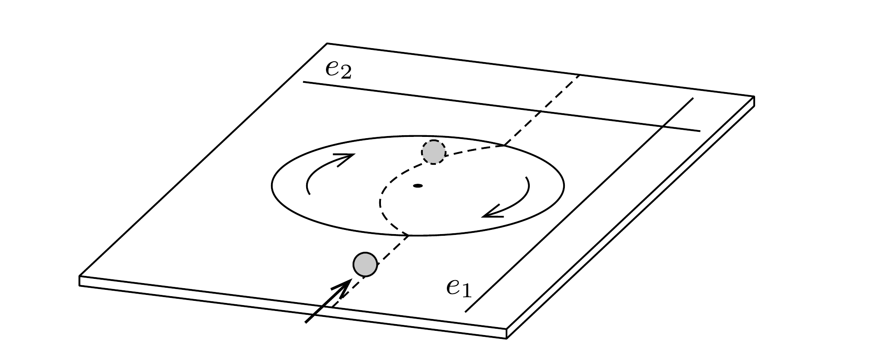

## Útmutatás

A rendszer energia és impulzus szempontjából nem zárt, ezek megmaradására tehát nem hivatkozhatunk. A furcsa jelenség a perdületmegmaradással magyarázható.

## Megoldás

Ha a labda mozgását pontosan az eredeti haladási irányból figyeljük, azt látjuk, hogy kezdetben távolodik tőlünk, de „oldalirányban" nem mozog. Emiatt állíthatjuk, hogy az asztallap síkjában fekvő, a mozgásiránnyal párhuzamos $e_{1}$ egyenesre nézve a labda teljes perdülete nulla (lásd az ábrát). Amikor a labda a forgó korongra ér, a fellépő súrlódási eró hatására oldalirányú mozgásba és forgásba jön. Mivel azonban a súrlódási eró hatásvonala mindvégig átmegy $e_{1}-\mathrm{en}$, a perdületnek az $e_{1}$ egyenesre vonatkoztatva mindvégig nullának kell maradnia. (Ha például a labda egy adott pillanatban távolodik $e_{1}$-től, akkor a tömegközéppontja körül megfelelő szögsebességgel úgy kell forognia, hogy az eredő perdület nulla legyen.) Ugyanez érvényes akkor is, amikor a labda már elhagyta a forgó korongot, és az asztallapon gördül. Itt azonban - a tiszta (csúszásmentes) gördülés feltétele miatt - az $e_{1}$ egyeneshez közeledő vagy távolodó labda eredő perdülete nem lehetne nulla. Egyetlen kiút van: a labda az $e_{1}$ egyenessel (és eredeti mozgásirányával) párhuzamosan, irányváltoztatás nélkül gördül tovább.

Hasonló érveléssel láthatjuk be, hogy a sebességének nagysága a korong elhagyása után nem lehet más, mint amekkora sebességgel a forgó koronghoz érkezett. Ehhez az asztal síkjában fekvő, az eredeti mozgásirányára merőleges $e_{2}$ egyenesre vonatkozó perdület megmaradását kell használni.

A labda tehát ugyanakkora sebességgel, emiatt ugyanakkora nagyságú és irányú impulzussal hagyja el az asztalt, mint amekkorával eredetileg rendelkezett, és emellett az összes mozgási energiája is megmarad. Ez utóbbi azért különösen furcsa, mert mind a korongra érkezéskor, mind pedig annak elhagyásakor a csúszási súrlódási erő munkát végez a labdán, megváltoztatja annak mozgási energiáját. A két munkavégzés előjeles összege nulla, de ennek nincs köze sem az impulzus, sem pedig az energia megmaradásához, hanem a perdülettétel következménye.

Megjegyzések. 1. A labda mozgását és forgását leíró dinamikai egyenletek megoldásával belátható, hogy egyenletesen forgó korongon áthaladva a labda éppen az eredeti pályaegyenesének meghosszabbításában folytatja útját. Nem egyenletesen forgó korongra azonban ez már nem igaz, a labdának az impulzusa megmarad ugyan, de a pályája oldalirányban eltolódik.
2. A következó feladatban belátjuk, hogy az egyenletesen forgó korongon a labda (az asztal koordináta-rendszeréből nézve) körpályán mozog, méghozzá egyenletes körmozgással. A kör középpontja nem esik egybe a korong tengelyével, és a szögsebessége is különbözik a korongétól, mindössze $\frac{2}{7}$ része annak.
