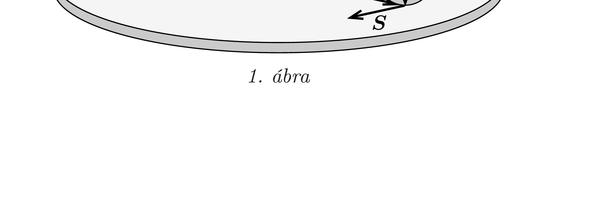
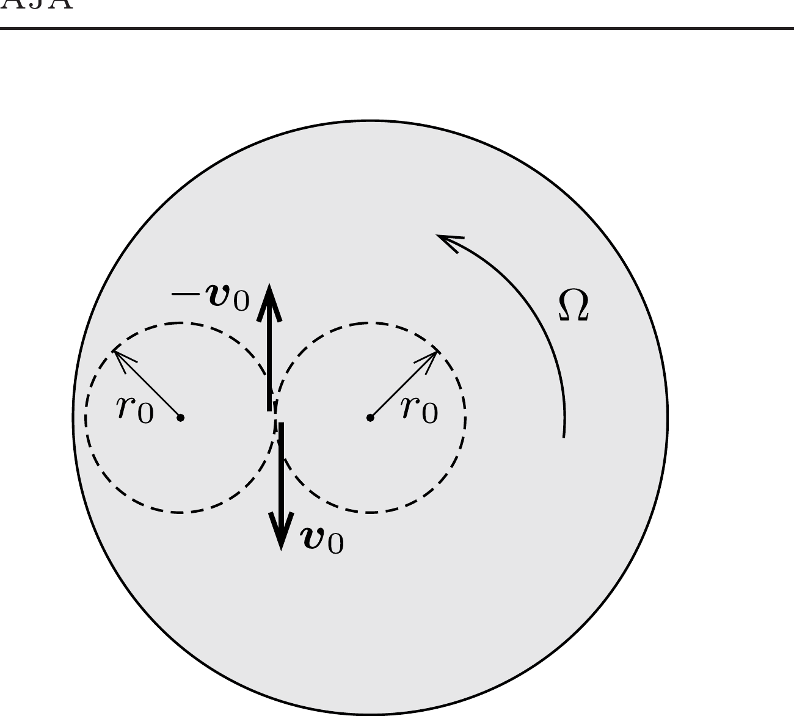

## Útmutatás

Vektorok segítségével írjuk fel a labda forgását és tömegközépponti mozgását leíró egyenleteket, valamint a csúszásmentes gördülést kifejező kényszerfeltételt, majd próbáljuk meg belátni, hogy a labda középpontja tetszőleges kezdőfeltétel esetén egyenletes körmozgást végez. Ennek a körnek a középpontja általában nem esik egybe a korong középpontjával.

## Megoldás

Használjuk az 1. ábrán látható jelöléseket: legyen $\boldsymbol{R}$ a labda középpontjából a koronggal való aktuális érintkezési pontba mutató vektor, $\boldsymbol{r}$ a korong középpontjából az érintkezési pontba mutató vektor, $\boldsymbol{S}$ a labdára ható tapadási súrlódási erő, $\boldsymbol{v}=\dot{\boldsymbol{r}}$ a labda tömegközéppontjának sebessége, $\boldsymbol{\omega}$ a labda szögsebességvektora, $\boldsymbol{\Omega}$ pedig a korong szögsebességvektora.

Az $m$ tömegú gumilabda tömegközéppontjának $\dot{\boldsymbol{v}}$ gyorsulását a tapadási súrlódási erő okozza, ezért a vízszintes irányú mozgásegyenlet
\[
\boldsymbol{S}=m \dot{\boldsymbol{v}}
\]
alakban írható. A labda szöggyorsulását is a súrlódási eró hozza létre, így a forgómozgás alapegyenlete:
\[
\boldsymbol{R} \times \boldsymbol{S}=\frac{2}{5} m R^{2} \dot{\boldsymbol{\omega}},
\]
ahol felhasználtuk, hogy a homogén tömegeloszlású gumilabda tehetetlenségi nyomatéka $\frac{2}{5} m R^{2}$.

A labda legalsó pontja a koronggal együtt mozog, ezért
\[
v+\omega \times R=\Omega \times r .
\]
A (3) kényszerfeltétellel analóg összefüggés érvényes a változási gyorsaságok között is:
\[
\dot{v}+\dot{\omega} \times \boldsymbol{R}=\boldsymbol{\Omega} \times \boldsymbol{v},
\]
amint arról (3) idő szerinti deriválásával is meggyóződhetünk. Ebből az (1) és (2) egyenletek felhasználásával:
\[
\dot{\boldsymbol{v}}+\frac{5}{2 m R^{2}}[\boldsymbol{R} \times(m \dot{\boldsymbol{v}})] \times \boldsymbol{R}=\boldsymbol{\Omega} \times \boldsymbol{v} .
\]
A hármas vektorszorzat $\dot{\boldsymbol{v}}$-tal megegyező irányú (ez például a jobbkéz-szabály kétszeri alkalmazásával, vagy a könyv végén található matematikai összefoglalóban is szereplő kifejtési tétellel látható be). Egyszerúsítések és rendezés után a
\[
\dot{\boldsymbol{v}}=\frac{2}{7} \boldsymbol{\Omega} \times \boldsymbol{v}
\]
egyenletre jutunk, amely az $\boldsymbol{\Omega}_{0}=\frac{2}{7} \boldsymbol{\Omega}$ jelöléssel
\[
\dot{\boldsymbol{v}}=\boldsymbol{\Omega}_{0} \times \boldsymbol{v}
\]
alakra hozható. Éppen így változik a sebesség az egyenletes körmozgásnál is, ezért az $\boldsymbol{r}$ helyvektor időbeli változását leíró egyenlet:
\[
\dot{r}=\Omega_{0} \times r+v^{*},
\]
itt $\boldsymbol{v}^{*}$ a kezdeti feltételektől függő állandó. Tetszőleges $\boldsymbol{v}^{*}$-hoz található olyan $\boldsymbol{r}^{*}$ vektor, melynek segítségével $\boldsymbol{v}^{*}$ felírható $-\boldsymbol{\Omega}_{0} \times \boldsymbol{r}^{*}$ alakban, ezért (4) így alakítható:
\[
\dot{\boldsymbol{r}}=\boldsymbol{\Omega}_{0} \times\left(\boldsymbol{r}-\boldsymbol{r}^{*}\right) .
\]

A kapott (4') összefüggés egy $\frac{2}{7} \boldsymbol{\Omega}$ szögsebességú, $\boldsymbol{r}^{*}$ középpontú egyenletes körmozgást ír le. Ennek az egyenletnek a segítségével már válaszolhatunk a feladatban feltett kérdésekre.
a) Ahhoz hogy a labda a korong középpontjával koncentrikus, $r_{0}$ sugarú pályán mozogjon, a (4') egyenletben $\boldsymbol{r}^{*}$ helyére nullvektort kell írnunk, így a tömegközéppont kezdeti sebességét a
\[
\boldsymbol{v}_{0}=\boldsymbol{\Omega}_{0} \times \boldsymbol{r}_{0}
\]
formula adja meg, ahol $\boldsymbol{r}_{0}$ a labda kezdeti pozícióját megadó, $r_{0}$ hosszúságú vektor. Ebből a kezdősebesség nagysága
\[
v_{0}=\left|\boldsymbol{\Omega}_{0} \times \boldsymbol{r}_{0}\right|=r_{0} \Omega_{0}=\frac{2}{7} r_{0} \Omega
\]
értékúnek adódik.
A labda kezdeti szögsebessége a tiszta gördülést kifejező (3) kényszerfeltételből határozható meg. Az (5) eredményt figyelembe véve
\[
\boldsymbol{\omega}_{0} \times \boldsymbol{R}=\frac{5}{2} \boldsymbol{v}_{0} .
\]
A bal oldalon megjelenő vektoriális szorzat értéke nem függ attól, hogy mekkora a labda $\boldsymbol{\omega}_{0}$ szögsebességvektorának függőleges ( $\boldsymbol{R}$-rel párhuzamos) komponense, így az elvben tetszóleges értékú lehet (feltételezve, hogy a gumilabda egyetlen pontban érintkezik a koronggal). Valójában azonban a labda és a korong is kis mértékben deformálódik, így az érintkezési felületen kialakuló súrlódás elkerülése érdekében válasszuk a szögsebesség függőleges összetevőjét nullának! Ebben az esetben a szögsebesség vízszintes irányú, nagysága pedig
\[
\omega_{0}=\frac{5}{2} \frac{\left|\boldsymbol{R} \times \boldsymbol{v}_{0}\right|}{R^{2}}=\frac{5}{2} \frac{v_{0}}{R}=\frac{5}{7} \frac{r_{0} \Omega}{R} .
\]
b) A labdát most is az $\boldsymbol{r}_{0}$ kezdőhelyzetből, de $-\boldsymbol{v}_{0}$ sebességgel indítjuk. A (4') egyenlet ekkor a következő alakot ölti:
\[
-\boldsymbol{v}_{0}=\boldsymbol{\Omega}_{0} \times\left(\boldsymbol{r}_{0}-\boldsymbol{r}^{*}\right),
\]
amit (5)-tel összehasonlítva az $\boldsymbol{r}^{*}=2 \boldsymbol{r}_{0}$ eredményre jutunk. A gumilabda tehát ebben az esetben is $r_{0}$ sugarú körpályán mozog, ennek középpontja azonban a korong középpontjától $2 r_{0}$ távolságra van (2. ábra). A labda szögsebességének nagysága az $a$ ) részben leírt gondolatmenettel határozható meg, az eredmény $\omega_{0}=\frac{9}{7} r_{0} \Omega / R$.

