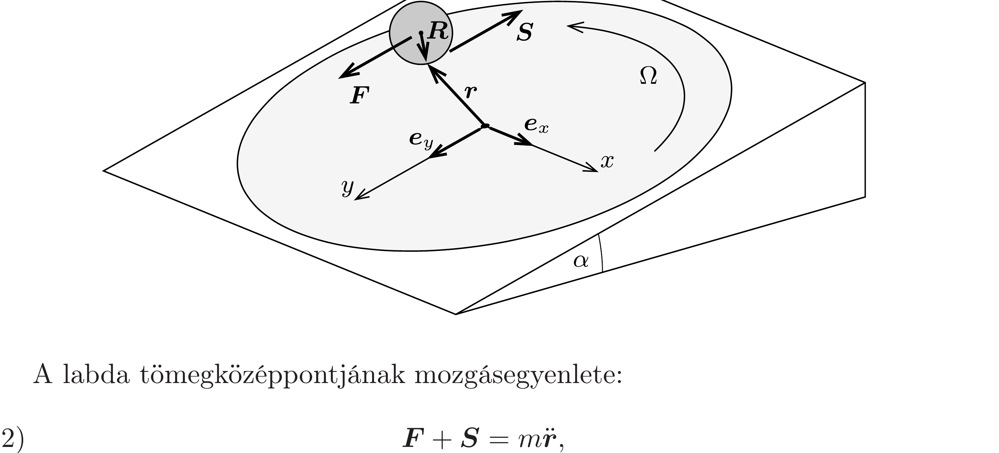

## Útmutatás

A labda mozgás- és forgásegyenletének felírásához használjunk vektorokat, és nézzük meg, mi a feltétele annak, hogy a labda középpontjának gyorsulása nulla legyen. Segíthet az előző feladat megoldásának tanulmányozása is.

## Megoldás

Használjuk az ábrán látható, a lejtő síkjához illeszkedő derékszögü koordináta-rendszert, és legyenek az egyes tengelyek irányába mutató egységvektorok $\boldsymbol{e}_{x}$, illetve $\boldsymbol{e}_{y}$. Jelöljük a labda középpontjából a koronggal való aktuális érintkezési pontba mutató vektort $\boldsymbol{R}$-rel, a korong középpontjából az érintkezési pontba mutató vektort $\boldsymbol{r}$-rel, a tapadási súrlódási erốt $\boldsymbol{S}$-sel, az $m g$ nehézségi erő lejtőirányú komponensét pedig $\boldsymbol{F}$-fel. Utóbbi vektoriális alakban így fejezhető ki:
\[
\boldsymbol{F}=\boldsymbol{e}_{y} m g \sin \alpha .
\]

A labda tömegközéppontjának mozgásegyenlete:
\[
\boldsymbol{F}+\boldsymbol{S}=m \ddot{\boldsymbol{r}},
\]
a tömegközéppont körüli forgómozgást leíró egyenlet pedig:
\[
\boldsymbol{R} \times \boldsymbol{S}=\frac{2}{5} m R^{2} \dot{\boldsymbol{\omega}},
\]
ahol $\boldsymbol{\omega}$ a labda (időben változó) szögsebességvektora, $\frac{2}{5} m R^{2}$ pedig a tehetetlenségi nyomatéka.

A gumilabda koronggal érintkező pontja nem csúszik meg, ezért a tiszta gördülést kifejező kényszerfeltétel:
\[
\dot{r}+\omega \times R=\Omega \times r .
\]
Ezzel teljesen analóg összefüggés érvényes a labda középpontjának gyorsulása és szöggyorsulása között is:
\[
\ddot{r}+\dot{\omega} \times \boldsymbol{R}=\boldsymbol{\Omega} \times \dot{r} .
\]
(2) és (3) felhasználásával ebbő́l a következőt kapjuk:
\[
\ddot{\boldsymbol{r}}+\frac{5}{2 m R^{2}}[\boldsymbol{R} \times(m \ddot{\boldsymbol{r}}-\boldsymbol{F})] \times \boldsymbol{R}=\boldsymbol{\Omega} \times \dot{\boldsymbol{r}} .
\]
A vektoriális szorzásokat elvégezve, bevezetve a tömegközéppont sebességére a $\boldsymbol{v}=\dot{\boldsymbol{r}}$ jelölést, majd az (1) összefüggést figyelembe véve:
\[
\dot{\boldsymbol{v}}=\frac{2}{7} \boldsymbol{\Omega} \times \boldsymbol{v}+\frac{5}{7} \boldsymbol{e}_{y} g \sin \alpha .
\]
Ez az egyenlet a
\[
\boldsymbol{v}^{*}=\boldsymbol{e}_{x} \frac{5 g \sin \alpha}{2 \Omega}
\]
jelöléssel a következő alakra hozható:
\[
\dot{\boldsymbol{v}}=\frac{2}{7} \boldsymbol{\Omega} \times\left(\boldsymbol{v}-\boldsymbol{v}^{*}\right) .
\]
A tömegközéppont sebességének változási ütemét leíró (6) egyenletből látszik, hogy ha $\boldsymbol{v}=\boldsymbol{v}^{*}$, azaz a gumilabdát $\boldsymbol{e}_{x}$ irányában, $\frac{5}{2} g \sin \alpha / \Omega$ sebességgel gurítja el a búvész, akkor a labda középpontja egyenes vonalú, egyenletes mozgást fog végezni.

Megjegyzések. 1. Érdekes, hogy az eredmény nem függ a kezdeti pozíciótól, azaz ha a labdát a korong tetszőleges pontjából $\boldsymbol{v}^{*}$ sebességgel indítjuk, akkor a középpontjának pályája egy, az $x$ tengellyel párhuzamos egyenes lesz. A labda kezdeti szögsebességvektora viszont már függ az indítás helyétől, értékét a tiszta gördülés (4) feltételéból határozhatjuk meg.
2. Felmerülhet a kérdés, hogyan mozog a labda, ha középpontjának kezdősebessége nem egyenlő a fent meghatározott $\boldsymbol{v}^{*}$ értékkel. A (6) egyenletből következik, hogy az $\boldsymbol{u}=\boldsymbol{v}-\boldsymbol{v}^{*}$ módon definiált $\boldsymbol{u}$ vektor változási ütemét az
\[
\dot{\boldsymbol{u}}=\frac{2}{7} \boldsymbol{\Omega} \times \boldsymbol{u}
\]
egyenlet írja le. Ez azt jelenti, hogy az $\boldsymbol{u}$ vektor időben egyenletesen, $\frac{2}{7} \Omega$ szögsebességgel fordul körbe (ahogy azt az előzó feladat megoldásában láttuk). A $\boldsymbol{v}=\boldsymbol{v}^{*}+\boldsymbol{u}$ vektor végpontja emiatt egy $\boldsymbol{v}^{*}$ középpontú, $\boldsymbol{u}$ sugarú körön söpör végig. A golyó középpontja tehát a $\boldsymbol{v} \neq \boldsymbol{v}^{*}$ esetben (a kezdősebesség nagyságától függően) hurkolt, nyújtott vagy csúcsos ciklois alakú pályán mozog.
