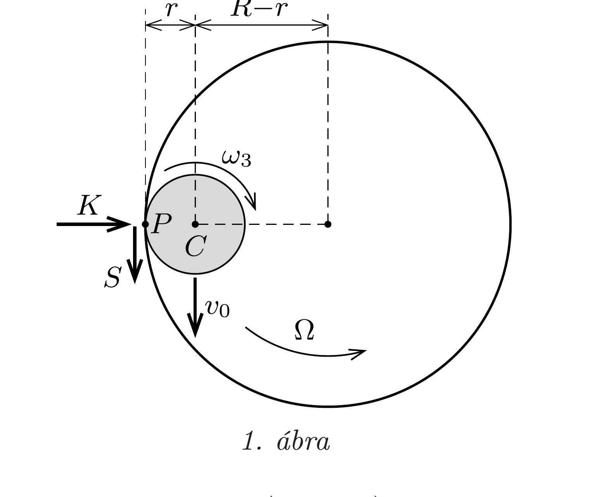
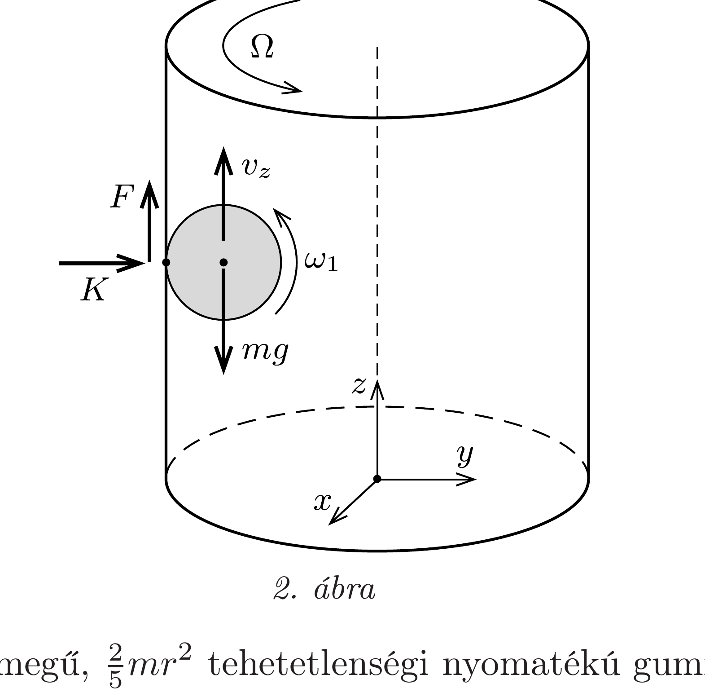
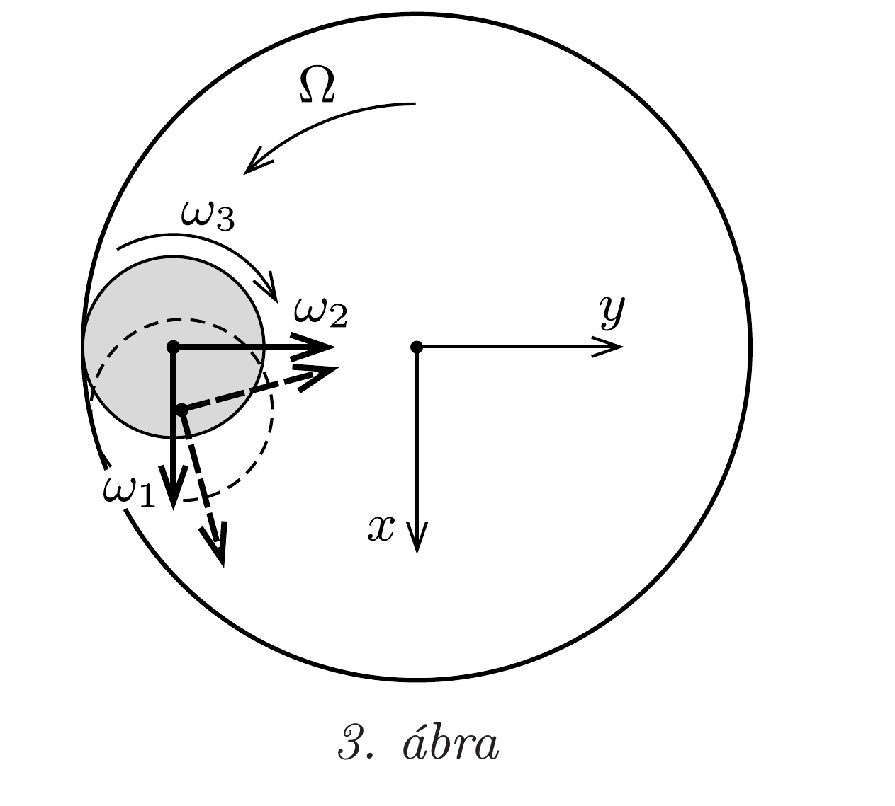

## Útmutatás

Vizsgáljuk először a gumilabda függőleges tengely körüli forgását és a tömegközéppontjának a cső tengelye körüli forgását! Ha sikerül belátnunk, hogy mindkét forgás egyenletes, ez megkönnyíti a mozgás többi részletének leírását. Vigyázat! Hibás az a gondolat, mely szerint a labda függőleges irányban egyenletesen gyorsuló mozgást végez.

\section*{Rugalmasságtan}

## Megoldás

Megmutatjuk, hogy a labda - jóllehet a nehézségi eró lefelé húzza - függőleges irányban harmonikus rezgőmozgást végez. Ezt a meglepő viselkedést - a forgás és a tömegközépponti mozgás érdekes „összjátékával” - a cső falánál fellépő súrlódási erő okozza.

Jelöljük a labda középpontját $C$-vel, a cső falával való mindenkori érintkezési pontját pedig $P$-vel. A labda tömegközéppont körüli forgásának szögsebességét érdemes három, egymásra merőleges összetevőre bontanunk: a függőleges irányú $\omega_{3}$ komponensre, a $P C$ irányú $\omega_{2}$ komponensre, valamint a $P C$-re merőleges, vízszintes irányú $\omega_{1}$ komponensre. A mozgás során a szögsebesség-komponenseknek nemcsak a nagysága változik, de ( $\omega_{3}$ kivételével) az irányuk is elfordul a $P C$ szakasszal együtt.

Tekintsünk a labdára felülnézetből (1. ábra), és rajzoljuk be a függőleges tengely körüli forgásokat, illetve a labdára ható vízszintes irányú eróket: a cső falára merőleges kényszererőt $(K)$ és a tapadási súrlódási erő vízszintes komponensét $(S)$ ! A labdára ható további erőket, azaz a súrlódási erő függőleges komponensét és a nehézségi erốt nem tüntettük fel az ábrán. (Feltételezzük, hogy a labda mozgásának vizsgált szakaszán a légellenállás és a gördülési ellenállás figyelmen kívül hagyható.)

Jelöljük a labda tömegközéppontjának a cső tengelye körüli „keringési” szögsebességét $\Omega$-val (az ábrán látható irányítással), ezzel a csúszásmentes gördülés (egyik) feltétele így írható:
\[
(R-r) \Omega=r \omega_{3}, \quad \text { vagyis } \quad \omega_{3}=\frac{R-r}{r} \Omega .
\]
Figyelemre méltó, hogy a labda saját perdülete és a tömegközéppont „pályaperdülete" ellentétes irányú.

A labdára ható erốk közül egyedül az érintő irányú $S$ tudná megváltoztatni az $\Omega$ és $\omega_{3}$ szögsebességeket. Az ábrán jelölt irányú $S$ eró forgatónyomatéka $\Omega$-t növelné, $\omega_{3}-\mathrm{t}$ viszont csökkentené, de ez lehetetlen, hiszen az (1) feltétel miatt a két szögsebesség aránya rögzített. Az ellentmondás feloldása: $S=0$, és sem $\Omega$, sem $\omega_{3}$ nem változhat a mozgás során. A labda középpontjától a cső szimmetriatengelyére
bocsátott merőleges egyenes (és vele együtt a $P C$ szakasz) tehát egyenletesen forog, a szögsebesség nagyságát a labda $v_{0}$ kezdősebessége határozza meg:
\[
\Omega=\frac{v_{0}}{R-r}=\text { állandó. }
\]

A labda függőleges irányú mozgásának leírásához válasszunk olyan derékszögü koordináta-rendszert, melynek $z$ tengelye egybeesik a csó szimmetriatengelyével. Jelöljük a labda tömegközéppontjának függőleges sebességkomponensét $v_{z}$-vel, a függőleges irányú tapadási súrlódási erốt pedig $F$-fel (2. ábra). A $v_{z}$ sebesség és az $\omega_{1}$ szögsebesség nem független egymástól, hiszen a tiszta gördülés miatt a már felírt (1) mellett teljesülnie kell még a
\[
v_{z}=r \omega_{1}
\]
egyenlőségnek is.

Írjuk fel az $m$ tömegú, $\frac{2}{5} m r^{2}$ tehetetlenségi nyomatékú gumilabdára a függőleges irányú mozgást leíró Newton-egyenletet, valamint az $x$ és $y$ tengely körüli forgómozgás alapegyenletét egy tetszőleges helyzetben. Az általánosság megsértése nélkül feltehetjük, hogy a vizsgált időpillanatban a labda $x$ koordinátája (az ábráknak megfelelően) éppen nulla, így az egyenletek az
\[
F-m g=m \dot{v}_{z},
\]
\[
r F=-\frac{2}{5} m r^{2} \dot{\omega}_{x},
\]
\[
0=\dot{\omega}_{y}
\]
alakot öltik. A (4) és (5) összefüggésben megjelenő $\omega_{x}$ és $\omega_{y}$ mennyiségek a labda szögsebességének $x$ és $y$ irányú összetevői, amelyek a korábban bevezetett $\omega_{1}$ és
$\omega_{2}$ szögsebesség-komponensekkel (a vizsgált időpillanatban) a következő kapcsolatban állnak:
\[
\omega_{x}=\omega_{1}, \quad \omega_{y}=\omega_{2} .
\]

A (6) egyenletek közül az elsőre pillantva könnyen arra a következtetésre juthatunk, hogy a szögsebesség-komponensek változási gyorsaságai között fennáll az $\dot{\omega}_{x}=\dot{\omega}_{1}$ összefüggés. Ebből a (2)-(4) egyenletek felhasználásával az adódik, hogy a labda $-z$ irányú, $\frac{5}{7} g$ nagyságú gyorsulással halad lefelé, vagyis a labda pályája egy lefelé haladó, egyre növekvő menetemelkedésú csavarvonal. Ez a gondolatmenet azonban hibás!

A labda szögsebességének $x$ irányú összetevője ugyanis két okból is változik (3. ábra): egyrészt az $\omega_{1}$ komponens nagyságának változása miatt, másrészt pedig azért, mert az $\omega_{2}$ komponens iránya $\Omega$ szögsebességgel forog:
\[
\dot{\omega}_{x}=\dot{\omega}_{1}-\Omega \omega_{2} .
\]
Hasonló összefüggést írhatunk fel $\omega_{y}$ változási gyorsaságára is:
\[
\dot{\omega}_{y}=\dot{\omega}_{2}+\Omega \omega_{1} .
\]

A (3) és (4) egyenletekből egyaránt kifejezhetjük az $F$ erő változási gyorsaságát, így a másik oldalakat egyenlővé téve kapjuk:
\[
m \ddot{v}_{z}=-\frac{2}{5} m r \ddot{\omega}_{x},
\]
amiből a (2), (5), (7) és (8) összefüggések felhasználásával:
\[
\ddot{v}_{z}=-\frac{2}{7} \Omega^{2} v_{z}(t) .
\]
Ez az egyenlet formailag éppen olyan, mint egy $\sqrt{2 / 7} \Omega$ körfrekvenciával rezgő test mozgásegyenlete, ezért a gumilabda függőleges sebessége időben periodikusan változik. A $v_{z}=0$ kezdeti feltételt figyelembe véve:
\[
v_{z}(t)=-v_{z}^{\max } \sin \left(\sqrt{\frac{2}{7}} \Omega t\right) .
\]

Ugyanilyen frekvenciájú harmonikus rezgőmozgás szerint változik a labda függőleges helyzete is:
\[
z(t)=z_{0}-z_{\max }\left[1-\cos \left(\sqrt{\frac{2}{7}} \Omega t\right)\right],
\]
ahol $z_{0}$ a labda középpontjának $z$ koordinátája a mozgás kezdetén, $z_{\text {max }}$ pedig a rezgés amplitúdója, amit az $\omega_{2}=0$ kezdeti feltételbő̌l határozhatunk meg. Ekkor ugyanis $\dot{\omega}_{x}=\dot{\omega}_{1}$, amit a (4) egyenletbe helyettesítve, majd (2)-t és (3)-at felhasználva az
\[
\left(\dot{v}_{z}\right)_{t=0}=-\frac{5}{7} g
\]
eredményre jutunk, ami pedig nem más, mint a labda tömegközéppontjának $-\frac{2}{7} \Omega^{2} z_{\text {max }}$ maximális gyorsulása. A függőleges rezgőmozgás amplitúdója tehát
\[
z_{\max }=\frac{5}{2} \frac{g}{\Omega^{2}} .
\]

Megjegyzések. 1. A labda térbeli mozgása (szigorú értelemben véve) nem periodikus, hanem kváziperiodikus, mert a felülnézetben látszó körmozgás és a függőleges irányú harmonikus rezgőmozgás periódusidejének aránya nem racionális szám.
2. Az első látásra meghökkentő jelenséget gyakran megfigyelhetjük golfversenyek televíziós közvetítésekor. A túl nagy sebességgel megütött golflabda érintőlegesen beleesik ugyan a csớ alakú lyukba, de - egy rezgési periódus megtétele után - ki is táncol onnan.

\section*{Rugalmasságtan}
