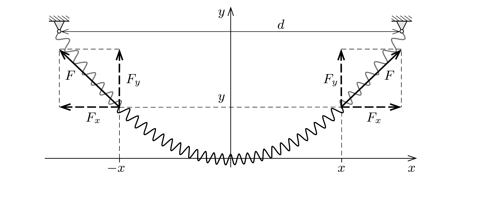

## Útmutatás

Belátható, hogy a slinky tetszőleges, nem feltétlenül rövid darabjának tömege egyenesen arányos a rugódarab vízszintes vetületének hosszával.

## Megoldás

Vegyük fel koordináta-rendszerünket az ábrán látható módon és jelöljük a slinky rögzített végeinek távolságát $d$-vel.

A slinkyt feszítő erő $x$ irányú komponense a rugó mentén állandó, hiszen ebben az irányban a slinky egy tetszőlegesen kiválasztott darabja nem gyorsul, vízszintes irányú külső erő pedig nem hat a rugóra. Ez az állandó vízszintes feszítőerő azt jelenti, hogy a slinky egyenlő tömegú (így szükségképpen egyenlő direkciós állandójú) kis darabkáinak a vízszintes vetülete is egyenlő (a darabkák nyugalmi hosszát a megnyúlt hosszukhoz képest elhanyagoltuk). Ebből következik, hogy a slinky bármely (nem feltétlenül rövid) darabjának tömege egyenesen arányos a darab vízszintes vetületének hosszával.

Tekintsük most a slinky ábrán látható darabját! Ennek a vízszintes vetülete $2 x$, így e darab tömege a slinky teljes $m$ tömegének a $2 x / d$ része. A függőleges irányú egyensúly feltétele:
\[
2 F_{y}=\frac{2 x}{d} m g .
\]
Mindkét oldalt elosztva a feszítőerő állandó $F_{x}$ vízszintes vetületével:
\[
\frac{F_{y}}{F_{x}}=\frac{x}{d} \frac{m g}{F_{x}} .
\]
A feszítőerő a rugóban mindig érintőirányú, ezért a bal oldalon álló hányados éppen a slinky $x$ helyen mérhető $\Delta y / \Delta x$ meredeksége:
\[
\frac{\Delta y}{\Delta x}=\frac{x}{d} \frac{m g}{F_{x}} .
\]
Ez az egyenlet nagyon hasonlít a nyugalomból induló, egyenes vonalban állandó a gyorsulással mozgó test $s(t)$ elmozdulást megadó egyenletre:
\[
\frac{\Delta s}{\Delta t}=a t,
\]
melynek megoldása (például a $v(t)=\Delta s / \Delta t$ grafikon alatti terület meghatározásából):
\[
s(t)=\frac{a}{2} t^{2} .
\]

Az analógia alapján a két végénél felfüggesztett slinky alakját leíró $y(x)$ függvény
\[
y(x)=\frac{m g}{2 F_{x} d} x^{2},
\]
a slinky alakja tehát egy parabola.
Megjegyzés. Az analógia felismerése nélkül is célhoz érünk, ha az (1) összefüggést differenciálegyenletté alakítjuk, majd integráljuk:
\[
y^{\prime}(x)=x \cdot \frac{m g}{F_{x} d}, \quad \text { ahonnan } \quad y(x)=\frac{m g}{2 F_{x} d} x^{2}+C .
\]
Az integrációs állandó a választott koordináta-rendszerben $C=0$, a feszítőerő vízszintes komponense pedig kifejezhető a slinky rugóállandójával $\left(F_{x}=D \cdot d\right)$, így a rugó alakját megadó függvény:
\[
y(x)=\frac{m g}{2 D d^{2}} x^{2} .
\]
