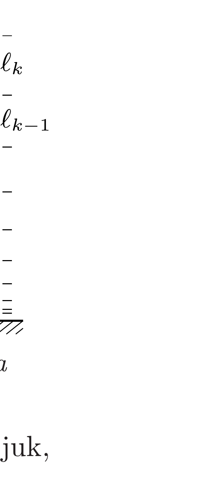
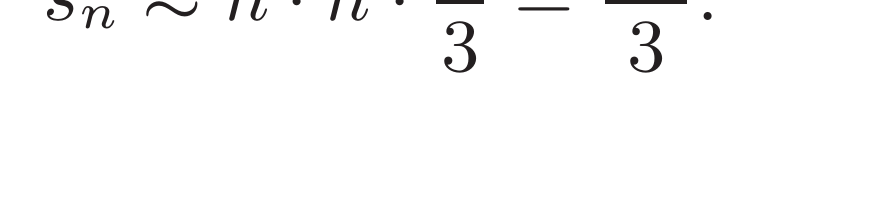
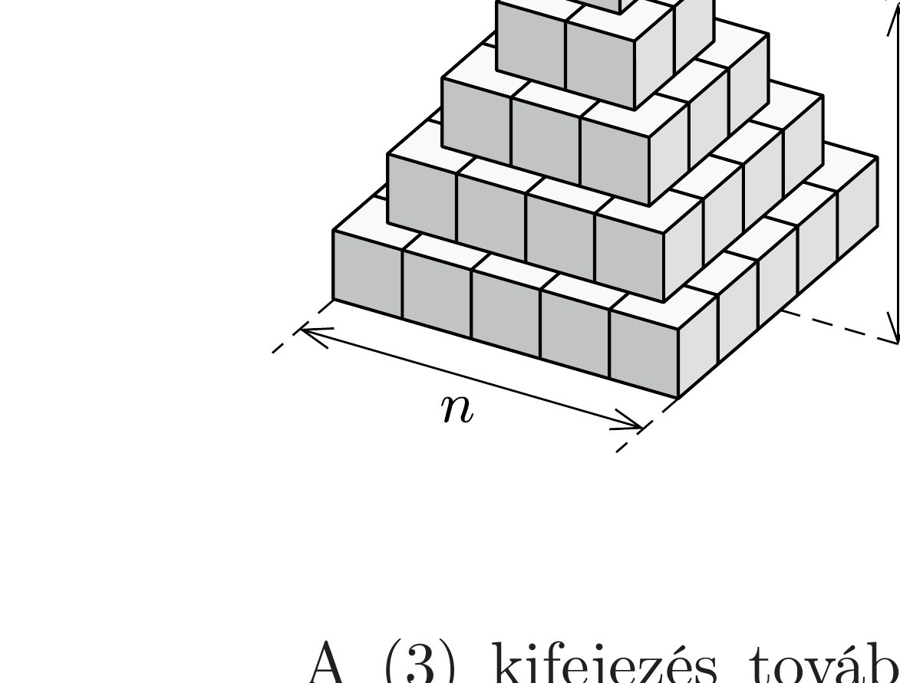
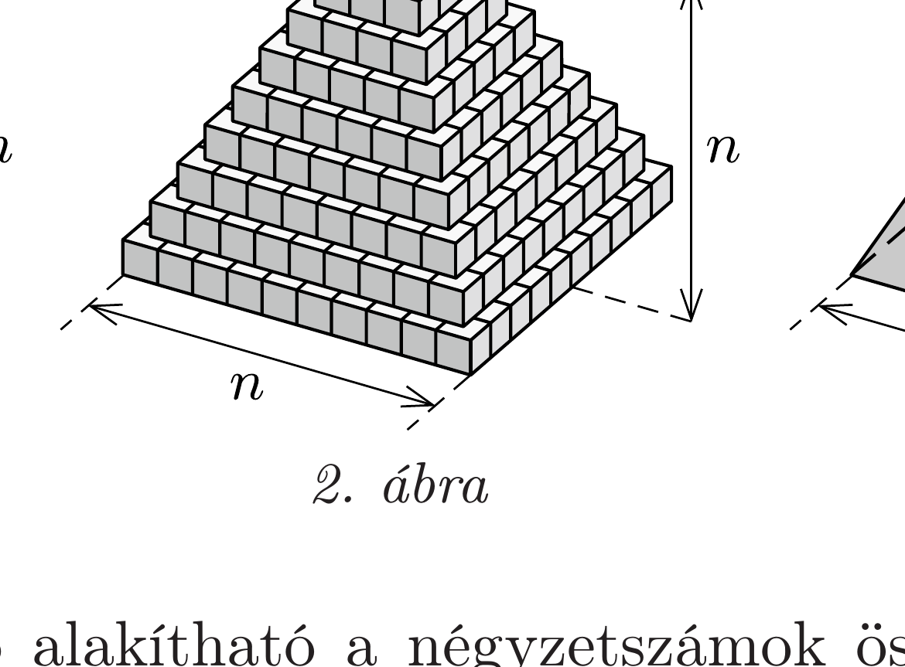
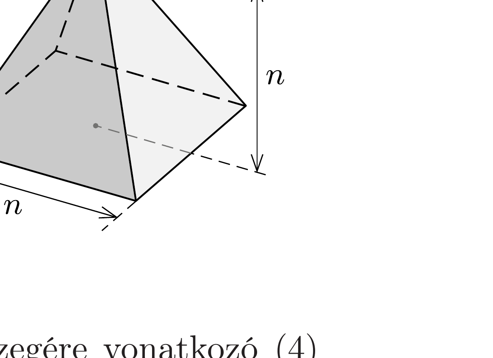

## Útmutatás

Az emelés során végzett munka a slinky gravitációs helyzeti és rugalmas energiájának növelésére fordítódik. Ezeket a slinky kicsiny, egyenlő tömegú részekre osztásával határozhatjuk meg. A $b$ ) és $c$ ) kérdésekre könnyen válaszolhatunk, ha észrevesszük: a rugó elengedését követően a tömegközéppont szabadon esik.

## Megoldás

a) Osszuk fel a slinkyt gondolatban $N \gg 1$ darab egyforma tömegü részre! A darabkák tömege ekkor $m / N$, rugóállandója pedig a teljes slinky $D$ rugóállandójának az $N$-szerese, $D^{*}=N D$ lesz. Alulról számítva a $k$-adik darabkát feszítő erő nagysága
\[
F_{k}=(k-1) \frac{m g}{N},
\]
így a darabka $\ell_{k}$ hossza:
\[
\ell_{k}=\frac{F_{k}}{D^{*}}=(k-1) \frac{m g}{N^{2} D} .
\]
(A darabkák kezdeti hossza a végső hosszhoz képest elhanyagolha-

tó, ezért hosszukat a megnyúlásukkal közelíthetjük.)
A $k$-adik darabka felső végének a slinky aljától mért $x_{k}$ távolságát megkapjuk, ha összeadjuk az alatta lévő darabkák hosszát:
\[
x_{k}=\sum_{j=1}^{k} \ell_{j}=\sum_{j=1}^{k}(j-1) \frac{m g}{N^{2} D}=\frac{k(k-1)}{2} \frac{m g}{N^{2} D}=\frac{k}{N}\left(\frac{k}{N}-\frac{1}{N}\right) \frac{m g}{2 D} .
\]
$k$ helyébe $N$-et helyettesítve, majd felhasználva, hogy $N \gg 1$, megkapjuk a slinky $L$ hosszát $D$-vel és $m$-mel kifejezve:
\[
L=\frac{m g}{2 D},
\]
összhangban a 107. feladat megoldásával.
Az emelés során befektetett munka egyrészt a slinky rugalmas energiáját növeli, másrészt fedezi a tömegközéppont emelkedése miatt bekövetkező potenciális
energia-növekedést. A rugalmas energia kezdetben nulla, a végállapotban pedig az egyes darabkák rugalmas energiájának összege:
\[
E_{\mathrm{rug}}=\sum_{j=1}^{N} \frac{1}{2} D^{*} \ell_{j}^{2}=\sum_{j=1}^{N} \frac{1}{2} N D\left[(j-1) \frac{m g}{N^{2} D}\right]^{2}=\frac{1}{2} \frac{(m g)^{2}}{N^{3} D} \sum_{j=1}^{N}(j-1)^{2} .
\]

Megjegyzés. A rugalmas energia kifejezésében megjelenik az elsó $(N-1)$ darab négyzetszám összege. A további számolásainkban többször előfordul majd hasonló összegzés, ezért vizsgáljuk meg, hogyan számolható nagy $n$-ekre az
\[
s_{n}=\sum_{j=1}^{n} j^{2}
\]
alakú szumma! Ez az összeg nem más, mint a 2. ábrán látható, csupa egységkockából felépített, $n$ emeletes „piramis" térfogata. Nagy $n$-ekre a piramis térfogatát jól közelíti egy olyan egyenes gúla, melynek alapja $n$ oldalhosszúságú négyzet, magassága szintén $n$ egység, ezért

A (3) kifejezés tovább alakítható a négyzetszámok összegére vonatkozó (4) közelítő formula segítségével:
\[
E_{\mathrm{rug}}=\frac{1}{2} \frac{(m g)^{2}}{N^{3} D} s_{N-1} \approx \frac{1}{2} \frac{(m g)^{2}}{N^{3} D} \frac{(N-1)^{3}}{3} \approx \frac{1}{6} \frac{(m g)^{2}}{D}=\frac{1}{3} m g L .
\]
Az utolsó lépésben felhasználtuk a (2) összefüggést.
A slinky gravitációs potenciális energiájának kiszámításához határozzuk meg a tömegközéppont asztaltól mért $h$ távolságát az emelési folyamat végén:
\[
h=\frac{1}{m} \sum_{k=1}^{N} \frac{m}{N} x_{k}=\frac{1}{2} \frac{m g}{N^{3} D} \sum_{k=1}^{N} k(k-1) .
\]
Az összegzésben nagy $N$-ekre elég csak a $k$-ban másodfokú tagokat megtartani:
\[
h \approx \frac{1}{2} \frac{m g}{N^{3} D} s_{N} \approx \frac{1}{2} \frac{m g}{N^{3} D} \frac{N^{3}}{3}=\frac{1}{6} \frac{m g}{D}=\frac{L}{3} .
\]

A slinky tömegközéppontja tehát teljes hosszának alsó harmadánál található. Ezzel a potenciális energia az asztallap síkjához viszonyítva:
\[
E_{\mathrm{grav}}=m g h=\frac{1}{3} m g L .
\]
Tehát az emelés közben végzett munka
\[
W=E_{\text {rug }}+E_{\text {grav }}=\frac{2}{3} m g L .
\]

Megjegyzés. Ugyanezt az eredményt az emelésnél kifejtett (változó nagyságú) erő integrálásával is megkaphatjuk. Amikor a slinkynek éppen $k$ darabkáját emeltük meg, ezek súlyát, tehát
\[
F_{k}=\frac{k}{N} m g
\]
erốt kell kifejtenünk. Az (1) összefüggés szerint a $k \gg 1$ darabkából álló, az alsó végénél feszítetlen rugódarab hossza
\[
x_{k} \approx\left(\frac{k}{N}\right)^{2} \frac{m g}{2 D} .
\]
A (2), (5) és (6) egyenletek összevetéséból az erő távolságfüggésére $F(x)=m g \sqrt{x / L}$, a végzett munkára pedig
\[
W=\int_{0}^{L} F(x) \mathrm{d} x=\frac{m g}{\sqrt{L}} \int_{0}^{L} \sqrt{x} \mathrm{~d} x=\frac{2}{3} m g L
\]
adódik.
b) Az elengedés után a slinky tömegközéppontja szabadon esik, ezért a teljes összecsukódás utáni pillanatban a sebessége
\[
v_{0}=\sqrt{2 g h}=\sqrt{\frac{2}{3} g L} .
\]
c) Az összecsukódás időtartama a szabadesés idejével egyezik meg:
\[
t=\sqrt{\frac{2 h}{g}}=\sqrt{\frac{2 L}{3 g}} .
\]

Megjegyzés. A b) kérdésre kapott eredményünk segítségével kiszámíthatjuk a slinky mozgási energiáját az összecsukódás utáni pillanatban:
\[
E_{\mathrm{kin}}=\frac{1}{2} m v_{0}^{2}=\frac{1}{3} m g L,
\]
tehát a slinky teljes (rugalmas és gravitációs helyzeti) energiájának csak a felét kaptuk vissza mozgási energiaként! Vajon hová túnt az energia másik fele? Disszipálódott, méghozzá a slinky összecsukódásakor a menetek parányi, rugalmatlan ütközései következtében.
