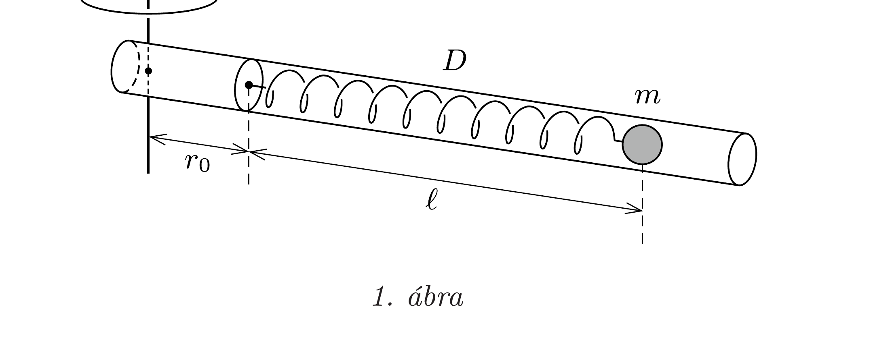
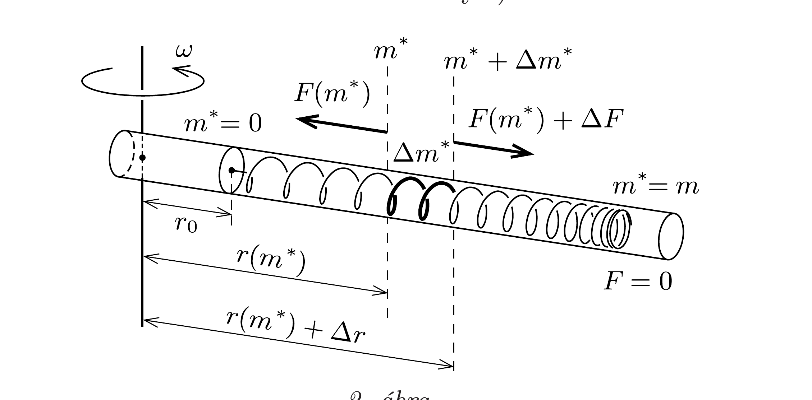

## Útmutatás

A dimenzióanalízis módszerét alkalmazva - ha nem is a teljes megoldást, de - fontos részeredményt kaphatunk.

A részletes leírásnál érdemes a rugó pontjait a rugó rögzített vége és a kérdéses pont közötti rugódarab $m^{*}$ tömegével jellemezni. Ha sikerül meghatároznunk a rugó mentén ható $F$ erốt és a rugó egy-egy darabkájának a forgástengelytől mért $r$ távolságát $m^{*}$ függvényében, akkor megkapjuk a probléma részletes megoldását. Ehhez írjunk fel egyenleteket az $F\left(m^{*}\right)$ és $r\left(m^{*}\right)$ függvények $m^{*}$ szerinti változási ütemére. Ezekből - alkalmas mechanikai analógia felhasználásával - leolvashatjuk a slinky alakváltozásának minden részletét, így a teljes megnyúlást is.

Megjegyzés. Tanulságos a feladat megoldása előtt átgondolni egy egyszerúbb változatot: a slinky folytonos tömegeloszlása helyett tekintsünk egy nulla tömegü, elhanyagolható feszítetlen hosszúságú, $D$ direkciós állandójú rugót, amelynek végéhez egy $m$ tömegú pontszerú testet erósítünk, majd a rendszert forgásba hozzuk.

## Megoldás

A megforgatott rugó $\ell$ hosszúsága $D, m, \omega$ és $r_{0}$ függvénye lehet. Ezen mennyiségek mértékegysége:
\[
[\ell]=\mathrm{m} ; \quad[D]=\frac{\mathrm{kg}}{\mathrm{~s}^{2}} ; \quad[m]=\mathrm{kg} ; \quad[\omega]=\frac{1}{\mathrm{~s}} ; \quad\left[r_{0}\right]=\mathrm{m} .
\]
Látható, hogy hosszúság dimenzió csak $r_{0}$-ban szerepel, a megnyúlt rugó $\ell$ hosszának tehát $r_{0}$-lal arányosnak kell lennie, és az arányossági tényező csak a $\xi=$ $\omega \sqrt{m / D}$ dimenziótlan kifejezéstől függhet:
\[
\ell=r_{0} \cdot f(\xi) .
\]
Az $f(\xi)$ függvény konkrét alakját csak részletes dinamikai számítással határozhatjuk meg, annyit azonban megállapíthatunk, hogy $r_{0} \rightarrow 0$ határesetben a rugó egyensúlyi hossza - ha ilyen egyáltalán kialakul - nulla lesz, tehát a rugó (annak ellenére, hogy forgásba hoztuk) egyáltalán nem nyúlik meg.

Tekintsük először azt az egyszerúsített feladatot, amikor egy nulla tömegü slinky-rugó végén $m$ tömegú pontszerú test található (1. ábra).

A forgásba hozott rugó hosszát a tömegpont mozgásegyenletéből számíthatjuk ki:
\[
m\left(r_{0}+\ell\right) \omega^{2}=D \ell,
\]
ahonnan
\[
\ell=r_{0} \frac{\frac{m \omega^{2}}{D}}{1-\frac{m \omega^{2}}{D}}=r_{0} \frac{\xi^{2}}{1-\xi^{2}} .
\]
Ez a megoldás csak $\xi<1$, vagyis
\[
\omega<\sqrt{\frac{D}{m}} \equiv \omega_{0}
\]
esetben érvényes, és ilyen szögsebességeknél $r_{0} \rightarrow 0$ határesetben $\ell$ nullává válik. Ha viszont $\omega>\omega_{0}$, akkor a rugóeró semekkora $\ell$ értéknél nem tudja biztosítani a körmozgáshoz szükséges centripetális erốt, tehát az ideális slinky sehol nem lehet egyensúlyban, így (tetszőlegesen kicsi $r_{0}$ mellett is) végtelen hosszúra nyúlik!

Ezek szerint finomítani kell a dimenzionális megfontolással kapott (1) egyenletből levonható következtetést. Ha az $f(\xi)$ függvény valahol szingulárissá („végtelen
naggyá") válik, akkor tetszőleges $r_{0}$ mellett (és így az $r_{0} \rightarrow 0$ határesetben is) az $\ell$ hossz végtelen nagy lesz. (Reális körülmények között természetesen a megnyúlásnak korlátot szab a rugó meneteinek hossza: egy teljesen kitekeredett rugó nyilvánvalóan nem követi már a Hooke-törvényt.)

Térjünk most vissza az eredeti, folytonos tömegeloszlású rugó esetére! Jellemezzük a rugó egyes pontjait a rugó rögzített vége és a kérdéses pont közötti rugódarab $m^{*}$ tömegével. Jelöljük az $m^{*}$ paraméterértékhez tartozó rugódarabka és a forgástengely távolságát $r\left(m^{*}\right)$-gal, az ezen a helyen ébredő rugóerőt pedig $F\left(m^{*}\right)$-gal (2. ábra). Ekkor teljesül, hogy
\[
r(0)=r_{0} \quad \text { és } \quad F(m)=0 .
\]

A megfeszített rugó kicsiny, $\Delta m^{*}$ tömegú (a 2 . ábrán vastag vonallal jelölt) darabkája a feszítőerő hatására
\[
r\left(m^{*}+\Delta m^{*}\right)-r\left(m^{*}\right) \equiv \Delta r=\frac{1}{m D} F\left(m^{*}\right) \Delta m^{*}
\]
hosszúságúra nyúlik (hiszen ha $F$ mindenhol ugyanakkora volna, akkor a rugó hossza $F / D$ lenne). A kicsiny rugódarabkára felírható a forgómozgás dinamikai feltétele:
\[
F\left(m^{*}+\Delta m^{*}\right)-F\left(m^{*}\right) \equiv \Delta F=-\Delta m^{*} \cdot r\left(m^{*}\right) \cdot \omega^{2} .
\]
A fenti két egyenlet így foglalható össze:
\[
\begin{aligned}
\frac{\Delta r}{\Delta m^{*}} & =\frac{1}{m D} F\left(m^{*}\right), \\
\frac{\Delta F}{\Delta m^{*}} & =-\omega^{2} r\left(m^{*}\right) .
\end{aligned}
\]

Nem nehéz ráismerni, hogy a (3) és (4) egyenletek alakilag megegyeznek egy harmonikus rezgőmozgást végző tömegpont mozgásegyenleteivel. Valóban, az
\[
m^{*} \longleftrightarrow t \quad \text { és } \quad \frac{F}{m D} \longleftrightarrow v
\]
megfeleltetéssel a rugó alakját és a benne ébredő feszítőerőt megadó egyenletek így írhatók:
\[
\begin{gathered}
\frac{\Delta r(t)}{\Delta t}=v(t), \\
\frac{\Delta v(t)}{\Delta t}=-\left(\frac{\xi}{m}\right)^{2} r(t),
\end{gathered}
\]
ahol $\xi=\omega \sqrt{m / D}$ a korábban is használt dimenziótlan állandó. Ezek az egyenletek egy tömegpont $\xi / m$ „körfrekvenciájú" harmonikus rezgőmozgását írják le. Ha figyelembe vesszük még a (2)-nek megfelelő $r(t=0)=r_{0}$ és $v\left(m^{*}=m\right)=0$ határfeltételeket is, a megoldás:
\[
r\left(m^{*}\right)=\frac{r_{0}}{\cos \xi} \cos \left[\xi\left(1-\frac{m^{*}}{m}\right)\right], \quad F\left(m^{*}\right)=\frac{\xi D r_{0}}{\cos \xi} \sin \left[\xi\left(1-\frac{m^{*}}{m}\right)\right] .
\]

Megjegyzés. Ugyanehhez az eredményhez úgy is eljuthatunk, ha a (3) és (4) egyenletekben a $\Delta m^{*} \rightarrow 0$ határértéket képezzük, és így az
\[
r^{\prime}\left(m^{*}\right)=\frac{1}{m D} F\left(m^{*}\right), \quad F^{\prime}\left(m^{*}\right)=-\omega^{2} r\left(m^{*}\right), \quad \text { vagyis } \quad r^{\prime \prime}\left(m^{*}\right)=-\frac{\xi^{2}}{m^{2}} r\left(m^{*}\right)
\]
differenciálegyenlethez jutunk. Ennek megoldása megfelelő periodicitású szinusz- és koszinusz-függvények szuperpozíciója.

A rugó teljes megnyúlása:
\[
\ell=r(m)-r(0)=r_{0}\left(\frac{1}{\cos \xi}-1\right)=r_{0}\left[\frac{1}{\cos (\omega \sqrt{m / D})}-1\right],
\]
de ez csak akkor írja le helyesen a kialakuló állapotot, ha $\xi<\pi / 2$, vagyis ha
\[
\omega<\frac{\pi}{2} \sqrt{\frac{D}{m}} \equiv \omega_{\text {kritikus }} .
\]
A szögsebességet lassan növelve a rugó megnyúlása egyre nagyobbá válik, és a kritikus szögsebességhez közeledve végtelenhez tart. A kritikus értéket meghaladva a rugónak nincs stabil forgó állapota, megnyúlásának csak a teljes kiegyenesedése (a Hooke-törvény érvénytelenné válása) szab határt.

Látható, hogy a folytonos tömegeloszlású slinky lényegében ugyanúgy viselkedik, mint az egyszerúsített feladatban szereplő (a végénél pontszerú testtel terhelt súlytalan) rugó, csak a kritikus szögsebesség nagysága különbözik egy $\pi / 2$-es tényezőben.
