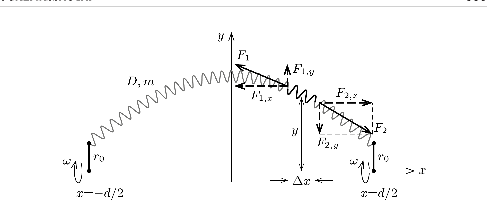

## Útmutatás

Keressünk analógiát a forgásban lévó slinky alakját leíró görbe egyenlete és egy harmonikus rezgőmozgást végző tömegpont mozgásegyenlete között. Az előző feladat megoldásának tanulmányozása sokat segíthet.

## Megoldás

Vegyük fel a koordináta-rendszerünket az ábrán látható módon, és keressük a (már állandósult állapotban lévố) rugó alakját ebben a rendszerben. Jelöljük az $m$ tömegü, $D$ rugóállandójú slinky végeinek távolságát $d$-vel, pályasugarukat pedig $r_{0}$-lal.

Tekintsük a slinky egy tetszőlegesen kiválasztott, kicsiny darabkájára ható eróket! A slinkyt feszítő erő $x$ irányú komponense a rugó mentén állandó $\left(F_{0}\right)$, hiszen ebben az irányban a slinky kiválasztott kicsiny darabkája nem gyorsul:
\[
F_{1, x}=F_{2, x}=F_{0} .
\]
Ebből következik, hogy a slinky egyforma tömegú (azaz egyenló direkciós állandójú) darabjainak az $x$ irányú vetülete is egyforma (a darabkák nyugalmi hosszát a megnyúlt hosszukhoz képest elhanyagoltuk). A kiszemelt darabka $x$ irányú vetülete $\Delta x$, így tömege a slinky teljes $m$ tömegével kifejezve $m \Delta x / d$.
$y$ irányban a kis darabkára ható erők eredője biztosítja a darabka $y \omega^{2}$ centripetális gyorsulását, ahol $\omega$ a pörgetés szögsebessége:
\[
F_{2, y}-F_{1, y}=\Delta x \frac{m}{d} \cdot y \omega^{2} .
\]

A slinkyben ható erő mindig érintőirányú, így a feszítőerő $x$ és $y$ irányú komponensének aránya kifejezhető az adott pontbeli meredekséggel:
\[
\frac{F_{1, y}}{F_{0}}=-\left(\frac{\Delta y}{\Delta x}\right)_{1}, \quad \frac{F_{2, y}}{F_{0}}=-\left(\frac{\Delta y}{\Delta x}\right)_{2} .
\]
Az (1) egyenlet mindkét oldalát elosztva $F_{0}$-lal, majd felhasználva a meredekségre vonatkozó összefüggéseket:
\[
\left(\frac{\Delta y}{\Delta x}\right)_{2}-\left(\frac{\Delta y}{\Delta x}\right)_{1}=-\Delta x \frac{m \omega^{2}}{F_{0} d} \cdot y .
\]
$\Delta x$-szel osztva, majd $\Delta x$ értékével nullához tartva a bal oldalon a slinky alakját leíró $y(x)$ függvény második deriváltja jelenik meg:
\[
\frac{\mathrm{d}^{2} y}{\mathrm{~d} x^{2}}=-\frac{m \omega^{2}}{F_{0} d} \cdot y(x) .
\]
Ez az egyenlet teljesen analóg egy $\Omega=\omega \sqrt{m /\left(F_{0} d\right)}$ körfrekvenciával egydimenziós harmonikus rezgőmozgást végző tömegpont
\[
\frac{\mathrm{d}^{2} r}{\mathrm{~d} t^{2}}=-\Omega^{2} r(t)
\]
mozgásegyenletével, ahol $r(t)$ a tömegpont egyensúlyi helyzettől mért kitérése az idő függvényében. Jól ismert, hogy az utóbbi egyenlet megoldása
\[
r(t)=A \cos \left(\Omega t+\varphi_{0}\right),
\]
ahol $A$ az amplitúdó, $\varphi_{0}$ pedig a kezdőfázis. Ennek alapján a slinky alakját leíró görbe
\[
y(x)=A \cos \left(\sqrt{\frac{m}{F_{0} d}} \omega x\right)
\]
alakú. (Felhasználtuk, hogy a választott koordináta-rendszerben $y(x)$ páros függvény, a „kezdőfázis" értéke tehát nulla.)

Megjegyzés. Az $F_{0}$ eró kifejezhető a slinky $D$ rugóállandójával és a végpontok $d$ távolságával is, ha felírjuk a rugó kicsiny, $\Delta m$ tömegú darabkájának $\Delta s$ megnyúlását a rá ható $F$ erốvel kifejezve. Mivel egy ilyen darabka rugóállandója az egész rugó $D$ állandójának $m / \Delta m$-szerese, ezért
\[
F=D \frac{m}{\Delta m} \cdot \Delta s .
\]
Másrészt igaz, hogy
\[
\frac{F}{F_{0}}=\frac{\Delta s}{\Delta x},
\]
hiszen a slinkyben ható erố érintó irányú. A fenti egyenletekből $F_{0} \Delta m=m D \Delta x$, ennek a rugó teljes hosszára történő összegzéséből pedig $F_{0}=D d$ adódik.

Ezek szerint a rugó alakját leíró függvény „körfrekvenciája”
\[
\Omega=\omega \sqrt{\frac{m}{F_{0} d}}=\omega \sqrt{\frac{m}{D}} \cdot \frac{1}{d}=\frac{\xi}{d}
\]
alakban is megadható, ahol $\xi=\omega \sqrt{m / D}$ az előző feladatban is használt dimenziótlan állandó.

A rugó alakját leíró $y(x)=A \cos (\xi x / d)$ függvény amplitúdóját az $y(d / 2)=r_{0}$ feltétel határozza meg:
\[
A=\frac{r_{0}}{\cos (\xi / 2)} .
\]
Látható, hogy ha az „ugrókötél” végeit nagyon kicsi sugarú körök mentén mozgatjuk, vagyis $r_{0} \approx 0$, akkor a rugó nem válik el számottevően a forgástengelytől $(y(x) \approx 0)$, feltéve, hogy $\xi<\pi$, vagyis
\[
\omega<\pi \sqrt{\frac{D}{m}}<\omega_{\text {kritikus }} .
\]
A kritikus szögsebességet megközelítve, majd elérve viszont az ideális rugó kitérése végtelen naggyá válna (reális körülmények között viszont addig nyúlik a rugó, amíg a Hooke-törvény érvényét veszíti).

Megjegyzések. 1. Az „ugrókötél” viselkedése a súlytalanság állapotában nagyon hasonló az előző feladatban szereplő (egy csőben, vízszintes síkban forgatott) rugó viselkedéséhez. Ez nem véletlen, ugyanis az ugrókötél mozgását megadó egyenletek két független komponensre bonthatók: a forgástengely irányú egyenlet egy egyenletesen megfeszített, $d$ hosszúságú rugót ír le, a tengelyre meróleges megnyúlás egyenlete pedig éppen megegyezik a csőben forgatott rugó mozgásegyenletével. A kritikus szögsebességek közötti 2-es faktor eltérés abból adódik, hogy az ugrókötél fele felel meg a csőben forgatott rugónak, így ennek tömege $m / 2$, rugóállandója pedig $2 D$.
2. A kis sugarú $\left(r_{0} \approx 0\right)$ körök mentén mozgatott „ugrókötélnek" nem csak a fentebb leírt „félhullám" a megoldása, hanem minden olyan koszinuszfüggvény, melynek értéke $x= \pm d / 2$-nél közelítőleg nulla, de más helyeken $y(x)$ véges nagyságú. Ez akkor következhet be, ha $\cos (\xi / 2) \approx 0$, vagyis $\xi=(2 n+1) \pi$, ahol $n$ pozitív egész szám. Ez esetben a slinkynek lesz $2 n$ darab csomópontja, azaz olyan pontja, amelynek az $x$ irányra meróleges kitérése nulla. Amennyiben a rugó végeit ellentétes fázisban mozgatjuk (az ugrókötéllel ez nehezen valósítható meg, de nem kizárt), akkor a rugó alakját páratlan (szinusz-)függvény írja le, és a csomópontok száma is páratlan lesz.

A jelenség megfigyeléséhez nem is kell a Nemzetközi Úrállomásra utazni! Ha ketten, egymástól viszonylag távol állva úgy feszítik ki a slinkyt, hogy annak belógása elég kicsi legyen, akkor - némi gyakorlás után - a végpontok megfelelően szinkronizált mozgatásával a slinky alap- és felharmonikusai is „gerjeszthetők”.
