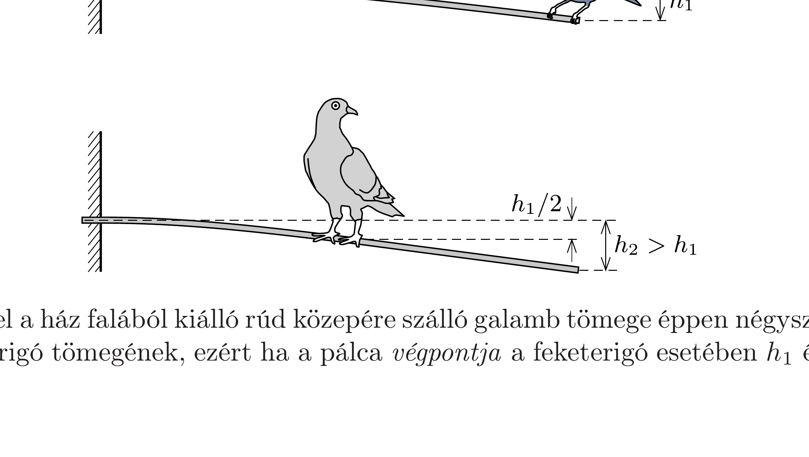

## Útmutatás

Az egyik végén vízszintesen befogott, másik végén terhelt rúd lehajlása egyenesen arányos a terhelő erővel és a pálca hosszának harmadik hatványával.

## Megoldás

Tapasztalatból tudjuk, hogy egy rugalmas rúd hajlításkor annál jobban görbül, minél nagyobb a hajlító forgatónyomaték. Precízebben mondva: egy meghajlított rúd adott pontjában a görbületi sugár fordítottan arányos a pontban ható forgatónyomatékkal. Ebből következik, hogy ha egy $\ell$ hosszúságú, vízszintesen befogott rúd $F$ eró hatására bekövetkező lehajlása $h$, akkor egy ugyanolyan keresztmetszetú, $\ell / 2$ hosszúságú rúd lehajlása abban az esetben lesz éppen $h / 2$ értékú, ha a végét $4 F$ eróvel terheljük (hiszen az arányos kicsinyítés során a görbületi sugarak is feleződnek, így a rúd pontjaiban ható forgatónyomatékoknak kétszereződniük kell, ami a feleakkora erőkarok miatt négyszeres terhelőerővel valósítható meg).

Mivel a ház falából kiálló rúd közepére szálló galamb tömege éppen négyszerese a feketerigó tömegének, ezért ha a pálca végpontja a feketerigó esetében $h_{1}$ érték-
kel kerül lejjebb, akkor a zászlórúd középpontjának süllyedése a galamb esetében ennek éppen fele, vagyis $h_{1} / 2$ (lásd az ábrát). A galamb esetében a pálca alakja a közepétől a szabad végéig egyenes, amely meredekebben áll, mint a rúd befogott vége és a galamb közötti részének bármely darabkája, ezért a galamb esetében a zászlórúd végének lehajlása biztosan nagyobb, mint a feketerigós esetben.

Megjegyzés. A rúd alakjának kiszámításával meghatározható a lehajlások pontos aránya, eredményül 5 : 4 adódik a galambos eset javára.
