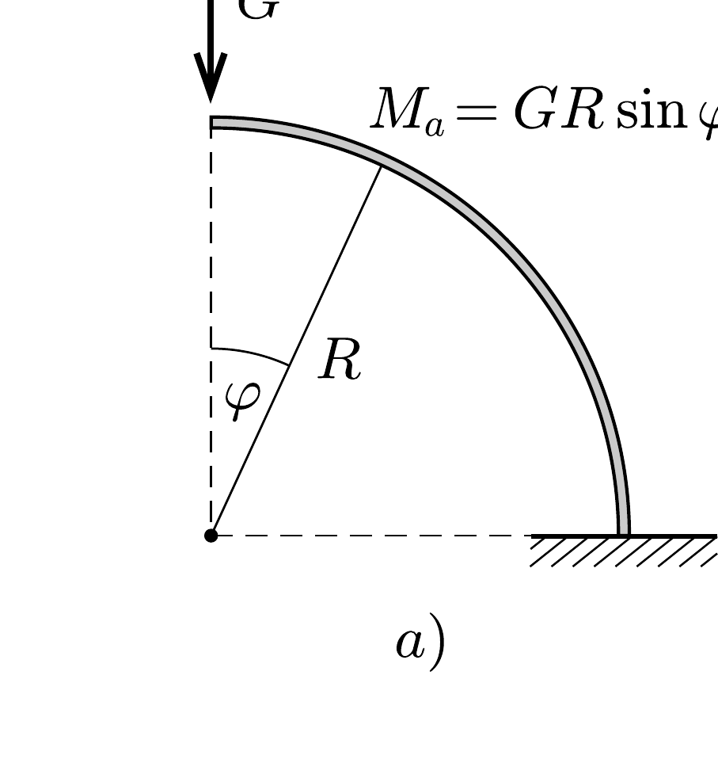
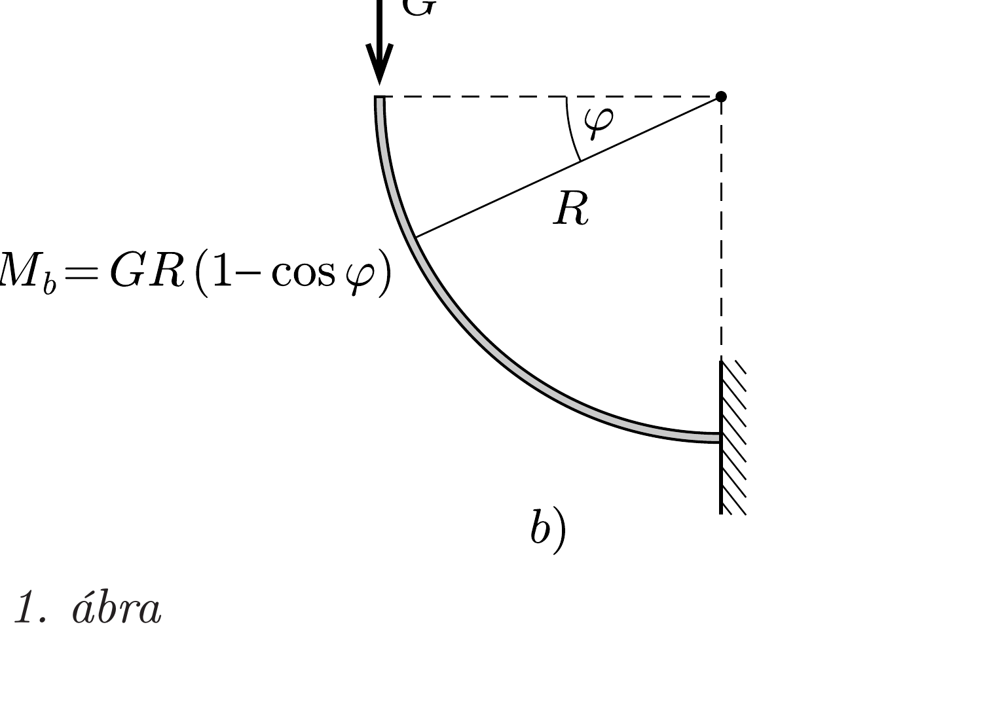
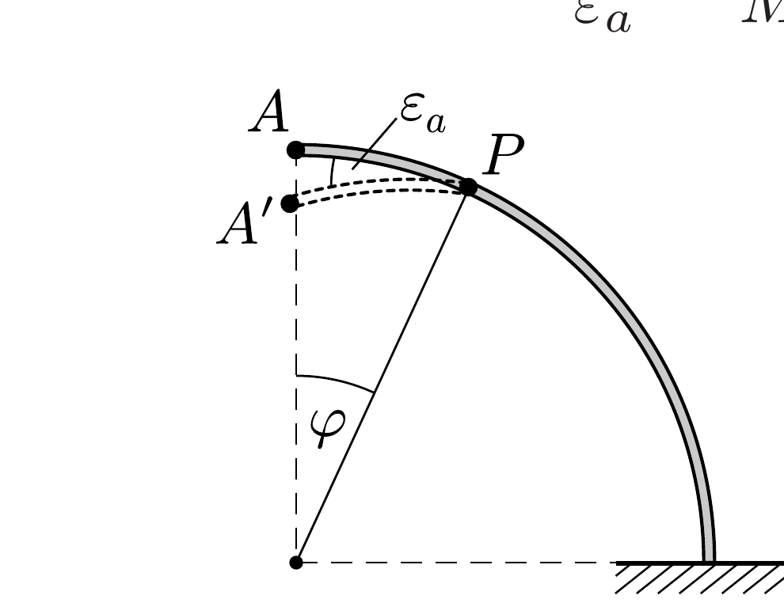
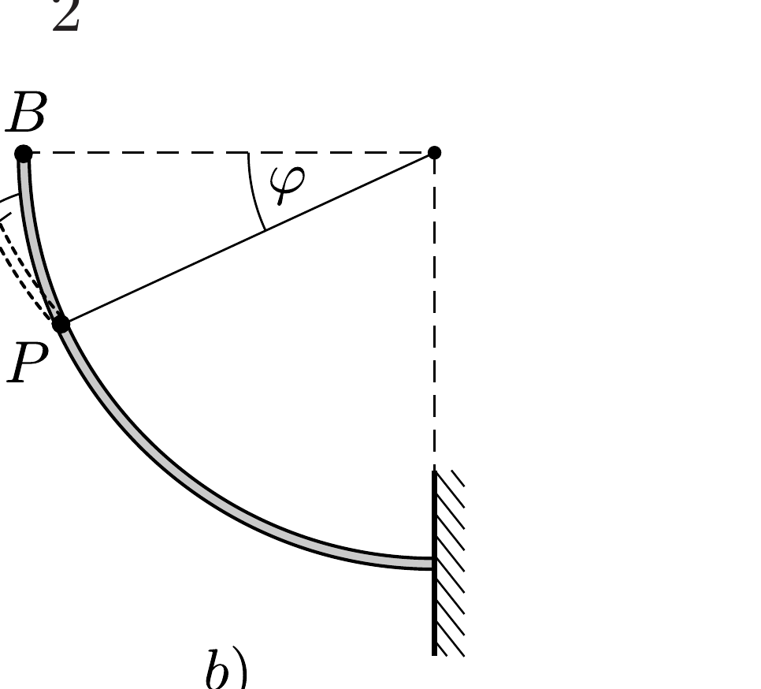

## Útmutatás

A végpontok lesüllyedésének összehasonlításához osszuk fel a negyedköríveket egyenlő hosszúságú, kicsiny szakaszokra. Terhelt állapotban a fémszál mentén helyről helyre változó nagyságú forgatónyomaték ébred, melynek hatására a szál kis darabjai meghajlanak. A darabkák meghajlását jellemző szög (azaz a darabka végpontjaihoz húzott érintők által bezárt szög megváltozása) egyenesen arányos az adott pontban ható forgatónyomatékkal. A két fémszál pontjainak alkalmas megfeleltetésével hasonlítsuk össze a szálak kis szakaszain fellépő
forgatónyomatékokat, majd vizsgáljuk meg, hogy a létrejött deformációk milyen mértékben járulnak hozzá a végpontok lesüllyedéséhez.

Energetikai megfontolásokkal is eljuthatunk a kérdés megválaszolásához, ha felhasználjuk, hogy a fémszálak azonos hosszúságú darabkáiban tárolt rugalmas energia a bennük ébredő forgatónyomaték négyzetével arányos.

## Megoldás

Osszuk fel gondolatban a rugalmas fémszálakat kicsiny, egyforma hosszú szakaszokra. Egy-egy ilyen kis szakasz terheletlen állapotban is ívelt, hajlító forgatónyomaték hatására azonban ez a görbület (az igénybevétel irányától függően) csökken vagy növekszik. A kis szakaszok deformációját azzal a kicsiny $\varepsilon$ szöggel jellemezhetjük, amennyivel a darabka végpontjaihoz húzott érintők által bezárt szög megváltozik. Ez az $\varepsilon$ szög (egy egyenes rúd hajlításához hasonlóan) egyenesen arányos a darabkára ható hajlító forgatónyomatékkal.

1. ábra

Írjuk fel, hogy mekkora forgatónyomatékot gyakorol a teher $G$ súlya a fémszál $\varphi$ szöggel jellemzett helyen található kis szakaszára (1. ábra). (Ennek a kis darabnak a deformációja eredményez olyan visszatérítő nyomatékot, ami a $G$ terhelés helyi forgatónyomatékát ellensúlyozza.) Amint az 1. ábráról leolvasható, ugyanazon $\varphi$ szöghöz tartozó pontokban az $M$ forgatónyomaték az $a$ ) esetben sohasem lehet kisebb a $b$ ) esetben fellépőnél, mivel
\[
\sin \varphi=2 \sin \frac{\varphi}{2} \cos \frac{\varphi}{2}=\operatorname{ctg} \frac{\varphi}{2} \cdot 2 \sin ^{2} \frac{\varphi}{2}=\operatorname{ctg} \frac{\varphi}{2}(1-\cos \varphi) \geq 1-\cos \varphi .
\]
Az egyenlőség csak $\varphi=0$ és $\varphi=\pi / 2$ esetben (vagyis a szál végpontjainál) áll fenn, közben $M_{a}$ mindig határozottan nagyobb, mint $M_{b}$.

Vizsgáljuk meg, hogy ha a fémszálnak csupán a $\varphi$ szögnél lévő kis szakaszán jönne létre deformáció, ez a végpontnak mekkora függőleges elmozdulását eredményezné. Jelöljük a 2. ábrán látható $P$ pontnál található kis szakasz szögelhajlását (és így a $\widehat{P A}$, illetve $\widehat{P B}$ ívek elhajlását is) a két esetben $\varepsilon_{a}$-val és $\varepsilon_{b}$-vel. Egyrészt
tudjuk, hogy mindkét deformáció arányos a $P$ pontban ható hajlító forgatónyomatékkal, ezért
\[
\frac{\varepsilon_{b}}{\varepsilon_{a}}=\frac{M_{b}}{M_{a}}<1, \quad \text { ha } \quad 0<\varphi<\frac{\pi}{2} .
\]

2. ábra

Másrészt (mint az egyszerú geometriai megfontolásból következik) a végpontok $\Delta h$ lesüllyedésének aránya
\[
\frac{\Delta h_{b}}{\Delta h_{a}}=\frac{\varepsilon_{b} \sin \frac{\varphi}{2}}{\varepsilon_{a} \cos \frac{\varphi}{2}}=\frac{\varepsilon_{b}}{\varepsilon_{a}} \operatorname{tg} \frac{\varphi}{2}<\operatorname{tg} \frac{\varphi}{2}<1, \quad \text { ha } \quad 0 \leq \varphi \leq \frac{\pi}{2} .
\]

Beláttuk tehát, hogy a két fémszál egymásnak megfeleltetett pontjai közül (a végpontoktól eltekintve) mindig az $a$ ) esetbeli pontoknál fellépő deformáció ad nagyobb járulékot a szál végének lesüllyedéséhez. Mivel a teljes alakváltozás összetehető a fémszál kis darabkáinak deformációiból származó alakváltozásokból, kimondhatjuk: az a) esetben nagyobb a szál végpontjának lesüllyedése.

Megjegyzés. Energetikai megfontolásokkal és integrálszámítással számszerúen is meg tudjuk határozni a kétféle lesüllyedés arányát.

Ha a fogas végére - óvatosan növelve a terhelést - maximálisan $G$ nagyságú erốt fejtünk ki, és ennek hatására a végpont $\Delta h$-val mélyebbre kerül, akkor összesen $W=\frac{1}{2} G \Delta h$ munkát végzünk. (Az $\frac{1}{2}$-es faktor onnan származik, hogy az eró átlagértéke a maximális érték fele.) Ez a munkavégzés a kicsit meghajlított szálban tárolt rugalmas energiával egyenlő, ami a szál egyes darabkáiban tárolt energiák összegeként számítható. Egy-egy darabka rugalmas energiája - egy megfeszített csavarrugó energiaképletének analógiájára - a darabka $R \Delta \varphi$ hosszával és a végein ható $M$ forgatónyomaték négyzetével arányos. Ezek szerint a kétféle ruhafogas lehajlásának aránya:
\[
\frac{\Delta h_{a}}{\Delta h_{b}}=\frac{W_{a}}{W_{b}}=\frac{\int M_{a}^{2}(\varphi) R \mathrm{~d} \varphi}{\int M_{b}^{2}(\varphi) R \mathrm{~d} \varphi}=\frac{\int_{0}^{\pi / 2} \sin ^{2}(\varphi) \mathrm{d} \varphi}{\int_{0}^{\pi / 2}(1-\cos \varphi)^{2} \mathrm{~d} \varphi}=\frac{\frac{1}{2} \frac{\pi}{2}}{\frac{\pi}{2}-2+\frac{1}{2} \frac{\pi}{2}}=\frac{\pi}{3 \pi-8} \approx 2,2 .
\]

Ugyanez az eredmény megkapható úgy is, hogy a 2 . ábrán látható „elemi” lesüllyedéseket integráljuk össze.
