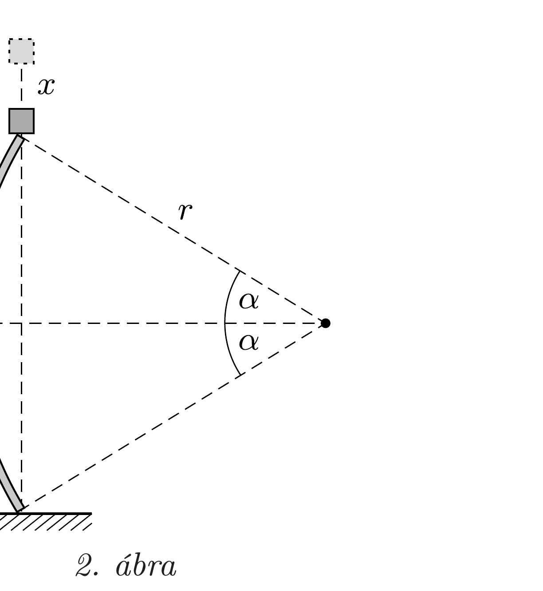

## Útmutatás

Egy meghajlított pálcában tárolt rugalmas energia egyenesen arányos a hosszával és fordítottan arányos a görbületi sugár négyzetével. Közelítsük a deformált pálca alakját mindkét esetben körívvel, és keressünk összefüggést a pálca rugalmas energiája és a terhelőerő között!

## Megoldás

Tekintsük először a vízszintesen befogott, $L$ hosszúságú pálcát, amelynek egyik vége $G$ súly hatására $h$ távolsággal hajlik le ( 1 . ábra). Közelítsük a meghajlított pálca alakját egyetlen $R$ sugarú körívvel!

Megjegyzés. Tudjuk ugyan, hogy a pálca görbülete (görbületi sugarának reciproka) a pálca egyes darabkáira ható forgatónyomatéktól függ, és emiatt a rögzítésnél a legnagyobb, a másik vége felé haladva egyre kisebbé válik, és a terhelésnél már nullára csökken. A görbület tehát nem lehet állandó, ennek ellenére - a számítás egyszerúsítése érdekében - mégis ezzel a durva közelítéssel élünk, hiszen nem pontos eredményt, hanem csak nagyságrendi becslést kívánunk kapni a keresett kritikus $F$ terhelésre.

![Ebben a közelítésben a görbületi sugár a Pitagorasz-tételből számítható:
\[
R^{2} \approx(R-h)^{2}+L^{2},
\]
ahonnan $h \ll L$ miatt](../../figures/333plus/figures/333+-p338-f1.png)
\[
R \approx \frac{L^{2}}{2 h} \approx 50 \mathrm{~m} .
\]
(A kicsiny lehajlás miatt a meghajlított pálca vízszintes vetületének hosszát $L$-nek vettük.)

Vizsgáljuk most az energiaviszonyokat! Gondoljuk el, hogy a lehajlított pálca egyensúlyi állapota úgy jött létre, hogy saját erőnkkel szép lassan lenyomtuk a pálca végét (ehhez a lehajlással arányosan fokozatosan növekvő erőt kellett kifejtenünk), majd amikor elértük a megadott $h$ értéket, ráakasztottuk a pálcára a $G$ súlyt. Mivel az általunk kifejtett erő az elmozdulással arányosan nőtt, átlagosan a maximális eró felével számolhatunk, a végzett munkánk tehát
\[
W=\frac{F_{\max }}{2} h=\frac{G}{2} h .
\]
Ez a munka a pálca rugalmas energiáját növelte (a pálca saját súlyát elhanyagoljuk). Ismert (és a feladathoz tartozó útmutatásban is szerepel), hogy egy meghajlított pálca rugalmas energiája egyenesen arányos a hosszával és fordítottan arányos a görbületi sugár négyzetével, ezért
\[
W=C \frac{L}{R^{2}},
\]
ahol $C$ a pálca merevségét jellemzó arányossági tényező, melynek értékére (1), (2) és (3) összevetéséből
\[
C=\frac{G}{2} h \cdot \frac{R^{2}}{L}=\frac{G L^{3}}{8 h}=125 \mathrm{~J} \mathrm{~m}
\]
adódik.
Megjegyzés. Ugyanerre az eredményre jutunk, ha a pálcából és a rá akasztott $G$ súlyból álló rendszer energiáját vizsgáljuk a pálca lehajlásának függvényében. Egyensúlyi állapotban az összenergia (ami a lehajlás másodfokú függvényével közelíthető) minimális.

Ha viszont a pálca rugalmas energiáját a nehezék helyzeti energiájának csökkenésével tesszük egyenlővé, egy kettes faktorban eltérő, hibás eredményt kapunk. Az energiamegmaradás tételének helyes alkalmazásakor ugyanis figyelembe kell vennünk a nehezék mozgási energiáját is, vagy pedig fokozatosan növekvő terheléssel és átlagerő munkájával kell számolnunk.

Tekintsük most a függőlegesen terhelt pálcát. Képzeljük el, hogy a pálca tetejére valamekkora súlyt helyezünk. Ha ez a súly kisebb egy kritikus $F$ értéknél, akkor a pálca csekély mértékben összenyomódik (mint egy megterhelt tartóoszlop), de nem hajlik ki. Ha elérjük a kritikus $F$ értéket, akkor a pálca kihajlik, és az $F$ nagyságú súly a 2. ábrán látható kicsiny $x$ távolsággal lejjebb kerül. Ilyenkor a pálca rugalmas energiájának növekedését a teher helyzeti energiájának csökkenése fedezi. (Ha $x$ kicsi, akkor kihajlás közben a terhelőerőt állandó nagyságúnak vehetjük, tehát a kétféle energiaváltozás egyenlőségének felírásakor nem követjük el a

fentebb említett 2-es faktor hibát.)

A pálca alakját ismét egyetlen körívvel közelítjük, melynek sugarát $r$-rel jelöljük. (Természetesen $r$ és a korábban szereplő $R$ nem egyenlő.) Az ábrán látható szög (radiánban mérve)
\[
\alpha=\frac{L}{2 r},
\]
és mivel ez a szög kicsiny, érvényes rá a
\[
\sin \alpha \approx \alpha-\frac{1}{6} \alpha^{3}
\]
közelítő összefüggés. (Ez a formula differenciálszámítás felhasználásával vezethető le, de numerikusan akár egy zsebszámológéppel is könnyen ellenőrizhető.)

A pálca rugalmas energiájának növekedése
\[
\Delta E_{1}=C \frac{L}{r^{2}},
\]
a súly helyzeti energiájának csökkenése pedig
\[
-\Delta E_{2}=F \cdot x=F(2 r \alpha-2 r \sin \alpha) \approx 2 F r \frac{\alpha^{3}}{6}=\frac{1}{24} \frac{F L^{3}}{r^{2}} .
\]
A pálca „spontán“ kihajlásának feltétele: $\left|\Delta E_{2}\right|>\Delta E_{1}$, azaz
\[
\frac{1}{24} \frac{F L^{3}}{r^{2}}>C \frac{L}{r^{2}} .
\]
Ez a feltétel - $r$ értékétől függetlenül - mindig teljesül, ha
\[
F>F_{\text {kritikus }}=24 \frac{C}{L^{2}}=3 G \frac{L}{h} \approx 3000 \mathrm{~N} .
\]

Megjegyzések. 1. A kritikus erő értéke (az alkalmazott közelítésben) független $r$-től, vagyis a kihajlás mértékétől, így a pálca tetőpontjának $x$ mértékú függőleges elmozdulása lényegében tetszóleges lehet. Ez a gyakorlatban azt jelenti, hogy ha a tartóoszlopok függőleges terhelése eléri a kritikus értéket, akkor a szerkezet összedól.
2. A lineáris (Hooke-törvényt követő) rugalmasságtani egyenletek megoldásával megmutatható, hogy a rúd kihajlásához szükséges kritikus terhelőerő pontos értéke
\[
F_{\text {kritikus }}=\frac{\pi^{2}}{3} G \frac{L}{h} \approx 3300 \mathrm{~N} .
\]

A görbület állandóságát feltételező számítás csak közelítő eredményt ad. A becsült érték a pontos eredménytől mindössze egy $9 / \pi^{2}$-es faktorban tér el, vagyis kb. 10 százalékos hibával kaptuk meg a kritikus terhelőerốt. Meglepő, hogy az alkalmazott durva közelítés - felsőbb matematikai módszerek alkalmazása nélkül - milyen jó becslést ad a kérdéses kritikus terhelésre.
