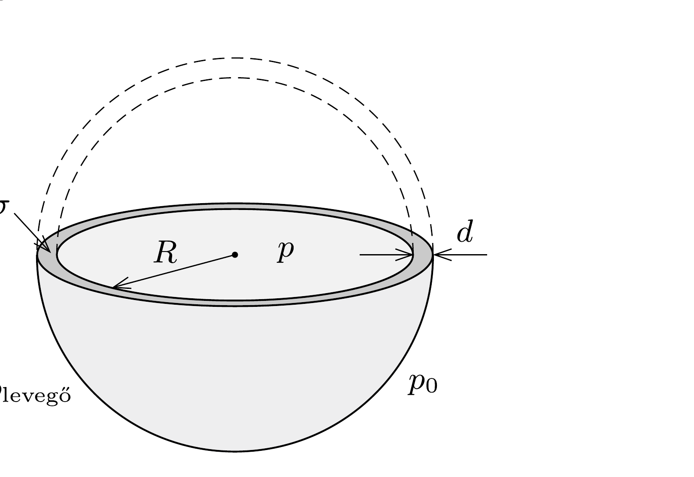

## Útmutatás

Vizsgáljuk meg, hogy legfeljebb mennyi héliumot tartalmazhatott a tartály kezdetben anélkül, hogy szétrepedt volna. A tartály anyagát szabadon választhatjuk, de csak reális anyagok jöhetnek szóba.

## Megoldás

Képzeljük el, hogy egy $R$ sugarú, $d$ falvastagságú tartályba $p$ nyomású héliumot zárunk. (Reális feltevés, hogy $d \ll R$, és hogy $p$ sokkal nagyobb, mint a külső légnyomás.) Jelöljük a tartály anyagának sürúségét $\varrho$-val, szakítószilárdságát pedig $\sigma$-val.

Számítsuk ki, legfeljebb mekkora lehet a $p$ nyomás, ha a tartály még nem szakad szét! Ha képzeletben kettévágjuk a tartályt, akkor a gáz $p R^{2} \pi$ erővel nyomja szét a két félgömböt. (A félgömböket szétfeszítő erót tulajdonképpen a $\Delta p=p-p_{0}$ túlnyomásból kellene számolnunk, de mivel $p \gg p_{0}$, a túlnyomást a tartályban lévő gáz nyomásával helyettesíthetjük.) Ez az erő nem lehet nagyobb, mint a $2 R \pi d$
nagyságú vágási felület és a szakítószilárdság szorzata:
\[
p \cdot R^{2} \pi<2 R \pi d \cdot \sigma .
\]

Ha a héliumgázt egy nagy ballonba engedjük, a nyomása a külső légnyomás $p_{0}$ értékére csökken, a térfogata tehát
\[
V=\frac{4 R^{3} \pi}{3} \frac{p}{p_{0}}
\]
lesz. Ekkora térfogatú gáz biztosan nem tud $V \varrho_{\text {levegög }} g$-nél nagyobb súlyú terhet felemelni, hiszen a felhajtóerőből még a légballon és a héliumgáz súlyát is le kell vonni.

A tartály súlya $4 \pi R^{2} d \varrho g$, ennek értéke a fentiek szerint nem lehet nagyobb, mint a maximális emelőerő:
\[
4 \pi R^{2} d \varrho g<\frac{4 R^{3} \pi}{3} \frac{p}{p_{0}} \varrho_{\text {levegög }} .
\]
Az (1) és (2) egyenlőtlenségekből a tartály anyagi állandói, valamint a külső levegő nyomása és súrúsége között kapunk kapcsolatot:
\[
\frac{\sigma}{\varrho}>\frac{3 p_{0}}{2 \varrho_{\text {levegör }}} .
\]
Érdekes, hogy (3)-ban nem szerepel sem a tartály sugara, sem a falának vastagsága, de még a tartályban lévő gáz súrúsége sem! (Vastagabb falú tartály nagyobb nyomást bír ki, de a súlya is arányosan nagyobb, a tartály sugarának csökkentése pedig nem csak a súlyát, de a benne tárolható gáz mennyiségét is csökkentené.)

Ha a fizikai állandók táblázatát lapozgatva megpróbálunk olyan anyagot keresni, amelynek adatai eleget tesznek a (3) feltételnek, a tiszta fémek között nem találunk ilyet, de alumínium- és titánötvözetekkel, továbbá szénszálas erősítésú anyagokkal már megoldható a tartály felemelése.
