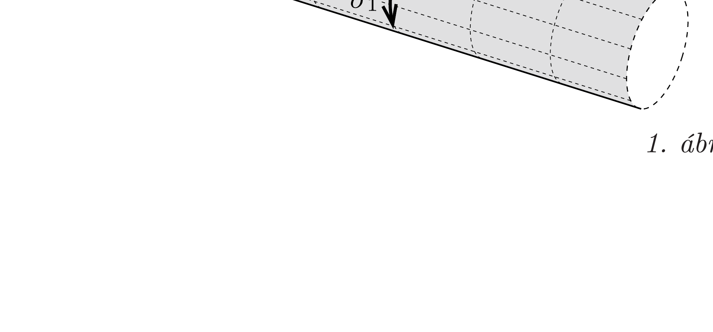
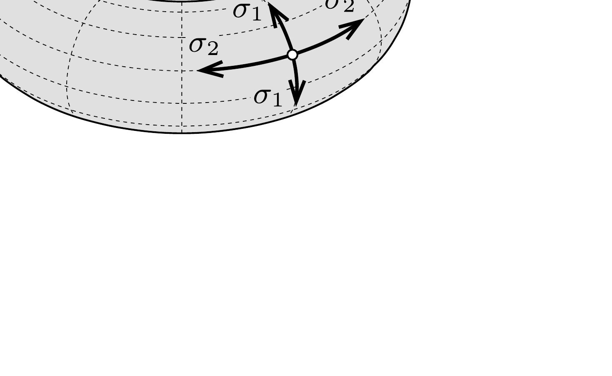
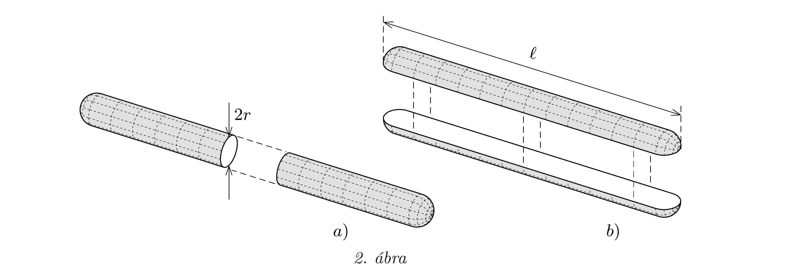
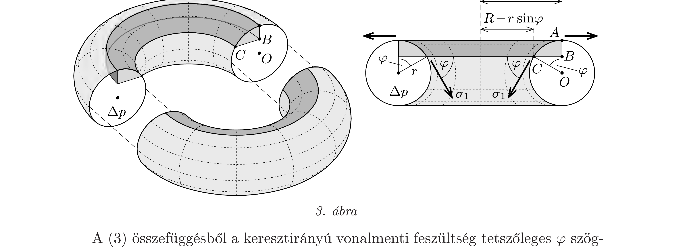
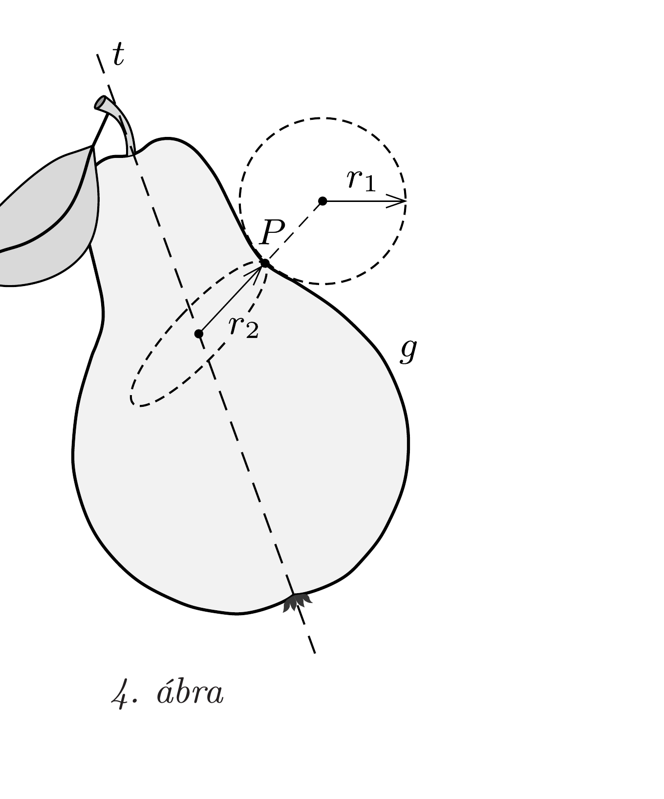

## Útmutatás

A virsli felhasadását a belsejében fokozatosan növekvő gőznyomás okozza. A túlnyomás hatására a virsli falában egyre növekvő húzófeszültség alakul ki, méghozzá anizotrop (és a tórusz esetében inhomogén) módon. A feszültségek nagysága a virsli alkalmasan kiválasztott darabjának erőegyensúlyából elemi úton is meghatározható.

## Megoldás

Akár egyenes, akár tórusz alakú virsliről van szó, a felhasadás olyan vonalnál következik be, amely mentén a rugalmas feszültség (adott belsó nyomás mellett) a legnagyobb.

Mivel a virsli falvastagságát állandónak tekintjük, az erő/felület dimenziójú rugalmas feszültség helyett vizsgálhatjuk a virsli falának egységnyi hosszúságú szakaszán ható feszítőerőt is. A továbbiakban ezt a mennyiséget vonalmenti feszültségnek fogjuk nevezni, és $\sigma$-val jelöljük. (Ez a folyadékok hasonló jellemzőjétől, a felületi feszültségtől eltérően a vizsgált szakasz elhelyezkedésétől is függhet, tehát általában anizotrop és inhomogén is lehet, ahogy az 1. ábrán látható.)

Tekintsük először az egyenes virslit! Legyen a virsli hossza $\ell$, sugara $r$, a túlnyomás benne pedig $\Delta p$. Ha a virslit - képzeletben - hosszában a közepén elvágjuk (2. ábra b) része), akkor a két felét (a félgömb alakú végek hatását elhanyagolva) $2 \ell \sigma_{1}$ erővel tudjuk együtt tartani. Ugyanakkor a félvirsliket a belső nyomás $2 r \ell \cdot \Delta p$ eróvel feszíti szét. Az erőegyensúly feltételéből:
\[
2 \ell \sigma_{1}=2 r \ell \cdot \Delta p,
\]
tehát a hosszanti vágásra merőleges, keresztirányú feszültség
\[
\sigma_{1}=r \Delta p .
\]

Ugyanezt a „vágásos" módszert a keresztirányú vonaldarabokon ható hosszirányú feszültségre (2. ábra $a$ ) része) is alkalmazhatjuk:
\[
2 \pi r \sigma_{2}=r^{2} \pi \cdot \Delta p,
\]
tehát ez a feszültség:
\[
\sigma_{2}=\frac{1}{2} r \Delta p .
\]
Látható, hogy $\sigma_{2}<\sigma_{1}$, tehát fózés során a virsliben lévő $\Delta p$ túlnyomás növekedtével először a keresztirányú feszültség éri el a szakítószilárdság határértékét, emiatt az egyenes virsli hosszában reped fel.

Vajon alkalmazhatók-e a fenti egyszerú megfontolások a tórusz-virsli esetére is? Legyen a tórusz középkörének sugara $R$, keresztmetszetének sugara $r$, a belsejében a túlnyomás pedig most is $\Delta p$. Jelöljük - az egyenes virslihez hasonlóan - a tórusz
falában „keresztirányban” ható feszültséget $\sigma_{1}$-gyel, a rá merőleges („hosszanti”) feszültséget pedig $\sigma_{2}$-vel az 1. ábrán látható módon.

Vágjuk el a tóruszt képzeletben egy - a (vízszintesnek képzelt) középkörével párhuzamos - síkkal, majd tekintsük a levágott résznek a belső „felét” (vagyis a szimmetriatengelyhez $R$-nél közelebb lévő részeket, lásd a 3. ábrát). Ha az elmetsző sík helyzetét az ábrán látható $\varphi$ szöggel adjuk meg, akkor a sötétszürkével jelölt forgástestre ható erők függőleges komponenseinek egyensúlyát így írhatjuk fel:
\[
\left[R^{2} \pi-(R-r \sin \varphi)^{2} \pi\right] \Delta p=2 \pi(R-r \sin \varphi) \sigma_{1} \sin \varphi .
\]
Felhasználtuk, hogy a vizsgált térrészre a belső túlnyomás csak a $C B$ oldal megforgatásából adódó körgyúrú mentén fejt ki függőleges erốt, a vonalmenti feszültség pedig csak a $C$ ponton áthaladó körvonal mentén, ahol $\sigma$ a forgásszimmetria miatt végig ugyanakkora. A vizsgált darab súlyát nem vettük figyelembe, mert az - egyre növekvő $\Delta p$ mellett - a többi erő mellett elhanyagolható.

A (3) összefüggésből a keresztirányú vonalmenti feszültség tetszőleges $\varphi$ szögnél meghatározható:
\[
\sigma_{1}=r \Delta p \frac{1-\frac{r}{2 R} \sin \varphi}{1-\frac{r}{R} \sin \varphi} .
\]
Hasonló módon számolhatjuk ki a tórusz „külső“ oldalán is a keresztirányú feszültséget, amit ugyancsak a (4) összefüggés ad meg a $\pi<\varphi<2 \pi$ értékek mellett. Látható, hogy a keresztirányú vonalmenti feszültség függ az $r / R$ aránytól, $R \gg r$ esetén pedig (4) visszaadja az egyenes virslire vonatkozó (1) összefüggést. Emellett $\sigma_{1}$ a $\varphi$ változón keresztül a helytől is függ, tehát inhomogén eloszlású. Legnagyobb értékét a tórusz belső köre mentén ( $\varphi=\pi / 2$-nél) veszi fel.

Mi a helyzet a másik irányú (az $r$ sugarú körvonal mentén „hosszában” ható) $\sigma_{2}$ feszültséggel? Ezt a megfeszített hártyák teljes görbületi nyomását megadó Laplace-képlet segítségével számíthatjuk ki:
\[
\Delta p=\frac{\sigma_{1}}{r_{1}} \pm \frac{\sigma_{2}}{r_{2}},
\]
ahol $r_{1}$ és $r_{2}$ a hártyát megadó felület ún. fógörbületi sugarai, $\sigma_{1}$ és $\sigma_{2}$ pedig az ezeknek megfelelő irányú feszültségek.

Megjegyzés. Laplace képletének egyik speciális esete a hengeres felület görbületi nyomása (lásd az (1) összefüggést), a másik pedig a gömb esete, amikor $r_{1}=r_{2}$ és $\sigma_{1}=\sigma_{2}$ (például egy szappanbuboréknál vagy a kapilláris csöveknél).

Forgásfelületek fógörbületei különösen egyszerúen számolhatók. Ha egy $g$ görbét valamely $t$ tengely körül megforgatunk (a 4. ábrán ez éppen egy körtét eredményez), a keletkezó forgásfelület $P$ pontjához tartozó egyik főgörbületi sugár a $g$ görbe $P$ pontbeli simulókörének sugara, a másik pedig $P$-től a forgástengelyig „ferdén" (a görbe érintőjére merőlegesen) mért távolság. Laplace képletében az előjel pozitív, ha mindkét irányú görbület ugyanarra „húzza” a felületet, és negatív akkor, ha a görbületek „iránya” ellentétes (ez teljesül pl. a 4. ábrán látható $P$ pontban).

A tórusz $C$ pontjában a főgörbületi sugarak:

\[
r_{1}=r \quad \text { és } \quad r_{2}=\frac{R-r \sin \varphi}{\sin \varphi},
\]
és a kétféle görbület ellentétes irányú. Laplace formulája szerint
\[
\sigma_{2}=\frac{R-r \sin \varphi}{\sin \varphi}\left(\frac{\sigma_{1}}{r}-\Delta p\right),
\]
amely a már kiszámított $\sigma_{1}$ feszültség (4) képletével tovább alakítható:
\[
\sigma_{2}=\frac{R-r \sin \varphi}{\sin \varphi}\left(\frac{1-\frac{r}{2 R} \sin \varphi}{1-\frac{r}{R} \sin \varphi}-1\right) \Delta p=\frac{1}{2} r \Delta p .
\]
Érdekes, hogy $\sigma_{2}$ nem függ $\varphi$-től (tehát a tórusz minden pontjában ugyanakkora), továbbá az $r / R$ arányra (a tórusz „karcsúságára”) sem érzékeny, és (2) szerint megegyezik az egyenes virsli megfelelő „hosszanti” feszültségével.

A (4) és (5) képletekből leolvasható, hogy tetszőleges helyen és tetszőleges $r / R$ arány mellett $\sigma_{1}>\sigma_{2}$, tehát az elképzelt ideális (egyenletes falvastagságú) tórusz-virsli is hosszában fog felrepedni. Mivel $\sigma_{1}$ a tórusz belsó körvonala mentén $(\varphi=\pi / 2$-nél) a legnagyobb, a repedés is itt várható.

