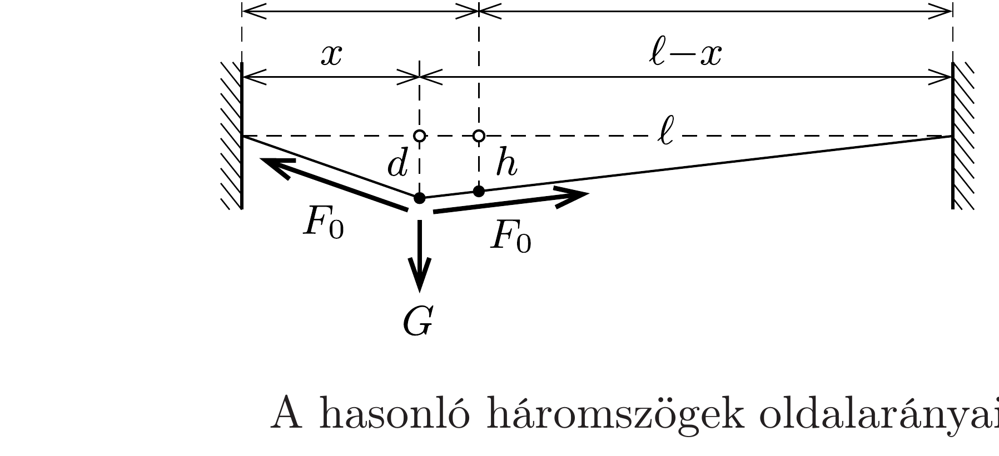
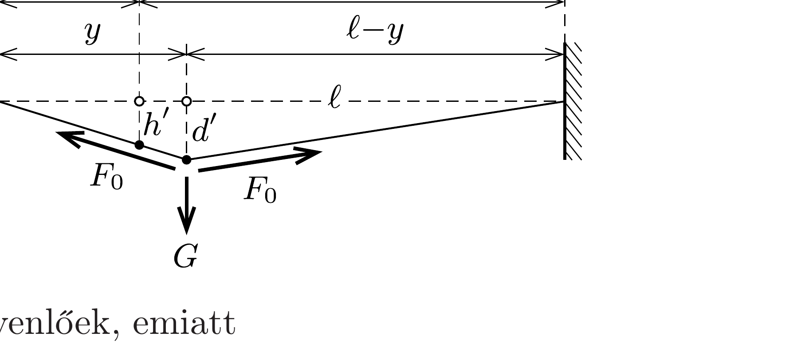

## Útmutatás

A kötéltáncosra ható nehézségi eróvel a feszítőerők függőleges komponense tart egyensúlyt. Kis szögekre alkalmazhatjuk $\operatorname{asin} \alpha \approx \operatorname{tg} \alpha$ közelítést.

## Megoldás

Megmutatjuk, hogy a szóban forgó pontok lesüllyedése - azok konkrét helyzetétől függetlenül - mindig megegyezik egymással. Legyen az $\ell$ hosszúságú kötelet feszítő erő $F_{0}$, és mérjük a vízszintes távolságokat a kötél bal oldali végétől! (A kötéltáncos két oldalán található kötélrészekben valójában kicsit különbözik a feszítőerő, ezt az eltérést azonban a kis lehajlások miatt elhanyagolhatjuk.)

Tegyük fel, hogy az $x$ helyen ható terhelés hatására a kötél $x$ helyen lévő pontja $d$-vel, az $y$ helyen lévő pontja pedig $h$-val süllyed le, illetve fordított szereposztásban: az $y$ helyen ható (ugyanakkora) terhelés hatására a lesüllyedés ott $d^{\prime}$, az $x$ helyen pedig $h^{\prime}$ (lásd az ábrát).

A hasonló háromszögek oldalarányai egyenlőek, emiatt
\[
\frac{d}{\ell-x}=\frac{h}{\ell-y} \quad \text { és } \quad \frac{d^{\prime}}{y}=\frac{h^{\prime}}{x} .
\]
Felírhatjuk még a függőleges erőkomponensek egyensúlyi feltételét (a kicsiny szögek szinuszát a tangensükkel közelítve):
\[
F_{0}\left(\frac{d}{x}+\frac{d}{\ell-x}\right)=F_{0}\left(\frac{d^{\prime}}{y}+\frac{d^{\prime}}{\ell-y}\right) .
\]
Az (1) egyenletpárból
\[
\frac{d}{d^{\prime}}=\frac{\ell-x}{\ell-y} \cdot \frac{x}{y} \cdot \frac{h}{h^{\prime}},
\]
(2)-ből pedig
\[
\frac{d}{d^{\prime}}=\frac{\frac{1}{y}+\frac{1}{\ell-y}}{\frac{1}{x}+\frac{1}{\ell-x}}=\frac{\ell-x}{\ell-y} \cdot \frac{x}{y}
\]
következik, ezek egyenlősége pedig $h^{\prime}=h$ esetén teljesül.
Amikor tehát a kötéltáncos a $H$ pontnál jár, a kötél $N$ pontjának lesüllyedése éppen ugyanakkora (5 cm) lesz, mint amekkora a $H$ pont lesüllyedése volt a kötéltáncos $N$-beli helyzeténél.

Megjegyzés. A kötél $y$-nal jellemzett pontjának lesüllyedése az $x$ pontban ható egységnyi terhelés hatására a „rendszer” ún. válaszfüggvénye. Ennek a - két adattól függő - függvénynek $G(x, y)=G(y, x)$ szimmetriatulajdonsága fontos szerepet játszik többek között a mechanikában, az elektrosztatikában és a hullámok leírásánál, valamint a kvantumelméletben. A lineáris rendszerek válaszfüggvényét George Green (1793-1841) brit matematikus és fizikus tiszteletére Green-függvénynek is nevezik.
