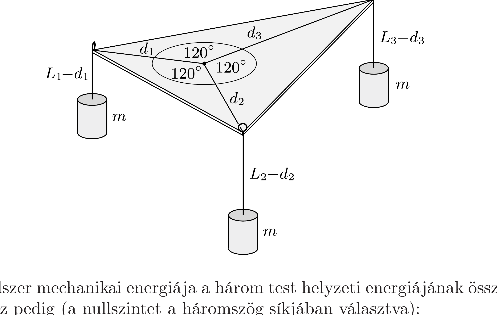

## Útmutatás

Található olyan mechanikai rendszer, amelynek energiája akkor minimális (tehát akkor van egyensúlyban), amikor a háromszög csúcsaitól mért távolságok összege a legkisebb. A megoldás könnyen általánosítható a távolságok súlyozott összegének legkisebb értékére is.

## Megoldás

Készítsünk el egy, az adott háromszöggel megegyező méretú merev síklapot, és rögzítsünk a csúcsaiban egy-egy kicsiny szemescsavart (olyan csavart, amelynek feje egy kis karika). Helyezzük el és rögzítsük a háromszöget vízszintes síkban, majd fúzzünk át egy-egy vékony fonalat a csavarszemeken. Az $L_{1}, L_{2}$ és $L_{3}$ hosszúságú fonalak egyik végét kössük össze, a másik végükhöz pedig erősítsünk egyforma $m$ tömegü testeket az ábrán látható módon.

A rendszer mechanikai energiája a három test helyzeti energiájának összegével egyenlő, az pedig (a nullszintet a háromszög síkjában választva):
\[
E_{\text {helyzeti }}=-m g\left(L_{1}-d_{1}\right)-m g\left(L_{2}-d_{2}\right)-m g\left(L_{3}-d_{3}\right) .
\]
A zárójelek felbontása, majd kiemelés után:
\[
E_{\text {helyzeti }}=\underbrace{m g}_{\text {állandó }} \cdot\left(d_{1}+d_{2}+d_{3}\right)-\underbrace{m g\left(L_{1}+L_{2}+L_{3}\right)}_{\text {állandó }} .
\]
Látható, hogy az összenergia akkor minimális, ha a $d_{1}+d_{2}+d_{3}$ távolságösszeg a lehetó legkisebb. Ebben a helyzetben a rendszer egyensúlyban van, és mivel a három fonalat feszítő erők megegyeznek, így a fonalaknak 120°-os szögben kell találkozniuk. A találkozási pont meg is szerkeszthető, ha megrajzoljuk az oldalak fölé a 120°-os szögnek megfelelő látószögköríveket.

Megjegyzések. 1. A megoldás könnyen általánosítható arra az esetre is, amikor azt a pontot keressük a háromszög belsejében, amelyre a csúcsoktól mért távolságok $m_{1} d_{1}+$ $m_{2} d_{2}+m_{3} d_{3}$ súlyozott összege minimális. A megfelelő energiaminimum az adott $m_{1}, m_{2}$
és $m_{3}$ számokkal (súlyfaktorokkal) megegyező (vagy azokkal arányos) tömegű testekkel valósítható meg. Egyensúly esetén a fonalak találkozási pontjában az $m_{1} g, m_{2} g$ és $m_{3} g$ nagyságú erók tartanak egymással egyensúlyt, ezek vektorháromszöge, és így a fonalak által bezárt szögek is könnyen megszerkeszthetők. Az így meghatározott szögeknek megfelelő látószögkörívek közös metszéspontja jelöli ki a keresett pont helyét.
2. Az eredeti feladat szappanhártyákból álló rendszer vizsgálatával is megoldható. Készítsünk két egyforma plexi háromszöget, melyeket a csúcsaikat összekötő vékony távtartók egymással párhuzamosan tartanak. Az így elkészített eszközt szappanoldatba mártva olyan szerkezet alakul ki, ami három, Y alakban találkozó, téglalap alakú hártyából áll. A három hártya találkozási vonalában a felületi feszültségből származó, egyforma nagyságú erók egyensúlya biztosítja a 120°-os szöget az egyes hártyák között, míg a minimális felületi energiából következik, hogy a $d_{1}+d_{2}+d_{3}$ távolságösszeg minimális.
3. A fenti megoldás csak olyan háromszögekre érvényes, melyeknek nincs $120^{\circ}$-osnál nagyobb szöge. Ha a háromszög tompaszöge éppen $120^{\circ}$-os, akkor a $d_{1}+d_{2}+d_{3}$ távolságösszeg egyik tagja (a 120°-os csúcshoz tartozó) nullává válik, így a keresett pont a háromszög tompaszögének csúcspontja lesz. Ha a tompaszög nagyobb 120°-osnál, akkor is a tompaszögú csúcspontra teljesül a minimális távolságösszeg feltétel. Ezt beláthatjuk a mechanikai modellel is, mert a három fonal találkozási pontjánál lévó csomó megakad a tompaszögnél lévő csavarszemben. A szappanhártyás modellben ez annak felel meg, hogy csak két hártya alakul ki a tompaszög szárain.
