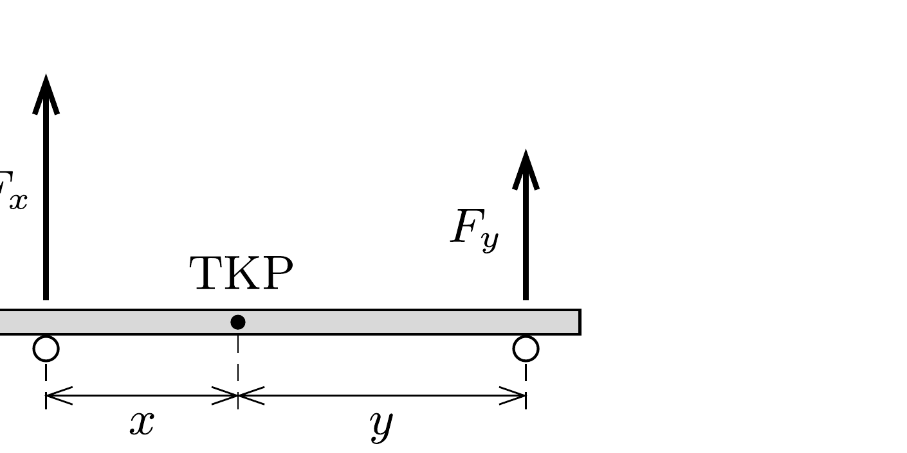

## Útmutatás

Az ujjaink általában nem egyforma nagy eróvel nyomják a rudat, emiatt a tapadási súrlódási erő legnagyobb értéke az egyik ujjunknál kisebb, mint a másiknál, itt fog megcsúszni a rúd. A csúszásban lévő ujjunk egyre közelebb kerül a rúd tömegközéppontjához, emiatt nő az általa kifejtett nyomóerő, és vele együtt a csúszási súrlódási eró is. Ha ez az eró meghaladja a másik ujjunknál fellépő tapadási súrlódási erő maximumát, a másik ujjunk kezd el csúszni. Ez a folyamat váltakozva ismétlődik, az ujjaink felváltva csúsznak, illetve tapadnak a rúdhoz. A munka kiszámítása az egyes csúszási szakaszok hosszának és a változó nagyságú erőnek a meghatározásával történhet.

## Megoldás

A rúdra ható függőleges erók egyensúlya és a forgatónyomatékok egyensúlya miatt a tömegközépponttól $x$, illetve $y$ távolságra lévő ujjakra
\[
F_{x}=m g \frac{y}{x+y} \quad \text { és } \quad F_{y}=m g \frac{x}{x+y}
\]

eró hat. Tegyük fel, hogy a rúd először a bal oldali ujjunknál csúszik meg! Ekkor a bal oldalon ható csúszási súrlódási erő
\[
S=\mu_{\mathrm{cs}} \cdot F_{x}=\mu_{\mathrm{cs}} m g \frac{y}{x+y} .
\]
Ez az eró lassú (elhanyagolható vízszintes gyorsulású) mozgásnál megegyezik a jobb oldalon ható tapadási súrlódási erővel, amelynek legnagyobb értéke
\[
\mu_{\mathrm{t}} F_{y}=\mu_{\mathrm{t}} m g \frac{x}{x+y} .
\]
Ezek szerint a bal oldali ujjunk addig csúszhat, míg
\[
\mu_{\mathrm{cs}} \cdot y \leq \mu_{\mathrm{t}} \cdot x, \quad \text { azaz } \quad x \geq k \cdot y,
\]
ahol $k=\mu_{\mathrm{cs}} / \mu_{\mathrm{t}} \leq 1$.
Kezdetben $x_{0}=y_{0}=\ell / 2$, a bal oldali ujjunk tehát - helyről helyre változó nagyságú súrlódási eró ellenében - az $x=x_{1}=k \ell / 2$ értéknek megfelelő helyzetig csúszik. Az eközben végzett munka integrálással számítható ki:
\[
W\left(x_{0} \rightarrow x_{1}\right)=-\int_{x_{0}}^{x_{1}} \mu_{\mathrm{cs}} F_{x} \mathrm{~d} x=-\mu_{\mathrm{cs}} m g \int_{\ell / 2}^{k \ell / 2} \frac{\ell / 2}{x+\ell / 2} \mathrm{~d} x=\mu_{\mathrm{cs}} m g \frac{\ell}{2} \ln \left(\frac{2}{1+k}\right) .
\]
A második lépésben a jobb oldali ujjunk csúszik meg, miközben $x=x_{1}$ állandó, $y$ pedig változik $y_{0}=\ell / 2$-től $y_{1}=k x_{1}=k^{2} \ell / 2$-ig. A végzett munka
\[
W\left(y_{0} \rightarrow y_{1}\right)=-\mu_{\mathrm{cs}} m g \int_{y_{0}}^{y_{1}} \frac{x_{1}}{x_{1}+y} \mathrm{~d} y=\mu_{\mathrm{cs}} m g \frac{\ell}{2} k \ln \left(\frac{1}{k}\right) .
\]
Hasonló módon számíthatók a további (hol az egyik, hol pedig a másik oldalon megcsúszó rúdnak megfelelő) munkavégzések is. A folyamat során végzett összes munka
\[
W=\mu_{\mathrm{cs}} m g \frac{\ell}{2}\left[\ln \left(\frac{2}{1+k}\right)+\left(k+k^{2}+k^{3}+\ldots\right) \ln \left(\frac{1}{k}\right)\right]
\]

A megjelenő végtelen mértani sor $k<1$ esetén összegezhető:
\[
W=\mu_{\mathrm{cs}} m g \frac{\ell}{2}\left[\ln \left(\frac{2}{1+k}\right)+\frac{k}{1-k} \ln \left(\frac{1}{k}\right)\right] .
\]
Amennyiben $\mu_{\mathrm{cs}} \ll \mu_{\mathrm{t}}$ (vagyis $k \ll 1$ ), a munkavégzés gyakorlatilag egyetlen lépésben történik és
\[
W \approx \mu_{\mathrm{cs}} m g \frac{\ell}{2} \ln 2 .
\]
Ha viszont $\mu_{\mathrm{t}} \approx \mu_{\mathrm{cs}}$ (azaz $k \approx 1$ ), akkor (mint az pl. zsebszámológéppel numerikusan ellenőrizhető)
\[
\frac{k}{1-k} \ln \left(\frac{1}{k}\right) \approx 1, \quad \text { vagyis } \quad W \approx \mu_{\mathrm{cs}} m g \frac{\ell}{2} .
\]

Megjegyzés. A $\mu_{\mathrm{t}} \approx \mu_{\mathrm{cs}}$ határesetben a tapadási és a csúszási súrlódási erók gyakorlatilag nem különböznek, mindkét ujjunk folyamatosan mozog, mindkét ujjunkra szimmetrikusan $\mu_{\mathrm{cs}} m g / 2$ vízszintes erő hat, és mindkét ujjunk elmozdulása $\ell / 2$. Tehát a két kezünk munkavégzése
\[
W=2 \cdot \frac{\mu_{\mathrm{cs}} m g}{2} \cdot \frac{\ell}{2},
\]
így visszakaptuk a (2) eredményt.
A matematikai teljesség kedvéért megjegyezzük, hogy $\mu_{\mathrm{t}}=\mu_{\mathrm{cs}}$ (tehát határozott egyenlőség) esetén az (1) munkavégzésben szereplő mértani sor nem összegezhető. Határértékszámítással megmutatható, hogy a (2) eredmény ekkor is érvényes.
