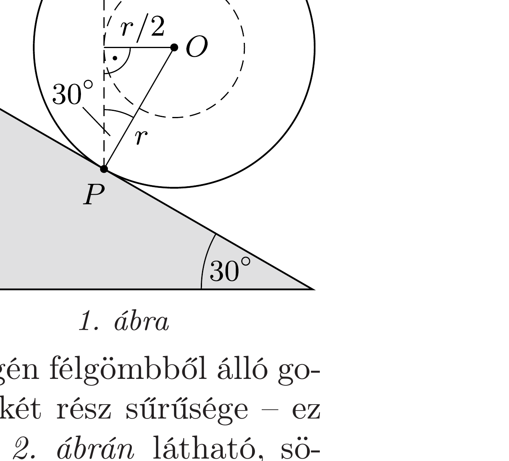
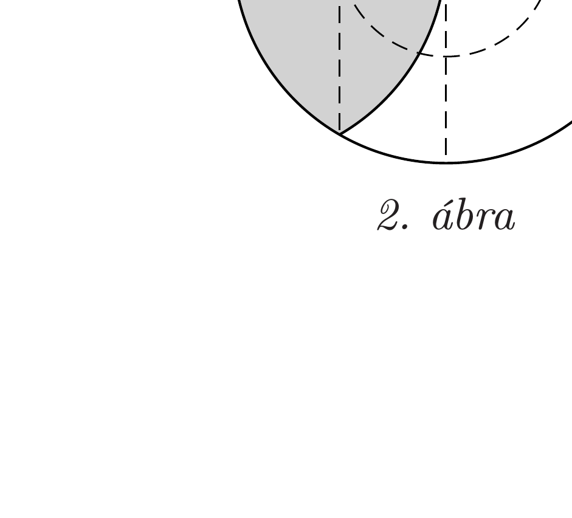

## Útmutatás

A gömb egyensúlyának feltétele, hogy a nehézségi erő hatásvonala átmenjen a lejtővel való érintkezési ponton. Gondoljuk meg, kerülhet-e a golyó tömegközéppontja az érintkezési pont fölé.

## Megoldás

Elegendően nagy tapadási súrlódás esetén a golyó nem csúszik le a lejtőn. Ez azonban még nem elegendő az egyensúlyhoz, hanem az is szükséges, hogy ne gördüljön le a golyó.

Ha a két félgömbből összeragasztott, (inhomogén tömegeloszlású) $r$ sugarú golyó tömegközéppontja a geometriai középpontjához $r / 2$-nél közelebb van, akkor bármilyen helyzetben tesszük is a lejtóre (lásd az 1. ábrát), a nehézségi erốnek lesz forgatónyomatéka a lejtővel érintkező $P$ pontra vonatkozólag, tehát a golyó biztosan legördül.

Megmutatjuk, hogy két homogén félgömbből álló golyónál - bármekkora legyen is a két rész súrúsége - ez a tényleges helyzet. Tekintsük a 2. ábrán látható, sötétebben jelölt, barackmag alakú térrészt, amely teljes egészében a nagyobb súrúségú homogén félgömbben helyezkedik el. Ennek a darabnak (a szimmetriából következően) az $A$ pontban, vagyis az $O$ középponttól $r / 2$ távolságra van a tömegközéppontja. A golyó többi része az $S$ tömegközéppontot valamennyivel közelebb „húzza”
az $O$ ponthoz, tehát $O S<r / 2$. Ez pedig - a fenti megfontolások alapján - annyit jelent, hogy a golyó nem maradhat egyensúlyban a 30°-os lejtőn.

Megjegyzés. A megoldás során feltételeztük, hogy a lejtő és a golyó közötti gördülési ellenállás kicsi, vagyis a $P$ pontnál nem léphet fel forgatónyomaték. Tépőzáras anyaggal bevont felületeknél ez nem igaz, ilyen szélsőséges esetben a golyó akár függőleges felületen is megtapadhat.
