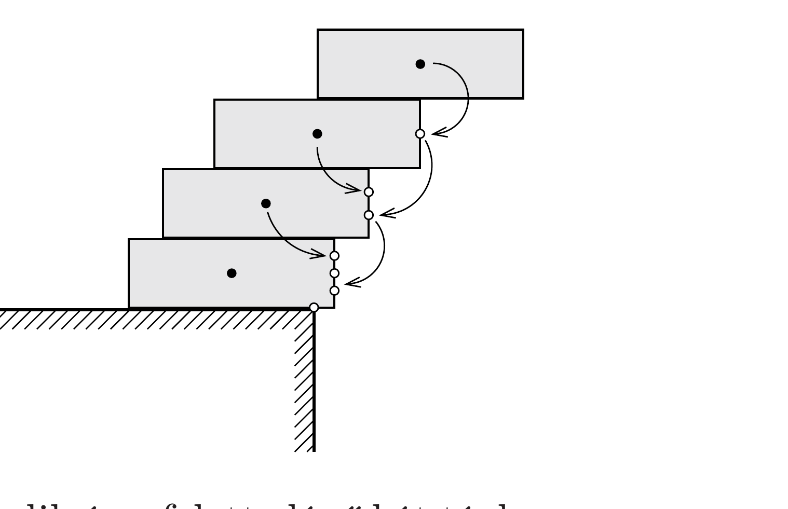

## Útmutatás

A csúsztatgatást a felső téglatesttel kell elkezdeni. A jó stratégia az, hogy a legfelsó testet addig csúsztatjuk el, amíg lehet, majd ugyanezt tesszük az alatta lévővel is, és így haladunk lefelé.

## Megoldás

A csúsztatgatást kezdjük felülről, és válasszuk a téglák hosszát egységnyinek. A legfelső téglát a feléig tolhatjuk ki, ezután a felső kettőt kell a felülről harmadikon elcsúsztatni, ahogy az ábra mutatja. A felső két tégla közös súlypontja nem nyúlhat túl a harmadik szélén, tehát a másodikat $\frac{1}{4}$ egységgel csúsztathatjuk el. A stratégia az, hogy bármely tégla széle felett legyen a kiszemelt tégla feletti da-

rabok közös súlypontja.

Felülről a harmadik tégla elcsúsztatásakor a harmadik és a felette lévő két tégla közös súlypontját kell megtalálni. A felső kettő közös súlypontja a harmadik széle felett van, és kétszeres súllyal számít, tehát az $\frac{1}{2}$ hosszú távolságot 2 : 1 arányban kell osztani. Eszerint a harmadik téglát $\frac{1}{6}$ egységgel csúsztathatjuk el. Hasonlóan adódik, hogy a negyedik téglatest $\frac{1}{8}$ hosszegységgel nyúlhat túl az asztal szélén. Számoljuk össze az elcsúsztatásokat:
\[
\frac{1}{2}+\frac{1}{4}+\frac{1}{6}+\frac{1}{8}=\frac{25}{24}>1,
\]
vagyis a legfelső tégla teljes egészében túlnyúlhat az asztal peremén. (Mindvégig bizonytalan egyensúlyi helyzeteket tekintettünk. A stabil egyensúly eléréséhez a számított értékeknél kissé kevesebbel kell elcsúsztatnunk a téglákat, de még így is megvalósítható az, hogy a negyedik túlnyúljon az asztal szélén.)

A megoldást tetszőleges számú téglára is kiterjeszthetjük. A felülről $k$-adik tégla saját súlypontja és a széle közötti $\frac{1}{2}$ egységnyi távolságot 1 : $(k-1)$ arányban kell osztani, mert a széle felett $(k-1)$ tégla közös súlypontja helyezkedik el. A $k$-adik téglát tehát maximálisan $\frac{1}{2 k}$ egységgel csúsztathatjuk el. Ha összesen $n$ téglánk van, a legfelső kinyúlása:
\[
\sum_{k=1}^{n} \frac{1}{2 k}=\frac{1}{2}\left(1+\frac{1}{2}+\frac{1}{3}+\cdots+\frac{1}{n}\right)
\]
A zárójelben az első $n$ természetes szám reciprokának összege áll, amely $n \rightarrow \infty$ esetén végtelenhez tart, hiszen
\[
\underbrace{1+\frac{1}{2}}_{>\frac{1}{2}+\frac{1}{2}}+\underbrace{\frac{1}{3}+\frac{1}{4}}_{>\frac{1}{4}+\frac{1}{4}}+\underbrace{\frac{1}{5}+\frac{1}{6}+\frac{1}{7}+\frac{1}{8}}_{>\frac{1}{8}+\frac{1}{8}+\frac{1}{8}+\frac{1}{8}}+\cdots>\frac{1}{2}+\frac{1}{2}+\frac{1}{2}+\frac{1}{2}+\ldots
\]
Megfelelően sok tégla esetén tehát elvben akármekkora kinyúlás elérhető!
